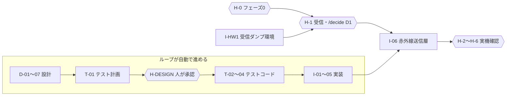

# IRハブ ループ開発キット

`docs/requirements.md`（v0.3）を起点に、設計 → テスト設計 → テストコード → 実装 → 実機確認を、Claude Code のループで進めるための一式。

## 全体の流れ



1周（`/loop-step`）の中身：

1. `state.py next` が依存の終わった項目を1つ選ぶ（LLM を使わない）
2. 担当サブエージェント（designer / test-designer / implementer）が作る
3. `verify.py` が機械検査（変更範囲、守るファイル、未決の要件、見出し、要件IDタグ、`pio test`、`pio run`）
4. `reviewer`（別モデル・既定 REJECT）が審査して `loop/reviews/` に書く
5. `state.py review` が PASS なら done＋コミット、REJECT なら差し戻し。3回通らなければ人に渡す

`{{ }}` の項目は人の出番。ループはそこで止まり、`loop/inbox.md` にやることを書く。

## 準備（初回のみ）

1. このフォルダを好きな場所に置く（パスに日本語・空白が無い方が PlatformIO で困らない）
2. 必要なもの
   - Git for Windows（Claude Code のフックも Git Bash 経由で動く）
   - Python（`python` コマンドで起動できること）
   - VS Code ＋ PlatformIO 拡張。`%USERPROFILE%\.platformio\penv\Scripts` を PATH に追加して `pio` を使えるようにする
   - **native テスト用の gcc**：Windows では PlatformIO の native 環境が PC の gcc を使う。MSYS2 で `mingw-w64-ucrt-x86_64-gcc` を入れて `C:\msys64\ucrt64\bin` を PATH に追加する。または、このフォルダを WSL の中に置いて、WSL で Claude Code と pio を動かす
   - Claude Code CLI（`/goal` を使うなら v2.1.139 以降）
3. 確認：`python scripts/doctor.py` がすべて OK になるまで直す
4. Git の初期化
   ```
   git init
   git add -A
   git commit -m "init: loop kit"
   ```
5. `pio test -e native` で test_smoke が1件通ることを確認（初回はライブラリのダウンロードで時間がかかる）
6. `claude` を起動し、ワークスペースを信頼する（信頼しないとフックが動かない）

## 回し方

### A. 1周ずつ（最初はこれ）
```
claude
> /loop-step
```
1周ごとに `loop/reviews/` と成果物を読み、審査が妥当かを確かめる。審査を信用できると思えるまでは、この回し方を続ける。

### B. /goal で続けて回す
```
claude --permission-mode acceptEdits
> /goal `python scripts/state.py next` の結果が HUMAN か NONE になる。各ターンでは /loop-step を1回だけ実行する。同じ項目が2回続けて REJECT か VERIFY-FAIL になったら止める。15ターンで止める。
```
1つのセッションで回るので、周回が増えるとコンテキストが膨らむ。5〜6周ごとに区切る。

### C. ヘッドレスで回す（Ralph 方式）
```
python scripts/run_loop.py --dry-run   # 次に何をするかだけ表示
python scripts/run_loop.py --max 3
```
周回ごとに新しいコンテキストで `claude -p "/loop-step"` を起動する。前回までの経緯は `loop/state.json`・`loop/reviews/`・`loop/verify/` からだけ引き継ぐ。止まる条件は周回数・累計コスト・同じ項目の連続失敗（`loop/state.json` の `config.runner`）。記録は `loop/runs.jsonl`。

## 人の出番

| いつ | すること | コマンド |
|---|---|---|
| いつでも | 進み具合の確認 | `/loop-status` |
| 最初から | フェーズ0（書き込みと動作確認） | `pio run -e esp32 -t upload` → `/hw-gate H-0 pass` |
| I-HW1 の後 | フェーズ1：受信して `docs/hw/phase1-capture.md` に貼る | `pio run -e dump -t upload` → `/decide D1` → `/hw-gate H-1 pass` |
| 設計とテスト計画の後 | 読んで承認、または差し戻し | `/hw-gate H-DESIGN pass` ／ `fail` |
| ループが止めたとき | `loop/inbox.md` の理由を見て直すか判断 | `/hw-gate <ID> pass`（再挑戦させる） |
| I-06 以降 | フェーズ2〜6 | `/hw-gate H-2` …、`/decide D2` |

ESP32 への書き込み（upload）は、ループからはできないようにしてある。VS Code の PlatformIO ボタンかターミナルで人が行う。

## 構造で止めていること

| 何を | どこで |
|---|---|
| 要件・状態ファイル・ハーネス・secrets.h の編集 | `.claude/hooks/guard.py`（Edit/Write をブロック） |
| 担当ごとの書き込み範囲（実装担当はテストを変えられない、など） | guard.py（サブエージェント名で判定） |
| upload、git push、作業の破棄、ネットワーク取得 | guard.py ＋ settings.json の deny |
| 項目の範囲外の変更 | verify.py の scope |
| 未決の要件（F1-TIMER など）の実装 | verify.py の pending |
| 状態遷移をモデルの自己申告で進めること | state.py（verify の合格記録と VERDICT 行がそろわないと done にならない） |
| 無限ループ・コスト | 1項目3回まで（`config.max_attempts`）、run_loop.py の上限 |

ハーネス自体を直すときは `LOOP_HARNESS_EDIT=1` を付けて claude を起動する（PowerShell なら `$env:LOOP_HARNESS_EDIT=1; claude`）。

## ファイル

| パス | 役割 |
|---|---|
| `CLAUDE.md` | 毎回読まれるプロジェクトの前提 |
| `docs/requirements.md` | 要件の原本（人が編集） |
| `docs/req-index.json` | 要件ID・決定/仮/未決・未決事項 D1/D2 |
| `loop/state.json` | 作業項目26件（依存、担当、書ける範囲、検査） |
| `loop/inbox.md` `loop/log.md` `loop/reviews/` | 人への連絡、履歴、審査記録 |
| `.claude/agents/` | designer / test-designer / implementer / reviewer |
| `.claude/skills/` | loop-step / loop-status / hw-gate / decide / irhub-conventions |
| `.claude/hooks/guard.py` `.claude/settings.json` | 書き込み制限、コマンド制限、起動時の状況表示 |
| `scripts/` | state.py（状態）、verify.py（機械検査）、run_loop.py（ヘッドレス）、doctor.py（環境確認） |
| `platformio.ini` `src/` `lib/core/` `test/test_smoke/` | PlatformIO の土台（フェーズ0の main.cpp と native テストの動作確認） |

## 調整するところ

- 審査担当のモデル：`.claude/agents/reviewer.md` の `model`（既定 opus）。作る側と違うモデルにしておく方が、見落としが重なりにくい
- 1項目の最大試行回数：`loop/state.json` の `config.max_attempts`
- 項目の追加・分割：`loop/state.json` の `items`（`LOOP_HARNESS_EDIT=1` で編集。`reqs` `allowed_paths` `checks` `brief` を書く）
