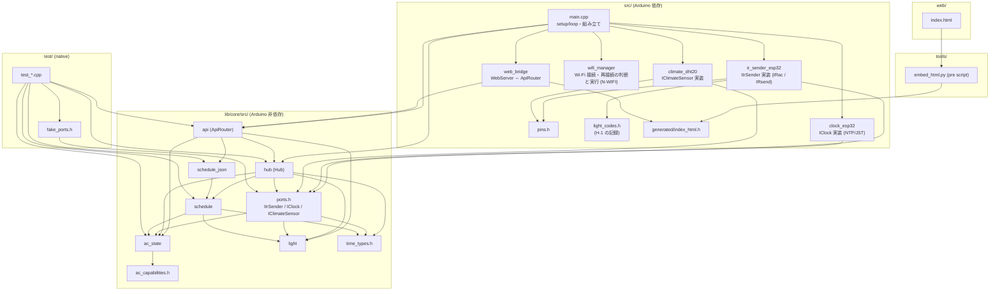
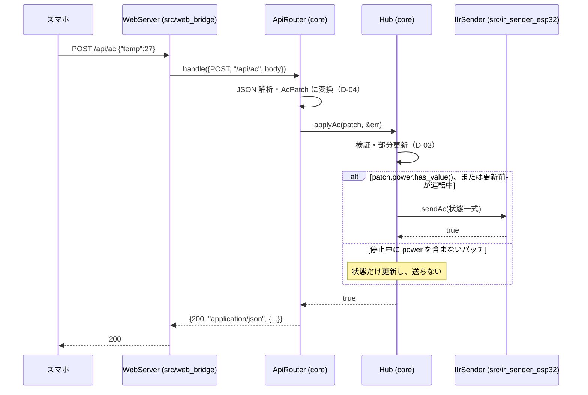
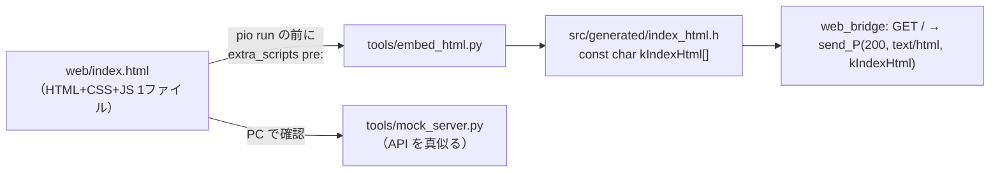

# 基本設計：モジュール構成と依存方向

作業項目：D-01／要件の原本：`docs/requirements.md` v0.3／要件ID：`docs/req-index.json`

この文書では、全体の骨組みを決める。骨組みとは、モジュールの一覧、責務、依存の向き、ファイルの置き場所、lib/core と src/ の境界になるインターフェースのこと。各モジュールの中身（フィールド、検証規則、JSON の細かい形）は後続の設計書が決める。

| 後続の設計書 | 決めること |
|---|---|
| D-02 `02-ac-state.md` | `AcState` のフィールド、部分更新、モード別の記憶、`ac_capabilities.h` の中身 |
| D-03 `03-schedule.md` | `Schedule` のデータ構造、実行判定、エクスポート／インポートの形 |
| D-04 `04-api.md` | 各エンドポイントの JSON、エラー一覧、`/api/status` の形 |
| D-05 `05-ui.md` | 画面、`web/index.html` の埋め込み方式の細部 |
| D-06 `06-runtime.md` | 起動シーケンス、Wi-Fi（`src/wifi_manager` の細部）、NTP、DHT20 の周期、`secrets.h` |

後続の設計書は、この文書で決めたモジュール名・ファイル名・インターフェースの名前と依存の向きに従う。

---

## 対象要件

- [F1] エアコン操作：「3. モジュール一覧」の `ac_state`・`ac_capabilities`、「4. 境界のインターフェース」の `IIrSender::sendAc`（状態一式を1回で送る）、「7. src/ 側のモジュール」の `ir_sender_esp32`（IRac への変換）
- [F3] 照明操作：「3. モジュール一覧」の `light`（6ボタンの列挙、状態を持たない）、`IIrSender::sendLight`
- [F4] スケジュール：「3. モジュール一覧」の `schedule`・`schedule_json`、`Hub::tick` からの判定呼び出し、時刻は `IClock` から得て純関数に引数で渡す
- [F5] 室温・湿度：`IClimateSensor`、`Hub::tick` での 30 秒周期の読み取り、`climate_dht20`（src 側）
- [N-STATE] 状態はメモリのみ：「12. やらないこと（設計上の禁止）」でフラッシュ保存系を使わないと決め、すべての状態を `Hub` が RAM に持つ
- [N-BOOT] 起動時に赤外線を送らない：「10. 起動時に赤外線を送らないための構造上の決まり」
- [UI] 画面：「9. ファイル配置」と「11. 画面の組み込み」の `web/index.html` → `tools/embed_html.py` → `src/generated/index_html.h` → `web_bridge` が `GET /` で返す流れ
- [API] HTTP API：「6. API ハンドラ」の `lib/core` の `ApiRouter`（HTTP 非依存の `handle(ApiRequest) → ApiResponse`）と `src/web_bridge`（WebServer との橋渡し）の分担
- [HW-PINS] ピン割り当て：「7. src/ 側のモジュール」の `src/pins.h` に 1 か所で定義
- [C-TECH] 技術制約：「8. 使うライブラリと置き場所」の表（espressif32 6.x = Arduino core 2.x、IRremoteESP8266 の IRac、DHT20 0x38、WebServer、ArduinoJson v7）

---

## 設計

### 1. 層の分け方（方針）

| 層 | 場所 | 依存してよいもの | テスト |
|---|---|---|---|
| core（中核） | `lib/core/src/` | C++17 標準ライブラリ、ArduinoJson v7 だけ。`Arduino.h`、IRremoteESP8266、WebServer、WiFi、Wire、DHT20 のヘッダは **include 禁止** | `pio test -e native`（PC の gcc） |
| platform（橋渡し） | `src/` | Arduino core 2.x、IRremoteESP8266、WebServer、WiFi、Wire、DHT20 ライブラリ、lib/core | `pio run -e esp32`（ビルド）と実機 |
| 画面 | `web/index.html` | ブラウザ標準の HTML/CSS/JS のみ（外部 URL・CDN 禁止） | PC 用モックサーバー（`tools/mock_server.py`）と実機 |
| テスト | `test/test_<name>/` | lib/core とテスト内のフェイク | native |

原則：
- **判断は core、ハードウェアに触るのは src**。src/ のクラスは「core のインターフェースを実装する」か「core の関数を呼んでその結果を実行する」だけにする。業務ルール（値の検証、部分更新、スケジュール判定、センサーの周期の判断）は持たない。
  - **例外は1つだけ：Wi-Fi の再接続（N-WIFI）**。再接続の回数・待ち時間・再起動の判断は `src/wifi_manager` に置き、PC（native）ではテストしない。確かめるのは実機だけ（人の判断・案A）。理由：Wi-Fi は `WiFi` と `ESP.restart()` に直接つながる処理で、今の作業項目の計画（I-05 は `src/**` に書く）に合わせるため。core には Wi-Fi に関わるモジュールを置かない。
  - この例外を他に広げない。`src/wifi_manager` 以外の src のファイルに、回数・時間・値の判断を書かない。
- core の中で時刻を得るのは `IClock` 経由だけ。`millis()`・`time()`・`getLocalTime()` を core で呼ばない。周期処理の基準になる経過ミリ秒は `Hub::tick(nowMs)` の引数で受け取る。
- core の型に IRremoteESP8266 の型（`stdAc::state_t` など）を持ち込まない。core は `stdAc::state_t` と同じ考え方の自前の型 `AcState` を持つ。`stdAc::state_t` への変換は src の `ir_sender_esp32.cpp` だけが行う。こうして C-TECH の「IRac 優先」と、core を native でビルドできることを両立させる。
- 文字列は core では `std::string` を使い、Arduino の `String` との変換は src で行う（`String::c_str()` → `std::string`、`std::string::c_str()` → `WebServer::send`）。

### 2. 依存方向

矢印は「include する／呼ぶ」の向き。逆向きの include は禁止。



`wifi_manager` は core のどのモジュールにも依存しない（Arduino の `WiFi`・`ESP` と `include/secrets.h` だけを使う）。

依存の規則（native ビルドとレビューで確かめる。scripts/verify.py は include を検査しない）：
1. `lib/core/src/**` から `src/**`・`Arduino.h`・`IRremoteESP8266.h`・`IRac.h`・`IRsend.h`・`WebServer.h`・`WiFi.h`・`Wire.h`・`DHT20.h` を include しない。破れば `pio test -e native` のビルドが失敗する（`env:native` にこれらのライブラリを入れないため）。
2. core の中の向き：`api → hub → ports → (ac_state, light, time_types)`。`ac_state`・`light`・`time_types`・`ac_capabilities` は core の他モジュールを include しない（`ac_state → ac_capabilities` だけ可）。`schedule` は `ac_state`・`light`・`time_types` だけに依存する。
3. ArduinoJson を include してよいのは `api` と `schedule_json` だけ。状態モデル（`ac_state`・`schedule`・`hub`）は JSON を知らない。
4. `src/` 同士は `main.cpp` が組み立てる。`Hub`・`ApiRouter`・各実装クラス・`WifiManager` の実体を作るのは `main.cpp` だけ。`web_bridge` は `ir_sender_esp32` などの実装クラスを知らず、`ApiRouter` だけを知る。`wifi_manager` は `Hub`・`ApiRouter` を知らない。

### 3. モジュール一覧（lib/core/src/）

| モジュール（ファイル） | 責務 | 主な型・関数 | 詳細を決める設計書 |
|---|---|---|---|
| `core_version.h`（既存） | バージョン文字列 | `irhub::coreVersion()` | — |
| `time_types.h` | 日本時間の日時の値型 | `LocalTime`、`ClockReading` | D-03 |
| `ac_capabilities.h` | **受信結果待ちの値の唯一の置き場**（温度範囲、風量の段階、風向上下・左右の選択肢）。各値に `// PENDING(F1-VALUES)` | `constexpr` の表 | D-02 |
| `ac_state.h/.cpp` | エアコンの状態一式、部分更新、値の検証、モード別の最後の設定、F2 初期値の表（`// 仮(F2)`） | `AcState`、`AcPatch`、`AcModel` | D-02 |
| `light.h/.cpp` | 照明6ボタンの列挙と文字列変換。状態は持たない | `LightButton`、`parseLightButton()`、`toString()` | D-04（文字列）、本書（列挙） |
| `ports.h` | 外界との境界になる抽象クラス（純粋仮想） | `IIrSender`、`IClock`、`IClimateSensor`、`ClimateReading` | 本書 |
| `schedule.h/.cpp` | スケジュール一覧（上限件数の固定配列）、追加・編集・削除、実行判定（時刻を引数で受け取る純関数） | `Schedule`、`ScheduleList`、`dueSchedules()` など | D-03 |
| `schedule_json.h/.cpp` | スケジュール一覧 ⇔ JSON（一覧・エクスポート・インポート）と検証 | `schedulesToJson()`、`schedulesFromJson()` | D-03 / D-04 |
| `hub.h/.cpp` | アプリの中心。全状態を RAM に持ち、ポートを使って送信・読み取り・スケジュール実行を行う | `Hub` | 本書（骨組み）、D-02/03/06（中身） |
| `api.h/.cpp` | HTTP 非依存の API ハンドラ。メソッド・パス・本文 → ステータス・本文 | `ApiRequest`、`ApiResponse`、`ApiRouter` | D-04 |

`namespace irhub` にすべて入れる。Wi-Fi に関わるモジュールは core に置かない（1節の例外）。

### 4. 境界のインターフェース（lib/core/src/ports.h）

ここで名前とシグネチャを固定する。`AcState` の中身は D-02、`LocalTime` の細部は D-03 で決める（フィールドの追加は可、ここに書いた名前の変更は不可）。

```cpp
// lib/core/src/time_types.h
#pragma once
#include <cstdint>

namespace irhub {

// 日本時間（JST）の日時。曜日は 0=日曜 … 6=土曜（struct tm の tm_wday と同じ）
struct LocalTime {
  int16_t year;    // 例 2026
  int8_t  month;   // 1..12
  int8_t  day;     // 1..31
  int8_t  hour;    // 0..23
  int8_t  minute;  // 0..59
  int8_t  second;  // 0..59
  int8_t  wday;    // 0..6
};

struct ClockReading {
  bool      synced;     // NTP で一度でも時刻が取れていれば true。false の間 local は無意味
  LocalTime local;      // JST
  int64_t   epochSec;   // UNIX 時刻（秒）。synced=false のとき 0
};

}  // namespace irhub
```

```cpp
// lib/core/src/light.h
#pragma once
#include <cstdint>
#include <optional>
#include <string_view>

namespace irhub {

// リモコンの6ボタン。API の文字列は power | night | brighter | dimmer | full | half（要件5章）
enum class LightButton : uint8_t { Power, Night, Brighter, Dimmer, Full, Half };
constexpr int kLightButtonCount = 6;

std::optional<LightButton> parseLightButton(std::string_view s);  // 不明な文字列は nullopt
const char* toString(LightButton b);

}  // namespace irhub
```

```cpp
// lib/core/src/ports.h
#pragma once
#include "ac_state.h"     // AcState（D-02）
#include "light.h"
#include "time_types.h"

namespace irhub {

// 赤外線送信。エアコンは状態一式を1回で送る（F1）。照明はボタン1つ分（F3）。
// 戻り値：送信処理を呼べたら true（相手に届いたかは分からない）。
class IIrSender {
 public:
  virtual ~IIrSender() = default;
  virtual bool sendAc(const AcState& state) = 0;
  virtual bool sendLight(LightButton button) = 0;
};

// 時計。src では NTP＋JST、テストでは手で進めるフェイク。
class IClock {
 public:
  virtual ~IClock() = default;
  virtual ClockReading now() = 0;
};

struct ClimateReading {
  bool  valid;        // 読み取り成功で true
  float temperatureC; // ℃
  float humidityPct;  // %RH
};

// 温湿度センサー。呼ばれたときに1回読む。周期の判断は Hub が行う。
class IClimateSensor {
 public:
  virtual ~IClimateSensor() = default;
  virtual ClimateReading read() = 0;
};

}  // namespace irhub
```

`IIrSender` に本体タイマー用のメソッドは**置かない**（F1-TIMER は未決）。赤外線の受信（IO14）もポートにしない。本体ファームは受信しない（受信は「やらないこと」の同期に当たるため）。Wi-Fi もポートにしない（1節の例外。判断と実行はどちらも `src/wifi_manager`）。

### 5. Hub（lib/core/src/hub.h）

アプリの状態を1か所に集め、`main.cpp` の `loop()` と `ApiRouter` の両方から使う。ESP32 の Arduino `loop()` は1本のタスクで回り、WebServer の `handleClient()` も同じ `loop()` の中で呼ぶ。このため `Hub` に排他制御は付けない。

```cpp
// lib/core/src/hub.h
#pragma once
#include <cstdint>
#include <string>
#include "ports.h"
#include "ac_state.h"
#include "schedule.h"

namespace irhub {

// センサーの読み取り周期。仮(F5)：要件「仮に30秒」
constexpr uint32_t kClimateIntervalMs = 30000;

class Hub {
 public:
  Hub(IIrSender& ir, IClock& clock, IClimateSensor& sensor);
  // コンストラクタは赤外線を送らない（N-BOOT）。状態は初期値（N-STATE、F2 の表）。

  // loop() から毎回呼ぶ。nowMs は millis() の値（49日で一周するので差は uint32_t の引き算で取る）。
  //  - センサー：一度も読んでいない、または前回から kClimateIntervalMs 以上経っていれば sensor.read()
  //  - スケジュール：clock.now() を1回取り、synced==false なら何もしない（N-TIME）。
  //    synced なら ScheduleList の判定関数（D-03）に LocalTime を渡し、実行すべきものを送る
  void tick(uint32_t nowMs);

  // API から使う操作（詳細な引数・エラーは D-02 / D-04）
  // 戻り値＝検証に通ったか。true なら内部の状態（モード別の記憶も含む）を更新し済み。
  // acState() が返すのは現在の AcState だけで、モード別の記憶は Hub の外から読めない。
  // 送信の条件（人の判断、H-DESIGN レビュー。詳細は D-02）：
  //  - patch が power を含む（AcPatch::power.has_value()。値が true か false かは見ない）、
  //    または更新前が運転中（power=true）
  //    → sendAc(状態一式) をちょうど1回呼ぶ
  //  - 更新前が停止中（power=false）で、patch が power を含まない（!AcPatch::power.has_value()。温度・モード・風量・風向だけ）
  //    → 状態は更新するが sendAc は呼ばない（戻り値は true）
  //    理由：再起動後は実機の状態が分からないまま power=false で始まるため、
  //    動いているエアコンに温度変更だけで停止信号が出るのを防ぐ
  // false なら状態は変えず、送信もしない（*error に理由）。
  // sendAc の戻り値は applyAc の戻り値に含めない。sendAc が false でも更新した状態は戻さない
  // （赤外線は一方通行で、状態は「最後に指示した内容」を表すため）。
  bool applyAc(const AcPatch& patch, std::string* error);
  // sendLight を1回呼ぶ。戻り値は sendLight の戻り値をそのまま返す（照明は状態を持たないので戻すものはない）。
  bool pressLight(LightButton button);

  // 参照（/api/status など）
  const AcState&        acState() const;
  ScheduleList&         schedules();
  const ClimateReading& lastClimate() const;  // まだ読めていなければ valid=false
  ClockReading          clockNow();

 private:
  IIrSender&      ir_;
  IClock&         clock_;
  IClimateSensor& sensor_;
  AcModel         ac_;
  ScheduleList    schedules_;
  ClimateReading  climate_{false, 0.0f, 0.0f};
  bool            climateEverRead_ = false;
  uint32_t        lastClimateMs_   = 0;
  // スケジュールの二重実行防止のための記録は D-03 で追加する
};

}  // namespace irhub
```

呼び出しの流れ：



### 6. API ハンドラ（lib/core/src/api.h）

```cpp
// lib/core/src/api.h
#pragma once
#include <cstdint>
#include <string>
#include "hub.h"

namespace irhub {

enum class HttpMethod : uint8_t { Get, Post, Put, Other };

struct ApiRequest {
  HttpMethod  method;
  std::string path;   // クエリ文字列を除いたパス。例 "/api/ac"
  std::string body;   // 本文（JSON 文字列）。GET は空
};

struct ApiResponse {
  int         status = 200;                     // 200 / 400 など（一覧は D-04）
  std::string contentType = "application/json";
  std::string body;                             // エラー時は {"error":"理由"}
  std::string downloadFilename;                 // 空でなければ Content-Disposition: attachment を付ける（export 用）
};

class ApiRouter {
 public:
  explicit ApiRouter(Hub& hub);
  // "/api/" で始まるパスだけを扱う。GET / は扱わない（web_bridge が HTML を返す）
  ApiResponse handle(const ApiRequest& req);
 private:
  Hub& hub_;
};

}  // namespace irhub
```

ルーティング表（中身の JSON は D-04）：

| メソッド | パス | ApiRouter が呼ぶもの |
|---|---|---|
| GET | `/api/status` | `hub.acState()`、`hub.lastClimate()`、`hub.clockNow()` |
| POST | `/api/ac` | `hub.applyAc()` |
| POST | `/api/light` | `parseLightButton()` → `hub.pressLight()` |
| GET | `/api/schedules` | `schedulesToJson(hub.schedules())` |
| PUT | `/api/schedules` | `schedulesFromJson()` → 置き換え |
| GET | `/api/schedules/export` | `schedulesToJson()`（エクスポート形式）＋ `downloadFilename` |
| POST | `/api/schedules/import` | `schedulesFromJson()`（エクスポート形式）→ 置き換え |

入出力の実例（値は仮。確定は D-04）：

```json
// ApiRequest
{ "method": "POST", "path": "/api/light", "body": "{\"button\":\"night\"}" }
// ApiResponse（成功）
{ "status": 200, "contentType": "application/json", "body": "{\"ok\":true}", "downloadFilename": "" }
// ApiResponse（失敗）
{ "status": 400, "contentType": "application/json", "body": "{\"error\":\"unknown button\"}", "downloadFilename": "" }
```

### 6a. Wi-Fi の接続と再接続（src/wifi_manager、N-WIFI）

要件（決定）は「Wi-Fi が切れたら再接続を最大3回（計30秒程度）試み、すべて失敗したら再起動して再接続をやり直す」。判断と実行の両方を `src/wifi_manager` に置く（1節の例外）。native テストは作らず、実機で確かめる（「テスト観点」）。作るのは I-05（書ける場所 `src/**`）。

```cpp
// src/wifi_manager.h
#pragma once
#include <cstdint>

namespace irhub {

constexpr uint8_t  kWifiMaxAttempts      = 3;      // N-WIFI（決定）：最大3回
constexpr uint32_t kWifiAttemptTimeoutMs = 10000;  // 仮(N-WIFI)：「計30秒程度」を 3回×10秒 とした

class WifiManager {
 public:
  WifiManager(const char* ssid, const char* pass);  // secrets.h の値を main.cpp が渡す
  // setup() で1回呼ぶ。IP 固定（N-IP）の WiFi.config() → WiFi.begin(ssid, pass)。
  // 最初の接続開始も「1回目の試行」として数える（試行中、attempts_=1、attemptMs_=nowMs）。
  void begin(uint32_t nowMs);
  // loop() から毎回呼ぶ。WiFi.status() == WL_CONNECTED を見て、下の表のとおり動く。ブロックしない。
  void tick(uint32_t nowMs);
  bool connected() const;    // WiFi.status() == WL_CONNECTED
 private:
  const char* ssid_;
  const char* pass_;
  bool        trying_    = false;
  uint8_t     attempts_  = 0;
  uint32_t    attemptMs_ = 0;   // 今の試行を始めた時刻（millis()）
};

}  // namespace irhub
```

`tick` の状態遷移（経過時間は `nowMs - attemptMs_` を uint32_t の引き算で取る。`millis()` の一周でも正しく数える）：

| 今の状態 | 入力 | すること | 次の状態 |
|---|---|---|---|
| 接続中（trying_=false） | 接続している | 何もしない | 接続中 |
| 接続中 | 接続していない | `WiFi.disconnect()` → `WiFi.begin(ssid_, pass_)` | 試行中、attempts_=1、attemptMs_=nowMs |
| 試行中 | 接続している | 何もしない | 接続中、attempts_=0 |
| 試行中 | 接続していない、経過 < 10000 | 何もしない | 試行中（変化なし） |
| 試行中 | 接続していない、経過 ≥ 10000、attempts_ < 3 | `WiFi.disconnect()` → `WiFi.begin(ssid_, pass_)` | 試行中、attempts_+1、attemptMs_=nowMs |
| 試行中 | 接続していない、経過 ≥ 10000、attempts_ == 3 | `ESP.restart()` | （再起動するので以後なし） |

例：`begin(0)` の後つながらなければ 10000ms・20000ms で再試行、30000ms で再起動する（起動時も約30秒で再起動）。運用中に 1000ms で切れたと気付けば、1000・11000・21000ms に試行して 31000ms で再起動する。

D-06 への申し送り：
- ESP32 Arduino core 2.x の `WiFi` は自動再接続が既定で有効で、自前の再接続とぶつかるおそれがある。`WiFi.setAutoReconnect(false)` で自前の再接続だけにするか、自動再接続に任せて回数・時間だけを数えるかを D-06 で決める。
- `WiFi.config()`（N-IP、仮）の呼び方（固定 IP を使うか DHCP 予約に任せるか）も D-06 で決める。
- 判断が src にあって native テストが無いので、`WifiManager` には上の表以外の判断を足さない。

### 7. src/ 側のモジュール

| ファイル | 責務 | 使うライブラリ API（実在を確認済みのもの。版の違いは要確認） | 詳細 |
|---|---|---|---|
| `src/main.cpp` | 実体（`Hub`、`ApiRouter`、各実装クラス、`WifiManager`、`WebServer`）の生成と組み立て、`setup()`／`loop()`。`loop()` では `server.handleClient()`、`wifi.tick(millis())`、`hub.tick(millis())` を呼ぶ。`delay()` で長く止めない | `Serial.begin(115200)`、`millis()` | D-06 |
| `src/pins.h` | ピン番号の唯一の定義 | — | 本書 |
| `src/ir_sender_esp32.h/.cpp` | `IIrSender` の実装。`AcState` → `stdAc::state_t` に変換して `IRac::sendAc()`。照明は `light_codes.h` の信号を送る。I-06 までは Serial に出すだけのスタブ | IRremoteESP8266：`IRac(uint16_t pin)`、`bool IRac::sendAc(const stdAc::state_t)`、`IRsend(uint16_t pin)`、`IRsend::begin()`、`IRsend::sendRaw(const uint16_t buf[], uint16_t len, uint16_t hz)` | D-02、I-06 |
| `src/light_codes.h` | H-1 で記録した照明6ボタンの信号（生データ、またはプロトコル名＋値。形式は H-1 の結果で I-06 が決める） | — | I-06 |
| `src/clock_esp32.h/.cpp` | `IClock` の実装。NTP 設定と JST、`synced` の判定 | Arduino core：`configTzTime()`、`getLocalTime(struct tm*, uint32_t)`、`time()` | D-06 |
| `src/climate_dht20.h/.cpp` | `IClimateSensor` の実装 | `Wire.begin(sda, scl)`、DHT20 ライブラリ（RobTillaart）：`DHT20(TwoWire*)`、`bool begin()`、`read()`（戻り値の型は版により `int`／`int8_t` などがあり**要確認**。実装は戻り値を `DHT20_OK`（0）と比べることだけに依存し、型を決め打ちしない）、`float getTemperature()`、`float getHumidity()`。連続読み取りは 1000ms 以上空ける必要あり（30 秒周期なので問題なし） | D-06 |
| `src/wifi_manager.h/.cpp` | Wi-Fi の接続開始、IP 固定（N-IP）の設定、再接続の判断と実行、全失敗時の再起動（N-WIFI、6a 節）。src に判断を置く唯一の例外 | `WiFi.config()`、`WiFi.begin(ssid, pass)`、`WiFi.disconnect()`、`WiFi.status()`（`WL_CONNECTED`）、`WiFi.setAutoReconnect(bool)`（使うかは D-06）、`ESP.restart()` | D-06 |
| `src/web_bridge.h/.cpp` | WebServer と `ApiRouter` の橋渡し。`GET /` は `kIndexHtml` を返す。それ以外は `onNotFound` で受けて `ApiRequest` に詰めて `ApiRouter::handle()` を呼び、`ApiResponse` をそのまま返す | `WebServer(int port)`、`on(uri, HTTPMethod, handler)`、`onNotFound(handler)`、`method()`、`uri()`、`arg("plain")`（本文）、`sendHeader()`、`send(code, type, content)`（API 応答）、`send_P(code, type, content)`（`GET /` の HTML。`String` へのコピーを避ける）、`handleClient()`、`begin()` | D-04、D-05 |
| `src/generated/index_html.h` | `web/index.html` を埋め込んだ `const char kIndexHtml[]`。`tools/embed_html.py` が生成。手で編集しない | — | D-05 |
| `include/secrets.h` | SSID／パスワード（Git 管理外）。見本は `include/secrets.h.example` | — | D-06 |

`src/pins.h`（HW-PINS、決定）：

```cpp
// src/pins.h
#pragma once
#include <cstdint>

namespace irhub::pins {
constexpr uint8_t kIrSend = 4;   // IO4 → 1kΩ → 2SC1815 ベース。LED 2個（エアコン向き・照明向き）を同時に駆動
constexpr uint8_t kI2cSda = 21;  // DHT20 SDA（10kΩ で 3.3V へプルアップ）
constexpr uint8_t kI2cScl = 22;  // DHT20 SCL（10kΩ で 3.3V へプルアップ）
constexpr uint8_t kDht20Addr = 0x38;  // DHT20 の I2C アドレス（固定）
// IO14（受信モジュール OUT）は本体ファームでは使わない。フェーズ1の env:dump（tools/phase1_dump/）だけが使う
}  // namespace irhub::pins
```

ピン番号を書いてよいのは `src/pins.h` と `tools/phase1_dump/` だけ。

### 8. 使うライブラリと置き場所（C-TECH）

| ライブラリ | 使う場所 | platformio.ini | 状態 |
|---|---|---|---|
| ArduinoJson v7（`JsonDocument`、サイズ指定なし） | lib/core（api, schedule_json） | `[common] lib_deps_core`（既存、`^7.2.0`） | 既存 |
| IRremoteESP8266 | src のみ | `env:esp32`（既存、`^2.8.6`） | 既存 |
| DHT20（RobTillaart） | src のみ | `env:esp32` に追加（I-05）。登録名・版は要確認（推測：`robtillaart/DHT20`） | 追加 |
| WebServer / WiFi / Wire | src のみ | Arduino core 2.x に同梱 | — |
| Unity | test のみ | `env:native` の `test_framework = unity`（既存） | 既存 |

`env:native` に IRremoteESP8266・DHT20 を入れない（core がそれらに依存していないことを native ビルドで確かめるため）。platform は `espressif32@^6.9.0`（Arduino core 2.x）のまま。3.x 系（pioarduino）にしない。

### 9. ファイル配置（完成時）

```
platformio.ini                 # env:esp32 / env:native / env:dump、extra_scripts = pre:tools/embed_html.py
include/
  secrets.h                    # Git 管理外
  secrets.h.example
lib/core/src/
  core_version.h
  time_types.h
  ac_capabilities.h            # PENDING(F1-VALUES) はここだけ
  ac_state.h / ac_state.cpp
  light.h / light.cpp
  ports.h
  schedule.h / schedule.cpp
  schedule_json.h / schedule_json.cpp
  hub.h / hub.cpp
  api.h / api.cpp
src/
  main.cpp
  pins.h
  ir_sender_esp32.h / ir_sender_esp32.cpp
  light_codes.h
  clock_esp32.h / clock_esp32.cpp
  climate_dht20.h / climate_dht20.cpp
  wifi_manager.h / wifi_manager.cpp   # N-WIFI の判断と実行（native テストなし）
  web_bridge.h / web_bridge.cpp
  generated/index_html.h       # 生成物
web/
  index.html                   # 画面の唯一のソース
tools/
  embed_html.py
  mock_server.py
  phase1_dump/                 # I-HW1
test/
  test_smoke/test_main.cpp     # 既存
  test_ac_state/{test_main.cpp, fake_ports.h}
  test_schedule/{test_main.cpp, fake_ports.h}
  test_api/{test_main.cpp, fake_ports.h}
```

Wi-Fi のテストディレクトリは作らない。フェイクは各テストディレクトリに `fake_ports.h` として置く。作業項目ごとに書ける場所が `test/test_<name>/**` に限られるので、共有ディレクトリは作らない。フェイクの最低限の形：

```cpp
// test/test_<name>/fake_ports.h（例）
struct FakeIrSender : irhub::IIrSender {
  int acCount = 0; irhub::AcState lastAc{};
  int lightCount = 0; irhub::LightButton lastLight = irhub::LightButton::Power;
  bool sendAc(const irhub::AcState& s) override { ++acCount; lastAc = s; return true; }
  bool sendLight(irhub::LightButton b) override { ++lightCount; lastLight = b; return true; }
};
struct FakeClock : irhub::IClock {
  irhub::ClockReading r{false, {}, 0};
  irhub::ClockReading now() override { return r; }
};
struct FakeClimateSensor : irhub::IClimateSensor {
  int readCount = 0; irhub::ClimateReading next{true, 25.0f, 50.0f};
  irhub::ClimateReading read() override { ++readCount; return next; }
};
```

### 10. 起動時に赤外線を送らないための構造上の決まり（N-BOOT）

1. 赤外線を送る経路は `IIrSender::sendAc` / `sendLight` の2つだけ。src/ で `IRac`・`IRsend` の送信メソッドを呼んでよいのは `ir_sender_esp32.cpp` だけ。
2. `IIrSender` の送信メソッドを呼んでよいのは `Hub::applyAc`、`Hub::pressLight`、`Hub::tick` のスケジュール実行の3か所だけ。
3. `Hub` のコンストラクタと `setup()` は送信メソッドを呼ばない。`IrSenderEsp32` の初期化（`IRsend::begin()` など）は送信しない。
4. 起動直後はスケジュール一覧が空（N-STATE）。`IClock` が `synced=true` になる前は判定しない。NTP が取れた時点で、起動前や未取得の間に過ぎた時刻の分を遡って実行しない（詳細は D-03）。
5. `WifiManager` の `ESP.restart()` による再起動も、ほかの再起動と同じく上の1〜4に従う（再起動後に送らない）。
6. 以上により、起動・再起動から最初の送信までには「画面からの操作」か「起動後に画面から登録したスケジュールの時刻到来」が必ず挟まる。

### 11. 画面の組み込み（UI）



- `send(200, "text/html", kIndexHtml)` と書くと、HTML 全体がいったん Arduino の `String` にコピーされ、HTML の大きさ分のヒープを使う。これを避けるため `send_P(200, "text/html", kIndexHtml)`（または長さ指定版 `send_P(code, type, content, contentLength)`）を使う。どちらを使うかと、ESP32 の Arduino core 2.x での引数の型は D-05 で確かめる（要確認）。
- ビルドツール（npm、React など）は使わない。埋め込みの細部（エスケープ方式、生文字列リテラルか配列か）は D-05 で決める。
- 画面は選択肢（風量・風向など）を HTML に直書きせず、API から受け取って描く（F1-VALUES の rule）。どのエンドポイントで渡すかは D-04。

### 12. やらないこと（設計上の禁止）

要件1章「やらないこと」を、このモジュール構成では次のように守る。

| やらないこと | 構成上の扱い |
|---|---|
| 状態・スケジュールの永続化 | `Preferences`、`SPIFFS`、`LittleFS`、`EEPROM` を include しない。`Hub` のメンバだけに持つ（`WifiManager` の試行回数も RAM のみで、再起動をまたいで数えない） |
| OTA | `ArduinoOTA`、`Update` を使わない |
| クラウド・通知・スマートスピーカー | 外部へ HTTP 接続するモジュールを作らない（NTP を除く） |
| 室温による自動運転 | `Hub::tick` は `lastClimate()` を送信判断に使わない |
| 照明の点灯状態の検出 | 照明は `LightButton` の送信だけ。照明の状態を表す型を作らない |
| 純正リモコンとの同期 | 本体ファームで赤外線受信（IO14）を初期化しない |
| 本体タイマー（F1-TIMER、未決） | 型・メソッド・API・画面のどこにも作らない |

---

## 仮・未決の扱い

| 要件 | 状態 | この文書での扱い | 変わったときに直す場所 |
|---|---|---|---|
| UI | 仮 | 1ファイルの `web/index.html` を埋め込んで `GET /` で返す流れだけを決めた | 画面構成が変わっても `web/index.html` と D-05 だけ。埋め込み方式が変われば `tools/embed_html.py` と `src/web_bridge.cpp` |
| API | 仮 | `ApiRouter::handle(ApiRequest) → ApiResponse` の形とルーティング表だけを決めた | パスや JSON が変われば `lib/core/src/api.cpp`（と D-04、test_api）。`web_bridge` は変えずに済む |
| N-BOOT | 仮（原本は「決定案」） | 「10. 起動時に赤外線を送らないための構造上の決まり」 | 仕様が変わった場合（例：起動時に停止を送る）は、`Hub` のコンストラクタではなく `main.cpp` の `setup()` 末尾に1か所追加する |
| C-TECH の WebServer | 決定（原本では「ESPAsyncWebServer は使わない」が仮） | WebServer に触るのは `src/web_bridge.cpp` だけ | ESPAsyncWebServer に変える場合は `src/web_bridge.*` と `platformio.ini` だけ |
| F5 の 30 秒 | F5 は決定、周期は原本で「仮に30秒」 | `hub.h` の `kClimateIntervalMs = 30000`（`// 仮(F5)`） | その定数1つ |
| PROTO（仮：HITACHI_AC424） | 仮 | core はプロトコルを知らない。プロトコル名は `ir_sender_esp32.cpp` で `stdAc::state_t::protocol` に入れる1か所だけ | `src/ir_sender_esp32.cpp` |
| F1-VALUES | 未決 | 値は `lib/core/src/ac_capabilities.h` だけに置く（`// PENDING(F1-VALUES)`）。この文書では置き場所だけを決め、値は書かない | D1 が閉じたら I-06 が `ac_capabilities.h` を確定値にする |
| F1-TIMER | 未決 | 作らない。`IIrSender`・`AcState`・API・画面のどこにも入れない | D1 で「対応」と決まった後に、改めて作業項目を立てて設計する（この構成では `AcState` へのフィールド追加と `ir_sender_esp32.cpp` の変換で入る見込み） |
| N-WIFI（本書の対象外だが境界に関わる） | 決定（「計30秒程度」の割り振りは `// 仮(N-WIFI)`） | 判断と実行の両方を `src/wifi_manager` に置く（人の判断・案A）。native テストなし、実機で確かめる（6a 節） | 1回の待ち時間・回数が変われば `src/wifi_manager.h` の `kWifiAttemptTimeoutMs`・`kWifiMaxAttempts` の2つだけ |
| N-IP | 仮 | `WiFi.config()` を `src/wifi_manager` が `WiFi.begin()` の前に呼ぶ、という置き場所だけを決めた | D-06 と `src/wifi_manager.cpp` |
| F2 | 仮 | 初期値の表は `ac_state` の中の1か所（`// 仮(F2)`）。詳細は D-02 | D2 が閉じたらその表だけ |

---

## テスト観点

### native 単体テスト（`pio test -e native`）で確かめること
- 依存の境界：lib/core が `Arduino.h` などなしで native ビルドできる（test_smoke を含む全テストがビルドできること自体で確かめる）。
- N-BOOT：`Hub` を生成しただけでは `FakeIrSender` の `acCount == 0` かつ `lightCount == 0`。`tick()` を何度呼んでも、スケジュールが空なら送信 0 回。
- N-BOOT／N-TIME：`FakeClock` が `synced=false` の間は、スケジュールを登録していても `tick()` で送信しない。
- N-STATE：新しく生成した `Hub` の `acState()` が F2 の初期値、`schedules()` が 0 件、`lastClimate().valid == false`。
- F5：`tick(0)` で `readCount == 1`（初回は即読む）、`tick(29999)` で 1 のまま、`tick(30000)` で 2。`millis()` の一周（`tick(0xFFFFFFF0)` の後 `tick(0x00007520)`、差 30000）でも 30 秒経過として読む。読み取り失敗（`valid=false`）が `lastClimate()` に反映される。
- F1：運転中（power=true）の `applyAc()`、または power を含むパッチ（`AcPatch::power.has_value()`。`power:true`／`power:false` のどちらも）の `applyAc()` 1 回で `acCount` がちょうど 1 増え、`lastAc` が状態一式（変更していない項目も含む）になる。
- F1（停止中の設定変更）：停止中（power=false、初期状態を含む）に power を含まないパッチ（例：`temp` だけ、`mode` だけ）で `applyAc()` を呼ぶと、戻り値 true、`acCount` は 0 のまま（増えない）、`acState()` は更新後の値になる（`acState()` は現在の `AcState` だけを返し、モード別の記憶は返さない。モード別の記憶は、D-02 のテスト観点の手順（停止中に temp→mode→fan→swingV を変え、power:true の後に運転中にモードを切り替える）のように、切り替え後の `lastAc` で間接に確かめる）。続けて `power:true` だけのパッチを送ると `acCount` が 1 増え、`lastAc` にそれまでの変更がまとめて入っている。
- F1（エラーと送信失敗）：検証エラー時は戻り値 false、送信 0 回、`acState()` は変わらない。`FakeIrSender::sendAc` が false を返す設定でも `applyAc()` は true を返し、`acState()` は更新後の値のまま。
- F3：`pressLight(LightButton::Night)` で `lightCount == 1`、`lastLight == Night`。`parseLightButton` が6つの文字列を受け、それ以外は `nullopt`。
- API：`ApiRouter::handle` がルーティング表の各メソッド・パスを該当処理へ振り分ける（中身の検証は test_api、D-04）。
- N-WIFI は native では確かめない（`src/wifi_manager` にあるため。下の実機で確かめる）。

### 実機でしか確かめられないこと
- `pio run -e esp32` でビルドが通る（IRremoteESP8266・DHT20・WebServer と core の結合）。
- 電源投入・リセット直後に赤外線が出ない（スマホのカメラで LED を見る、または別の受信機で確認）。
- `GET /` でスマホに画面が出る（埋め込み HTML が壊れていない）。
- DHT20 が 0x38 で応答し、30 秒ごとに値が更新される。
- IO4 から送った信号がエアコン・照明の両方に届く（フェーズ2）。
- 同じピン（IO4）で `IRac` と `IRsend` を併用しても互いに干渉しない（要確認：I-06 で確認）。
- N-WIFI（`src/wifi_manager`、6a 節の表）。シリアルに試行回数と時刻を出して確かめる：
  - 運用中にルーターの電源を切ると、約10秒ごとに再接続を試み、3回目から約10秒後（切断から約30秒）に再起動する。
  - 3回以内にルーターを戻すと、再起動せずに再接続し、画面が再び開ける。その後もう一度切ると、また1回目から数える。
  - ルーターを切ったまま起動すると、約30秒で再起動を繰り返す。ルーターを戻すと接続でき、画面が開ける。
  - 再起動後に赤外線が出ない（N-BOOT）。
  - 自前の再接続と core 2.x の自動再接続がぶつからない（D-06 の決め方に従う）。
- `loop()` が長く止まらず、画面のボタンから送信まで 1 秒以内に収まる（N-RESP、D-06 で詳細）。`WifiManager::tick` もブロックしない。

---

## 要件への疑問

1. **DHT20 のライブラリが要件に書かれていない。** 推測：RobTillaart の DHT20 ライブラリ（`DHT20(TwoWire*)`、`begin()`、`read()`、`getTemperature()`、`getHumidity()`）を使うとした。PlatformIO の登録名と版は要確認（推測：`robtillaart/DHT20`）。別ライブラリにする場合も影響は `src/climate_dht20.*` と `platformio.ini` だけ。
2. **N-BOOT の状態が原本と req-index で違う。** 原本は「決定案」、req-index は「仮」。req-index に従い仮として扱った。推測：「NTP 取得直後に、過ぎた時刻のスケジュールを遡って実行しない」ことも N-BOOT の意図に含まれるとした（詳細は D-03）。
3. **F5 の更新間隔。** req-index では F5 は「決定」だが、原本では「仮に30秒」。推測：周期の値だけを仮として `kClimateIntervalMs` の1か所に置いた。推測：初回は起動直後にすぐ読む（画面が長く空にならないように）とした。
4. **インポートの送り方。** 要件は「JSONファイルの内容でスケジュール一覧を置き換える」だけで、multipart でファイルを送るか、画面の JS がファイルを読んで JSON 本文として送るかは書かれていない。推測：JSON 本文として送る（`WebServer::arg("plain")` で受けられ、`ApiRequest::body` の形がそろう）とした。確定は D-04／D-05。
5. **受信ピン IO14 の本体ファームでの扱い。** 要件はピン割り当てに IO14 を挙げるが、本体の機能で受信を使うものはない（純正リモコンとの同期は「やらないこと」）。推測：本体ファームでは IO14 を初期化せず、フェーズ1のダンプ環境だけが使うとした。
6. **送信 LED 2個の駆動。** ピン割り当てでは、IO4 の1本でトランジスタ1個を駆動し LED 2個を点ける構成と読める。推測：エアコン向け・照明向けを別々に送り分けず、どの送信でも両方の LED が光るとした（`IIrSender` に LED の選択は入れない）。
7. **N-WIFI の「計30秒程度」の割り振りと、起動時の最初の接続。** 要件は回数（3回）と合計（約30秒）だけを決めている。推測：1回の試行を 10 秒待ち（`kWifiAttemptTimeoutMs = 10000`）、3回とも失敗したら再起動とした。また要件は「切れたら」とあるが、推測：起動時に一度もつながらない場合も同じ扱い（最初の接続を1回目と数え、約30秒で再起動）とした。値は `src/wifi_manager.h` の定数2つだけで変えられる。判断を src に置き native テストをしないことは人の判断（案A）による。
8. **赤外線送信の失敗の扱い。** 要件に定めがない。推測：`IIrSender::sendAc` が false を返しても `Hub` は状態を戻さず、`applyAc` の戻り値にも含めないとした（赤外線は一方通行で、届いたかはもともと分からないため）。API の応答にどう出すか（出さないか）は D-04 で決める。
9. **停止中の設定変更は F1 の例外。** F1（決定）は「画面で1項目を変えたときも、状態一式を送る」だが、人の判断（H-DESIGN レビュー）で送り方を変えた：停止中（power=false）に power を含まない（`!AcPatch::power.has_value()`）変更は、状態を更新するが送らない（5節の `applyAc`、詳細は D-02）。requirements.md の文面を直すかどうかは人が決める（原本への追記は人が行う）。
