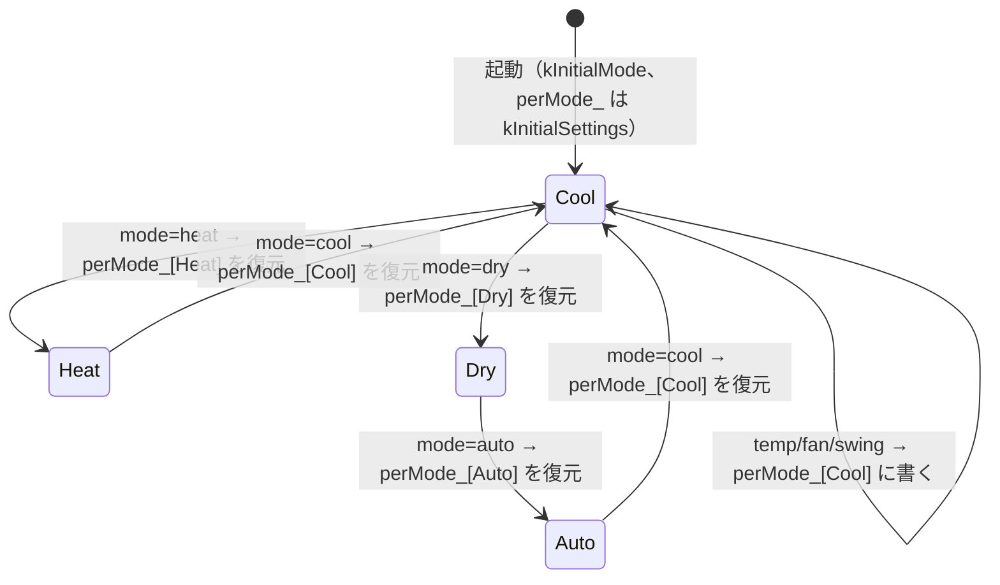

# 詳細設計：エアコン状態モデルと初期設定

作業項目：D-02／要件の原本：`docs/requirements.md` v0.3／要件ID：`docs/req-index.json`／前提：`docs/design/01-architecture.md`（D-01）

この文書では、`lib/core/src/ac_capabilities.h` と `lib/core/src/ac_state.h/.cpp` の中身を決める。あわせて、`Hub::applyAc` がこのモデルをどう使うか、`src/ir_sender_esp32.cpp` が `AcState` を `stdAc::state_t` にどう変換するかも決める。D-01 で決めた名前（`AcState`・`AcPatch`・`AcModel`・`Hub::applyAc(const AcPatch&, std::string*)`・`IIrSender::sendAc(const AcState&)`）と依存の向き（`ac_state → ac_capabilities` だけ）には従う。

---

## 対象要件

- [F1] エアコン操作：「2. 型」の `AcState`（運転・モード・温度・風量・風向の状態一式）、「4. 部分更新」、「6. Hub での使い方」（1回の変更で状態一式を1回送る。停止中に power を含まないパッチは送らない）、「7. stdAc::state_t への変換」
- [F1-VALUES] 温度範囲・風量・風向の選択肢（未決）：「1. ac_capabilities.h」に仮値を集め、各値に `// PENDING(F1-VALUES)` を付ける。値を使う側は定数名だけを参照する。画面へ渡す形は「8. 画面へ渡す選択肢」
- [F1-TIMER] 本体タイマー（未決）：作らない。「9. 作らないもの」と「仮・未決の扱い」に扱いだけを書く
- [F2] 初期設定：「3. モード別の記憶と初期値」の `kInitialSettings`（`// 仮(F2)`）と、「4. 部分更新」のモード切替時の復元規則
- [N-STATE] 状態はメモリのみ：「3. モード別の記憶と初期値」。`AcModel` は RAM のメンバだけで持ち、保存も読み込みもしない
- [N-BOOT] 起動時に送らない：「6. Hub での使い方」。`AcModel` の生成は送信を伴わず、初期状態は `power=false`
- [PROTO] プロトコル（仮：HITACHI_AC424）：「7. stdAc::state_t への変換」。プロトコル名は `src/ir_sender_esp32.cpp` の1か所だけ

---

## 設計

### 0. 全体の考え方

- core の型は IRremoteESP8266 の `stdAc::state_t` と同じ考え方にそろえる（運転・モード・温度・風量・上下風向・左右風向）。列挙の名前は `stdAc` の列挙子から `k` を取ったものにし、変換を1対1にする。
- **形（型・列挙・文字列）は確定**として扱う。**使える値の範囲と選択肢だけ**が未決（F1-VALUES）で、`ac_capabilities.h` の定数だけで決まる。D1 が閉じたときに直すのは `ac_capabilities.h` だけにする（初期値表の風向など、選択肢に従う値も `ac_capabilities.h` の定数を参照する）。
- モデルは「モード4つそれぞれの設定（温度・風量・風向）」と「運転・今のモード」を持つ。画面や API が見る `AcState` は、今のモードの設定を取り出した結果にすぎない。
- 検証はすべて済ませてから状態を変える（全部通るか、何も変えないか）。

### 1. lib/core/src/ac_capabilities.h（列挙と、受信結果待ちの値）

D-01 の規則「`ac_capabilities` は core の他モジュールを include しない」を守るため、列挙型はこのヘッダで定義する。列挙型そのものは `stdAc` の写しで確定しているので PENDING を付けない。PENDING を付けるのは「どの値が使えるか」の定数だけ。

```cpp
// lib/core/src/ac_capabilities.h
#pragma once
#include <cstdint>

namespace irhub {

// ---- 列挙（確定。stdAc の列挙子と1対1。文字列は 2節の表） -------------------------
// 要件 F1 のモードは4つ。stdAc の kFan（送風）と kOff は使わない。
enum class AcMode : uint8_t { Auto = 0, Cool = 1, Dry = 2, Heat = 3 };
constexpr int kAcModeCount = 4;   // 配列の添字は static_cast<int>(AcMode)

enum class AcFan : uint8_t { Auto, Min, Low, Medium, High, Max };
enum class AcSwingV : uint8_t { Off, Auto, Highest, High, Middle, Low, Lowest };
enum class AcSwingH : uint8_t { Off, Auto, LeftMax, Left, Middle, Right, RightMax, Wide };

namespace cap {

// ---- 受信結果待ちの値（フェーズ1で確定する。値だけを直す） ---------------------------
constexpr int kTempMinC  = 16;  // PENDING(F1-VALUES) 要件の仮：16℃
constexpr int kTempMaxC  = 30;  // PENDING(F1-VALUES) 要件の仮：30℃
constexpr int kTempStepC = 1;   // 要件 F1（決定）：1℃刻み。PENDING ではない

// モードごとに温度を指定できるか（添字は AcMode）。false のモードでは温度を持たず送らない（F2 除湿の但し書き）
constexpr bool kTempSupported[kAcModeCount] = {
  true,   // Auto  PENDING(F1-VALUES)
  true,   // Cool  PENDING(F1-VALUES)
  true,   // Dry   PENDING(F1-VALUES) 機種が除湿で温度指定できなければ false にする
  true,   // Heat  PENDING(F1-VALUES)
};

// 風量の選択肢（画面に並べる順）
constexpr AcFan kFanChoices[] = {
  AcFan::Auto, AcFan::Low, AcFan::Medium, AcFan::High,   // PENDING(F1-VALUES)
};
// 風向 上下の選択肢
constexpr AcSwingV kSwingVChoices[] = {
  AcSwingV::Off, AcSwingV::Auto,                          // PENDING(F1-VALUES)
};
// 風向 左右の選択肢
constexpr AcSwingH kSwingHChoices[] = {
  AcSwingH::Off,                                          // PENDING(F1-VALUES)
};

// 「機種の標準」の風向（F2 の表の風向欄。どのモードでも同じ）
constexpr AcSwingV kSwingVDefault = AcSwingV::Off;  // PENDING(F1-VALUES)
constexpr AcSwingH kSwingHDefault = AcSwingH::Off;  // PENDING(F1-VALUES)

// ---- 以下は値ではなく道具（確定） -------------------------------------------------------
constexpr int kFanChoiceCount    = sizeof(kFanChoices) / sizeof(kFanChoices[0]);
constexpr int kSwingVChoiceCount = sizeof(kSwingVChoices) / sizeof(kSwingVChoices[0]);
constexpr int kSwingHChoiceCount = sizeof(kSwingHChoices) / sizeof(kSwingHChoices[0]);

constexpr bool tempSupported(AcMode m) { return kTempSupported[static_cast<int>(m)]; }
constexpr bool tempInRange(int c) { return c >= kTempMinC && c <= kTempMaxC; }
constexpr bool fanSupported(AcFan f) {
  for (int i = 0; i < kFanChoiceCount; ++i) if (kFanChoices[i] == f) return true;
  return false;
}
constexpr bool swingVSupported(AcSwingV v) {
  for (int i = 0; i < kSwingVChoiceCount; ++i) if (kSwingVChoices[i] == v) return true;
  return false;
}
constexpr bool swingHSupported(AcSwingH h) {
  for (int i = 0; i < kSwingHChoiceCount; ++i) if (kSwingHChoices[i] == h) return true;
  return false;
}

}  // namespace cap
}  // namespace irhub
```

決まり：
- 文字列 `F1-VALUES` を書いてよいコードは `ac_capabilities.h`・`test/**`・`web/**` だけ（req-index の allowed_in）。`ac_state.*`・`hub.*`・`api.*`・`src/**` のコメントにこの ID を書かない。
- `ac_state.*`・`api.*`・`src/ir_sender_esp32.cpp` は温度の数値（16・30）や選択肢を直書きせず、`cap::` の定数・関数だけを使う。
- 列挙に無い値（`stdAc` の `kMediumHigh`・`kUpperMiddle`）は入れない。IRremoteESP8266 の master にはあるが、使っている `^2.8.6` にあるかは**要確認**。D1 の結果で必要になったら、列挙・2節の文字列表・7節の変換表に1行ずつ足す。

### 2. lib/core/src/ac_state.h（型と文字列変換）

```cpp
// lib/core/src/ac_state.h
#pragma once
#include <cstdint>
#include <optional>
#include <string_view>
#include "ac_capabilities.h"

namespace irhub {

// モード1つ分の設定。モードごとに1つずつ持つ（F2「モードごとに最後に使った設定」）
struct AcSettings {
  int8_t   tempC  = 26;               // tempSupported(mode)==false のモードでは使わない（保持だけする）
  AcFan    fan    = AcFan::Auto;
  AcSwingV swingV = AcSwingV::Off;
  AcSwingH swingH = AcSwingH::Off;
};

// 今の状態一式。IIrSender::sendAc に渡し、/api/status で返すもの
struct AcState {
  bool     power   = false;
  AcMode   mode    = AcMode::Cool;
  bool     hasTemp = true;            // == cap::tempSupported(mode)。false のとき tempC は送らない・見せない
  int8_t   tempC   = 26;
  AcFan    fan     = AcFan::Auto;
  AcSwingV swingV  = AcSwingV::Off;
  AcSwingH swingH  = AcSwingH::Off;
};
// 既定のメンバ初期化子は「値初期化で壊れた値にならない」ためだけのもの。
// 起動時の値は AcModel のコンストラクタが kInitialSettings から作る（3節）。

// 部分更新。値の入っている項目だけを変える（要件5章「送った項目だけ変更」）
struct AcPatch {
  std::optional<bool>     power;
  std::optional<AcMode>   mode;
  std::optional<int>      tempC;      // int にするのは、範囲外の大きな値（例 300）を int8_t に詰める前に検証するため
  std::optional<AcFan>    fan;
  std::optional<AcSwingV> swingV;
  std::optional<AcSwingH> swingH;
  bool empty() const {
    return !power && !mode && !tempC && !fan && !swingV && !swingH;
  }
};

// 検証の結果
enum class AcError : uint8_t {
  None,
  EmptyPatch,        // 項目が1つも無い
  TempOutOfRange,    // cap::kTempMinC..kTempMaxC の外
  TempNotSupported,  // 更新後のモードで温度を指定できない（例：除湿で温度指定不可の機種）
  FanNotSupported,   // cap::kFanChoices に無い
  SwingVNotSupported,
  SwingHNotSupported,
};
const char* errorMessage(AcError e);  // 下の表の文字列。None は ""

// 文字列 ⇔ 列挙（API と schedule_json が使う。不明な文字列は nullopt）
std::optional<AcMode>   parseAcMode(std::string_view s);
std::optional<AcFan>    parseAcFan(std::string_view s);
std::optional<AcSwingV> parseAcSwingV(std::string_view s);
std::optional<AcSwingH> parseAcSwingH(std::string_view s);
const char* toString(AcMode m);
const char* toString(AcFan f);
const char* toString(AcSwingV v);
const char* toString(AcSwingH h);

// F2 の初期値（3節の表）
AcSettings initialSettings(AcMode m);

class AcModel {
 public:
  AcModel();                          // 3節の初期状態にする。送信はしない（送信の手段を持たない）
  AcError validate(const AcPatch& p) const;   // 状態を変えずに検証だけする
  AcError apply(const AcPatch& p);    // validate が None なら 4節の順に更新して None。それ以外は何も変えずにその値
  const AcState&    state() const { return state_; }
  const AcSettings& settingsFor(AcMode m) const { return perMode_[static_cast<int>(m)]; }
 private:
  void rebuildState();                // power_/mode_/perMode_ から state_ を作り直す
  bool       power_;
  AcMode     mode_;
  AcSettings perMode_[kAcModeCount];
  AcState    state_;                  // rebuildState() の結果（参照を返すための写し）
};

}  // namespace irhub
```

文字列の表（`toString` と `parse*` はこの表だけに従う。大文字小文字は区別し、表にない文字列は nullopt）：

| 列挙 | 文字列 |
|---|---|
| AcMode | `auto` `cool` `dry` `heat` |
| AcFan | `auto` `min` `low` `medium` `high` `max` |
| AcSwingV | `off` `auto` `highest` `high` `middle` `low` `lowest` |
| AcSwingH | `off` `auto` `leftMax` `left` `middle` `right` `rightMax` `wide` |

`parse*` は列挙にある値ならすべて受ける（選択肢に入っているかは見ない）。選択肢の検査は `AcModel::validate` が行う。こうすると「知らない文字列」（API で 400 `unknown fan` など、D-04）と「知っているがこの機種で使えない値」（`fan not supported`）を分けて返せる。

`errorMessage` の文字列（API の `{"error": ...}` にそのまま入れる。D-04 で変えてよいが、変えるならこの表と一緒に直す）：

| AcError | 文字列 |
|---|---|
| None | `""` |
| EmptyPatch | `no ac fields` |
| TempOutOfRange | `temp out of range` |
| TempNotSupported | `temp not supported in this mode` |
| FanNotSupported | `fan not supported` |
| SwingVNotSupported | `swingV not supported` |
| SwingHNotSupported | `swingH not supported` |

### 3. モード別の記憶と初期値（ac_state.cpp）

F2 の初期値は `ac_state.cpp` の1つの表だけに置く（req-index F2 の rule）。

```cpp
// lib/core/src/ac_state.cpp（抜粋）
namespace irhub {
namespace {
// 添字は AcMode（Auto, Cool, Dry, Heat）。風向は「機種の標準」＝ cap::kSwingVDefault / kSwingHDefault
constexpr AcSettings kInitialSettings[kAcModeCount] = {
  {25, AcFan::Auto, cap::kSwingVDefault, cap::kSwingHDefault},  // 自動 仮(F2) 温度は「機種の標準」。推測で 25
  {26, AcFan::Auto, cap::kSwingVDefault, cap::kSwingHDefault},  // 冷房 決定
  {26, AcFan::Auto, cap::kSwingVDefault, cap::kSwingHDefault},  // 除湿 仮(F2) 温度を指定できない機種では送らない
  {20, AcFan::Auto, cap::kSwingVDefault, cap::kSwingHDefault},  // 暖房 仮(F2)
};
constexpr AcMode kInitialMode  = AcMode::Cool;  // 仮(F2) 起動直後のモード。推測で冷房
constexpr bool   kInitialPower = false;         // 起動直後は停止として持つ（N-BOOT：送っていないので実機は不明）

// 選択肢が変わったとき（D1）に初期値が選択肢の外になったら、ビルドで気付くようにする
static_assert(cap::fanSupported(AcFan::Auto), "F2: fan auto must be a choice");
static_assert(cap::swingVSupported(cap::kSwingVDefault), "default swingV must be a choice");
static_assert(cap::swingHSupported(cap::kSwingHDefault), "default swingH must be a choice");
static_assert(cap::tempInRange(25) && cap::tempInRange(26) && cap::tempInRange(20),
              "F2 initial temps must be in range");
}  // namespace
}  // namespace irhub
```

注意：`static_assert` の温度の数値は `kInitialSettings` と二重に書くことになる。実装では `kInitialSettings` をなめる `constexpr` 関数（例 `allInitialValid()`）1つで確かめてもよい（C++17 の constexpr ループで書ける）。どちらにするかは実装者に任せる。

モデルの持ち物と初期状態：

| 持ち物 | 初期値 | 変わるとき |
|---|---|---|
| `power_` | `false` | パッチの `power` |
| `mode_` | `Cool` | パッチの `mode` |
| `perMode_[Auto]` | 25℃・自動・標準・標準 | 今のモードが自動のときのパッチの温度・風量・風向 |
| `perMode_[Cool]` | 26℃・自動・標準・標準 | 同上（冷房） |
| `perMode_[Dry]` | 26℃・自動・標準・標準 | 同上（除湿） |
| `perMode_[Heat]` | 20℃・自動・標準・標準 | 同上（暖房） |

- すべて `AcModel` のメンバ（RAM）だけに持つ。フラッシュへの保存・読み込みはしない（N-STATE、やらないこと）。再起動すると `Hub` が作り直され、上の初期値に戻る。
- `perMode_` はモードを離れても消さない。再起動するまで、4モードそれぞれの最後の設定が残る。

`rebuildState()` の中身：

```
state_.power   = power_
state_.mode    = mode_
state_.hasTemp = cap::tempSupported(mode_)
state_.tempC   = perMode_[mode_].tempC     // hasTemp=false でも値は入れておく（7節で使う）
state_.fan     = perMode_[mode_].fan
state_.swingV  = perMode_[mode_].swingV
state_.swingH  = perMode_[mode_].swingH
```

### 4. 部分更新（AcModel::apply）

`apply(p)` の手順：

1. `e = validate(p)`。`e != None` なら何も変えずに `e` を返す。
2. `p.power` があれば `power_ = *p.power`。
3. `p.mode` があれば `mode_ = *p.mode`。**モードが変わると、温度・風量・風向は `perMode_[新しいモード]` の値になる**（復元）。同じモードを送ったときは何も変わらない。
4. `p.tempC`・`p.fan`・`p.swingV`・`p.swingH` のうち値のあるものを、**3. の後のモード**の `perMode_[mode_]` に書く。これがそのモードの「最後に使った設定」になる。
5. `rebuildState()` して `None` を返す。

`validate(p)` の規則（上から順に見て、最初に当たったものを返す）：

| 順 | 条件 | 結果 |
|---|---|---|
| 1 | `p.empty()` | `EmptyPatch` |
| 2 | `p.tempC` があり、`m = p.mode ? *p.mode : mode_` について `!cap::tempSupported(m)` | `TempNotSupported` |
| 3 | `p.tempC` があり、`!cap::tempInRange(*p.tempC)` | `TempOutOfRange` |
| 4 | `p.fan` があり、`!cap::fanSupported(*p.fan)` | `FanNotSupported` |
| 5 | `p.swingV` があり、`!cap::swingVSupported(*p.swingV)` | `SwingVNotSupported` |
| 6 | `p.swingH` があり、`!cap::swingHSupported(*p.swingH)` | `SwingHNotSupported` |
| — | どれにも当たらない | `None` |

補足の規則：
- 温度の検査は**更新後のモード**で行う。例：今が冷房で `{"mode":"dry","temp":24}` が来たら、除湿で温度を指定できるかを見る。
- 風量・風向の選択肢はモードによらず共通（`cap::` にモード別の表は無い）。
- 停止中（`power_=false`）でも温度・風量・風向・モードは変えられる。状態（`perMode_` のモード別の記憶も含む）は運転中と同じ規則で更新する。**送るかどうかは `AcModel` ではなく `Hub::applyAc` が決める**（6節）：更新前が停止中で、パッチが power を含まないときは送らない（人の判断、H-DESIGN レビュー）。`AcModel::apply` 自体は送信の有無にかかわらず同じ動きをする。
- 「パッチが power を含む」の判定は **`AcPatch::power.has_value()`** だけで行う。値が `true` か `false` か、今の `power_` と同じかは見ない（例：停止中に `{"power":false}` が来たら含むので送る）。
- 今と同じ値だけのパッチ（例：冷房中に `{"mode":"cool"}`）もエラーにしない。状態は変わらない。送信は上の規則どおり（運転中なら状態一式を送る、停止中で power を含まなければ送らない）。
- 温度が整数でない（例 `26.5`）、型が違う（例 `"temp":"26"`）、知らない文字列（例 `"fan":"turbo"`）は、`AcPatch` を作る前に `api`（D-04）が 400 にする。`AcModel` に来る時点で `tempC` は `int`、他は列挙になっている。

状態遷移の例（`cap::` は上の仮値、除湿は温度指定できるものとする。「送信」欄は 6節の `Hub::applyAc` を通したときの `sendAc` の回数）：

| 前の状態（power, mode, temp, fan） | パッチ | 結果 | 後の状態 | perMode_ の変化 | 送信 |
|---|---|---|---|---|---|
| 起動直後 false, cool, 26, auto | `{"power":true}` | None | true, cool, 26, auto | なし | 1（power を含む） |
| true, cool, 26, auto | `{"temp":27}` | None | true, cool, 27, auto | Cool.temp=27 | 1（運転中） |
| true, cool, 27, auto | `{"mode":"heat"}` | None | true, heat, 20, auto | なし（Heat の初期値を復元） | 1 |
| true, heat, 20, auto | `{"temp":22,"fan":"high"}` | None | true, heat, 22, high | Heat.temp=22, Heat.fan=high | 1 |
| true, heat, 22, high | `{"mode":"cool"}` | None | true, cool, 27, auto | なし（Cool の最後の設定 27 を復元） | 1 |
| true, cool, 27, auto | `{"mode":"heat","temp":18}` | None | true, heat, 18, high | Heat.temp=18（復元の後に上書き） | 1 |
| true, heat, 18, high | `{"temp":31}` | TempOutOfRange | 変わらない | なし | 0 |
| true, heat, 18, high | `{"mode":"cool","temp":40}` | TempOutOfRange | 変わらない（モードも変えない） | なし | 0 |
| true, heat, 18, high | `{"power":false}` | None | false, heat, 18, high | なし | 1（power を含む。停止信号） |
| false, heat, 18, high | `{"temp":19}` | None | false, heat, 19, high | Heat.temp=19 | **0**（停止中・power を含まない） |
| false, heat, 19, high | `{"mode":"cool","fan":"low"}` | None | false, cool, 27, low | Cool.fan=low（Cool を復元した後に上書き） | **0**（同上） |
| false, cool, 27, low | `{"power":false}` | None | false, cool, 27, low | なし | 1（power を含む。値が同じでも送る） |
| false, cool, 27, low | `{"power":true}` | None | true, cool, 27, low | なし | 1（停止中に変えた設定がまとめて送られる） |
| true, cool, 27, low | `{}` | EmptyPatch | 変わらない | なし | 0 |

モード切替の状態遷移（温度・風量・風向の出どころ）：



（矢印はすべてのモードの組で同じ規則。図は一部だけ）

### 5. 除湿で温度を送らない場合の扱い

要件 F2 の但し書き「機種が除湿で温度指定できない場合、温度は送らない」を、`cap::kTempSupported[Dry]` の1つの値で切り替える。今の仮値は `true`（要件の表どおり除湿 26℃ を使う）。フェーズ1の受信結果で「除湿では温度が変わらない／表示されない」と分かったら `false` にする。

`kTempSupported[m] == false` のモード `m` での動き：

| 場面 | 動き |
|---|---|
| 状態 | `AcState.hasTemp = false`。`perMode_[m].tempC` は初期値のまま保持する（パッチで変わらない） |
| パッチに `temp` がある | `TempNotSupported`（400）。モード切替と同時（`{"mode":"dry","temp":24}`）でも同じ |
| `/api/status` | `"temp": null`（例は 8節）。画面は −／＋ を出さない（D-05） |
| 送信（7節） | `stdAc::state_t::degrees` には `state.tempC`（除湿の初期値）を入れる。IRac は温度欄を必ず埋める形なので、「送らない」は「利用者が指定した値を送らない」と読む |
| 他のモードへ切り替え | そのモードの `perMode_` を復元する（除湿の温度は関係しない） |

自動モードも同じ仕組みで扱う（`kTempSupported[Auto]`）。自動で温度指定できない機種なら `false` にする。

### 6. Hub での使い方（lib/core/src/hub.cpp）

D-01 の `Hub::applyAc(const AcPatch&, std::string*)` の中身：

```cpp
bool Hub::applyAc(const AcPatch& patch, std::string* error) {
  const bool wasOn = ac_.state().power;          // 更新「前」の運転状態。apply の前に取る
  const AcError e = ac_.apply(patch);
  if (e != AcError::None) {
    if (error) *error = errorMessage(e);
    return false;                 // 状態は変わっていない。送信しない
  }
  const bool send = patch.power.has_value() || wasOn;
  if (send) {
    ir_.sendAc(ac_.state());      // 状態一式をちょうど1回。戻り値は見ない（D-01 5節）
  }
  // send==false：停止中に power を含まないパッチ。状態（perMode_ も）は更新済みで、送らない
  return true;
}
const AcState& Hub::acState() const { return ac_.state(); }
```

送信の条件（人の判断、H-DESIGN レビュー。D-01 5節の `applyAc` のコメントと同じ）：

| 更新前の power | パッチに power がある（`patch.power.has_value()`） | 検証 | 状態 | `sendAc` |
|---|---|---|---|---|
| どちらでも | どちらでも | 失敗 | 変えない | 0 回、戻り値 false |
| true（運転中） | どちらでも | 通る | 更新 | 1 回、戻り値 true |
| false（停止中） | ある（`true`／`false`） | 通る | 更新 | 1 回、戻り値 true |
| false（停止中） | ない（温度・モード・風量・風向だけ） | 通る | 更新（モード別の記憶も） | **0 回**、戻り値 true |

- 理由：再起動後は実機の状態が分からないまま `power=false` で始まる（N-BOOT）。停止中の温度変更で `power=false` を含む状態一式を送ると、動いているエアコンを止めてしまう。停止中に変えた設定は、次の `{"power":true}` でまとめて送られる。
- 「更新前の power」は `apply` の前に取る。`{"power":false,"temp":24}` のように power を含むパッチは、更新前が運転中でも停止中でも送る。
- スケジュール（D-03）への影響はない：「エアコン停止」は `{power:false}`、運転は `power:true` を必ず含むので、どちらも送る側に入る。

- `Hub` のコンストラクタは `AcModel` を既定構築するだけで、`sendAc` を呼ばない（N-BOOT）。`AcModel` は送信の手段（`IIrSender`）を持たない。
- スケジュールのエアコン動作（D-03）も `AcPatch` で表し、`Hub::tick` から同じ検証・更新・送信の流れ（`ac_.apply` → 上の送信条件 → `ir_.sendAc`）を通す。「エアコン停止」は `{power:false}` のパッチ。スケジュールのパッチは必ず power を含む（D-03 1.1）ので、送信条件を通しても常に送る（D-03 5.1 runOne の表「`apply` が `None` なら `ir_.sendAc(ac_.state())` を1回」と同じ結果）。`tick` に送信条件を書くかどうかは D-03 に従う。検証で落ちたスケジュールをどう扱うかは D-03（登録時に `validate` で弾くのが望ましい、と申し送る）。

### 7. stdAc::state_t への変換（src/ir_sender_esp32.cpp、I-06 が作る）

変換は src のこの1ファイルだけで行う（D-01）。関数の形：

```cpp
// src/ir_sender_esp32.cpp（抜粋）
#include <IRac.h>
#include "ac_state.h"

namespace irhub {
namespace {
// プロトコル（PROTO、仮）。ここ1か所だけ
constexpr decode_type_t kAcProtocol = decode_type_t::HITACHI_AC424;   // 仮(PROTO)
constexpr int16_t       kAcModel    = -1;                            // 仮(PROTO) モデル指定なし

stdAc::state_t toStdAc(const AcState& s) {
  stdAc::state_t r;                 // 既定値：quiet/turbo/econo/light/filter/clean/beep=false, sleep=-1, clock=-1
  r.protocol = kAcProtocol;
  r.model    = kAcModel;
  r.power    = s.power;
  r.mode     = /* 下の表 */;
  r.degrees  = static_cast<float>(s.tempC);   // hasTemp=false でも tempC（5節）
  r.celsius  = true;
  r.fanspeed = /* 下の表 */;
  r.swingv   = /* 下の表 */;
  r.swingh   = /* 下の表 */;
  return r;                         // sleep/clock は -1 のまま（本体タイマーは使わない）
}
}  // namespace
}  // namespace irhub
```

対応表（列挙子の順と名前をそろえてあるので1対1）：

| core | stdAc |
|---|---|
| `AcMode::Auto / Cool / Dry / Heat` | `opmode_t::kAuto / kCool / kDry / kHeat` |
| `AcFan::Auto / Min / Low / Medium / High / Max` | `fanspeed_t::kAuto / kMin / kLow / kMedium / kHigh / kMax` |
| `AcSwingV::Off / Auto / Highest / High / Middle / Low / Lowest` | `swingv_t::kOff / kAuto / kHighest / kHigh / kMiddle / kLow / kLowest` |
| `AcSwingH::Off / Auto / LeftMax / Left / Middle / Right / RightMax / Wide` | `swingh_t::kOff / kAuto / kLeftMax / kLeft / kMiddle / kRight / kRightMax / kWide` |

- core の列挙の数値は `stdAc` と違う（`stdAc` は `kOff=-1`）。`static_cast` で数値を流用せず、`switch` で1つずつ対応させる。
- 送信は `IRac::sendAc(const stdAc::state_t desired, const stdAc::state_t* prev)` を使う（IRac.h に実在。`prev` の既定は NULL）。`IrSenderEsp32` は前回送った `stdAc::state_t` をメンバに持ち、2回目からそれを `prev` に渡す。
  - 理由：IRremoteESP8266 の `IRac::hitachi424()` は上下風向を `setSwingVToggle(swingv != kOff)` で送る。つまり HITACHI_AC424 では上下風向が「切り替え」信号で、状態一式を毎回送ると、変えていないのに風向が切り替わるおそれがある。`IRac::handleToggles(desired, prev)` が HITACHI_AC424 の上下風向を前回と比べて抑えるかは**要確認**（ソースの該当箇所を読めていない）。I-06 でソースを確かめ、H-2（実機）で「温度だけ変えても風向が変わらない」ことを確かめる。
  - 起動後の最初の送信は `prev` が無い（NULL を渡す）。
- 本体タイマーに当たる `sleep`・`clock` は常に `-1`（使わない）。`quiet` などの要件に無い機能は常に `false`。

### 8. 画面へ渡す選択肢（F1-VALUES の rule）

画面は選択肢を HTML に直書きせず API から受け取る。どのエンドポイントに載せるか、JSON のキーの最終形は D-04 が決める。この文書では「`cap::` から作れる内容」と実例だけを決める。

`api.cpp` が `cap::` の定数と `toString` から作る内容（値は今の仮値）：

```json
{
  "ac": { "power": false, "mode": "cool", "temp": 26, "fan": "auto", "swingV": "off", "swingH": "off" },
  "acCapabilities": {
    "modes": ["auto", "cool", "dry", "heat"],
    "tempMin": 16, "tempMax": 30, "tempStep": 1,
    "tempModes": ["auto", "cool", "dry", "heat"],
    "fan": ["auto", "low", "medium", "high"],
    "swingV": ["off", "auto"],
    "swingH": ["off"]
  }
}
```

- `tempModes` は `kTempSupported` が true のモードの一覧。除湿で温度指定できない機種なら `"dry"` が消え、除湿中の `"ac"` は `"temp": null` になる：

```json
{ "ac": { "power": true, "mode": "dry", "temp": null, "fan": "auto", "swingV": "off", "swingH": "off" } }
```

- 並び順は `kFanChoices` などの配列の順。`modes` は `AcMode` の値の順（自動・冷房・除湿・暖房）。

### 9. 作らないもの

| 作らないもの | 理由 |
|---|---|
| 本体タイマー（`AcState`・`AcPatch` のフィールド、`sleep`・`clock` の設定、API キー、画面） | F1-TIMER は未決（req-index の allowed_in は空。ID をコードに書くこともしない） |
| 送風モード（`kFan`） | 要件 F1 のモードは4つ |
| 静音・パワフル・節電・フィルター・クリーン・ビープなどの項目 | 要件 F1 の表に無い |
| 状態の保存・読み込み | やらないこと（永続化）、N-STATE |
| 純正リモコンで変えた状態の取り込み | やらないこと（同期） |
| 室温を見て状態を変える処理 | やらないこと（自動運転） |

---

## 仮・未決の扱い

| 要件 | 状態 | この文書での扱い | 変わったときに直す場所 |
|---|---|---|---|
| F1-VALUES | 未決 | 仮値（温度 16〜30℃、モード別の温度指定可否すべて true、風量 auto/low/medium/high、上下 off/auto、左右 off、標準の風向 off/off）を `lib/core/src/ac_capabilities.h` だけに置き、各値に `// PENDING(F1-VALUES)`。他のファイルは `cap::` の名前だけを使う | D1 が閉じたら `ac_capabilities.h` の値だけ。列挙に無い値（例 `kMediumHigh`）が要るときだけ、`ac_capabilities.h` の列挙・2節の文字列表・7節の変換表に足す。初期値が選択肢の外になれば `ac_state.cpp` の `static_assert` がビルドを止めるので、その場合は F2 と合わせて人が決める |
| F1-TIMER | 未決 | 作らない。`AcState`・`AcPatch`・`IIrSender`・API・画面のどこにも入れず、`state_t::sleep`/`clock` は `-1` 固定。ID もコードに書かない | D1 で「対応」と決まったら、新しい作業項目で設計する（`AcState` へのフィールド追加と `toStdAc` の変換で入る見込み）。「非対応」ならこのまま（F4 スケジュールで代替） |
| F2 | 仮（冷房 26℃・自動は決定） | `ac_state.cpp` の `kInitialSettings` と `kInitialMode` の1か所。暖房 20℃・除湿 26℃・自動 25℃（推測）に `// 仮(F2)`。風向「機種の標準」は `cap::kSwingVDefault`/`kSwingHDefault` を参照 | D2 が閉じたら `kInitialSettings` の行だけ。風向の標準が決まったら `ac_capabilities.h` の2つの定数 |
| PROTO | 仮（HITACHI_AC424） | core はプロトコルを知らない。`src/ir_sender_esp32.cpp` の `kAcProtocol`・`kAcModel` の1か所 | D1 でプロトコルが変われば、その2つの定数。上下風向の「切り替え」扱い（7節）はプロトコル次第なので、I-06 で合わせて見直す |
| N-BOOT | 仮（原本は「決定案」） | `AcModel` は送信の手段を持たず、`kInitialPower=false`。送信は `Hub::applyAc` とスケジュール実行だけ | 起動時に停止を送る仕様になっても `AcModel` は変えない（D-01 の決まりどおり `main.cpp` の `setup()` 末尾） |
| N-STATE | 決定 | RAM のメンバだけ | — |
| F1 の温度刻み 1℃ | 決定 | `cap::kTempStepC = 1`（PENDING なし）。`AcPatch::tempC` は整数 | — |

---

## テスト観点

### native 単体テスト（`pio test -e native`、`test/test_ac_state/`）で確かめること

テストの期待値は、仮値の数字（16・30 など）を直書きせず `cap::kTempMinC` などを使って書く。D1 で値が変わってもテストを直さずに済むようにするため。

- 初期状態（F2・N-STATE）：`AcModel` を作った直後の `state()` が `power=false`、`mode=Cool`、`tempC=26`、`fan=Auto`、`swingV=cap::kSwingVDefault`、`swingH=cap::kSwingHDefault`。`settingsFor(Heat).tempC==20`、`settingsFor(Dry).tempC==26`、`settingsFor(Auto).tempC==25`。
- 部分更新（F1）：`{temp}` だけのパッチで温度だけが変わり、運転・モード・風量・風向は変わらない。`{fan}`・`{swingV}`・`{swingH}`・`{power}` も同様。
- モード切替の復元（F2）：4節の遷移例の表を順に流し、各行の後の状態と `settingsFor` が一致する。冷房で 27℃ にして暖房へ行き、冷房へ戻ると 27℃ に戻る。暖房で変えた風量が冷房に漏れない。
- モード＋温度の同時指定：`{"mode":"heat","temp":18}` で暖房に切り替わり、暖房の温度が 18 になる（復元の後に上書き）。
- 境界値（F1-VALUES）：`cap::kTempMinC` と `cap::kTempMaxC` は None、`kTempMinC-1` と `kTempMaxC+1` は `TempOutOfRange`。大きな値（300、-300）も `TempOutOfRange`（int8_t に詰める前に落ちる）。
- 選択肢の外：`cap::kFanChoices` に無い `AcFan`（今の仮値なら `Min`・`Max`）は `FanNotSupported`。`swingV`・`swingH` も同様。テストでは「列挙のうち `cap::fanSupported` が false のもの」をループで探して使う。
- 原子性：エラーを返したとき、`state()` と4モードの `settingsFor` がすべて呼ぶ前と同じ（`{"mode":"cool","temp":40}` でモードも変わらない）。
- 空のパッチ：`EmptyPatch`。
- 検証の順：温度が範囲外かつ風量が選択肢外なら `TempOutOfRange`（4節の表の順）。
- 除湿で温度指定できない場合（5節）：`kTempSupported` はコンパイル時定数なので、今の仮値（true）では直接試せない。テストでは `cap::tempSupported(m)` が false のモードがあればそのモードで `TempNotSupported` と `hasTemp==false` を確かめ、無ければそのテストを `TEST_IGNORE_MESSAGE` で飛ばす（D1 後に自動で有効になる）。
- 停止中の変更（AcModel 単体）：`power=false` のまま `{temp}`・`{mode}`・`{fan}` が通り、状態と `settingsFor` が変わる（`AcModel` は送信の有無を知らないので、運転中と同じ更新になる）。
- 文字列変換：2節の表の全文字列が `parse*` → `toString` で元に戻る。表に無い文字列（`""`、`"Cool"`、`"fan"`）は nullopt。
- エラー文言：`errorMessage` が2節の表どおり。
- Hub と合わせて（置き場所は T-01 で決める。候補は test_api）：
  - 運転中（power=true）の `applyAc` 成功、または power を含むパッチ（`{"power":true}`／`{"power":false}`）の `applyAc` 成功で `FakeIrSender::acCount` がちょうど1増え、`lastAc` が `acState()` と一致（変えていない項目も入っている）。運転中は同じ値のパッチでも送信1回。
  - 停止中の変更で送信 0 回：1つの `Hub` を生成し（power=false、冷房 26℃）、同じ `Hub` で `{"temp":27}` → `{"mode":"heat"}` → `{"fan":"high"}` → `{"swingV":"auto"}` の順に `applyAc` する。各呼び出しの戻り値は true、`acCount` は 0 のまま。4回の後の期待値：`acState()` は power=false・mode=Heat・tempC=20（暖房の記憶を復元）・fan=High・swingV=Auto・swingH=`cap::kSwingHDefault`。`Hub` にはモード別の記憶を読む関数が無い（D-01 5節の参照は `acState()` だけ）ので、冷房の記憶（27）はここでは確かめない。モード別の記憶は `AcModel` 単体（上の「モード切替の復元」「停止中の変更（AcModel 単体）」）で `settingsFor` を使って確かめる。（`"high"`・`"auto"` は今の仮値の選択肢。D1 で選択肢から外れたら、選択肢の中の値に差し替える）
  - 続けて同じ `Hub` で `{"power":true}` を `applyAc` すると `acCount` が 1 になり、`lastAc` は power=true・mode=Heat・tempC=20・fan=High・swingV=Auto・swingH=`cap::kSwingHDefault`（停止中の変更がまとめて入る。27 は冷房の記憶なので `lastAc` には入らない）。
  - さらに続けて同じ `Hub` で `{"mode":"cool"}` を `applyAc` すると（運転中なので送信する）`acCount` が 2 になり、`lastAc` は power=true・mode=Cool・tempC=27・fan=Auto・swingV=`cap::kSwingVDefault`・swingH=`cap::kSwingHDefault`（停止中に変えた冷房の 27 が残っていることを、`Hub` から見える値で確かめる）。
  - 停止中に `{"power":false}`（今と同じ値）でも送信1回。停止中に `{"power":false,"temp":24}` でも送信1回。
  - 運転中に `{"power":false}` で送信1回、`lastAc.power==false`。その後の `{"temp":25}` は送信 0 回。
  - 失敗で送信 0 回・`*error` に文言（運転中・停止中の両方）。
  - `Hub` 生成直後は `acCount==0`（N-BOOT）。
- 初期値が選択肢・範囲の中にあること：`static_assert` なのでビルドが通ること自体で確かめる。

### 実機でしか確かめられないこと

- `pio run -e esp32` で `toStdAc` の `switch` がすべての列挙を扱ってビルドが通る（`-Wswitch` の警告が出ない）。
- H-1（フェーズ1）：OAR-N9 の受信結果で、プロトコル名、温度の範囲、風量の段階、上下・左右風向の選択肢、除湿・自動で温度が載るか、本体タイマーの有無を記録し、`ac_capabilities.h` の値を確定する材料にする。
- H-2（フェーズ2）：ESP32 から送った状態一式で、運転・停止・温度変更がエアコンに効く。
- H-2：停止中に画面で温度を変えてもエアコンに何も届かず（受信音が鳴らない）、そのあと運転を押すと、変えた設定で運転が始まる。
- H-2：温度だけ変えて何度か送っても、上下風向が勝手に切り替わらない（7節の切り替え信号の問題。`prev` を渡す方式で足りるか）。
- H-2：除湿で送った温度の値がエアコン側で無視されるか、効いてしまうか（5節の `kTempSupported[Dry]` を決める材料）。
- 電源投入・リセット直後にエアコンが動かない（N-BOOT）。

---

## 要件への疑問

1. **自動モードの温度「機種の標準」。** 数値が書かれていない。推測：`kInitialSettings[Auto].tempC = 25`（`stdAc::state_t::degrees` の既定値と同じ）として `// 仮(F2)` を付けた。自動で温度を指定できない機種なら `cap::kTempSupported[Auto]=false` にして温度を持たない扱いにできる（5節）。
2. **起動直後のモード。** F2 は「起動直後に使う値」を表にしているが、起動直後がどのモードかは書かれていない。推測：冷房（`kInitialMode = Cool`、`// 仮(F2)`）、運転は停止（`power=false`）とした。停止にしたのは、N-BOOT で起動時に何も送らないため、実機の状態が分からないから。
3. **風向の「機種の標準」。** 推測：受信結果で決まる値として `ac_capabilities.h` の `kSwingVDefault`・`kSwingHDefault`（`// PENDING(F1-VALUES)`）に置き、仮値はどちらも `Off` とした。F1-VALUES の「風向の選択肢」に含まれると読んだ。
4. **モード別に記憶する項目。** F2 は「モードごとに最後に使った設定」とだけ書く。推測：温度・風量・上下風向・左右風向の4つをモード別に記憶し、運転（入／切）はモード別にしないとした（F2 の表の列が温度・風量・風向のため）。
5. **除湿で「温度は送らない」の意味。** IRac の状態一式には温度欄が必ずある。推測：「利用者の指定した温度を受け付けず、状態にも表示せず、送信の温度欄には除湿の初期値を入れる」とした（5節）。実機で温度欄が効いてしまう場合の扱いは H-2 の結果を見て決め直す必要がある。
6. **温度範囲はモードによらず1つか。** 要件は「16〜30℃（仮）」の1つだけ。推測：全モード共通の1つの範囲とした。モード別に違うと分かったら `ac_capabilities.h` を配列にする変更が要る（`cap::tempInRange` の引数にモードを足す）。
7. **空のパッチと「同じ値だけ」のパッチ。** 要件に定めがない。推測：空（`{}`）は 400（`no ac fields`）、今と同じ値だけのパッチは受け付ける（送信は 6節の条件どおり。運転中なら状態一式を送る）とした。
8. **停止中の設定変更。** 人の判断（H-DESIGN レビュー）で決着：停止中に power を含まないパッチは、状態（モード別の記憶も）を更新するが送らない（`applyAc` は true）。power を含むパッチと運転中のパッチは状態一式を送る（6節）。F1「1項目を変えたときも、状態一式を送る」の例外になるので、要件の原本に追記があるとよい（人が判断）。残る推測：「power を含む」は `AcPatch::power.has_value()` で判定し、値が今と同じ `{"power":false}` でも送るとした（停止を確実に届けるため、スケジュールの「停止」とも同じ動きになる）。
9. **HITACHI_AC424 の上下風向が「切り替え」信号であること。** IRremoteESP8266 の `IRac::hitachi424()` は上下風向を `setSwingVToggle()` で送る。F1 の「状態一式を毎回送る」と相性が悪く、毎回の送信で風向が切り替わるおそれがある。推測：`IRac::sendAc(desired, &prev)` に前回の状態を渡して抑える方式とした。抑えられるかは要確認（I-06 でソース、H-2 で実機）。抑えられない場合、上下風向の選択肢を `Off` だけにする（F1-VALUES の値で対応）ことになる見込み。
10. **OAR-N9 の要件表に無いボタン。** F1 は「リモコンでできる操作をすべて」と書く一方、表は運転・モード・温度・風量・風向・タイマーだけ。推測：表の項目だけを作り、静音・節電などは作らないとした。H-1 で OAR-N9 に他のボタンがあると分かった場合は要件の追記が要る。
11. **`stdAc` の `kMediumHigh`・`kUpperMiddle`。** IRremoteESP8266 の master には風量 `kMediumHigh`、上下風向 `kUpperMiddle` があるが、`^2.8.6` にあるか要確認。推測：列挙に入れず、D1 で必要になったら足すとした。
