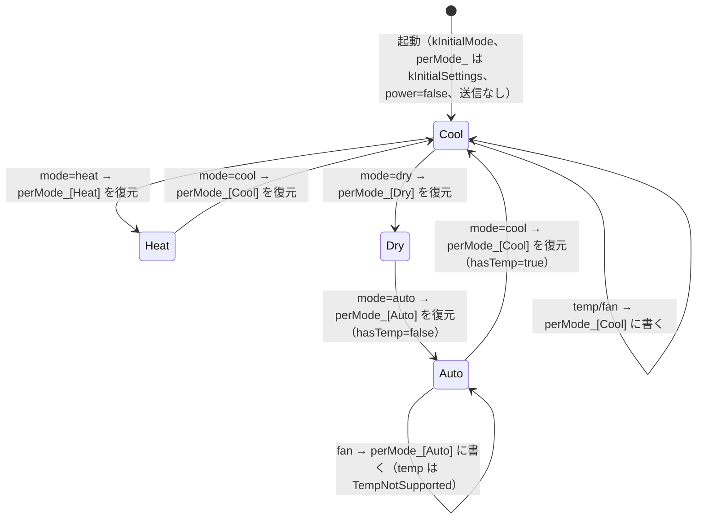

# 詳細設計：エアコン状態モデルと初期設定

作業項目：D-02／要件の原本：`docs/requirements.md` v0.4／要件ID：`docs/req-index.json`（D1 closed 後）／前提：`docs/design/01-architecture.md`（D-01、コミット 75ce1e8）／受信結果：`docs/hw/phase1-capture.md`

この文書では、`lib/core/src/ac_capabilities.h` と `lib/core/src/ac_state.h/.cpp` の中身を決める。あわせて、`Hub::applyAc` がこのモデルをどう使うか、`src/ir_sender_esp32.cpp` が `AcState` を `stdAc::state_t` にどう変換するかも決める。D-01 で決めた名前（`AcState`・`AcPatch`・`AcModel`・`Hub::applyAc(const AcPatch&, std::string*)`・`IIrSender::sendAc(const AcState&)`）、依存の向き（`ac_state → ac_capabilities` だけ）、7a 節の風向の扱いに従う。

実装済みの `lib/core/src/ac_state.h`・`ac_state.cpp`・`ac_capabilities.h`（I-01）のインターフェース（型名・フィールド名・関数のシグネチャ・列挙子）は変えない。D1 の結果で変わるのは `ac_capabilities.h` の**値だけ**で、それは I-06 が行う（1節の「確定後の中身」）。

D1 で確定したこと（この文書に関わるもの）：
- プロトコル **HITACHI_AC296**。`IRac::hitachi296` が扱うのは運転・モード・温度・風量だけ（風向・静音フラグ・タイマーなどは扱わない）。
- モード：冷房（信号の値 3）・暖房（6）・除湿（5）・自動（7）。**自動は温度指定なし**（受信で温度欄 0）。
- 温度 16〜30℃（1℃刻み）。
- 風量 5 段階：自動・静音・弱・中・強。
- 風向（上下・左右）と本体タイマーは作らない。

---

## 対象要件

- [F1] エアコン操作：「2. 型」の `AcState`（運転・モード・温度・風量の状態一式。風向のフィールドは残すが常に `Off`）、「4. 部分更新」、「6. Hub での使い方」（1回の変更で状態一式を1回送る。停止中に power を含まないパッチは送らない）、「7. stdAc::state_t への変換」、「8. 画面へ渡す選択肢」
- [F1-VALUES] 温度範囲・風量・風向の選択肢（決定）：「1. ac_capabilities.h」に確定値を1か所で置く。値を使う側は `cap::` の名前だけを参照する。画面へ渡す形は「8. 画面へ渡す選択肢」
- [F1-TIMER] 本体タイマー（対象外）：作らない。「9. 作らないもの」に扱いだけを書く
- [F2] 初期設定：「3. モード別の記憶と初期値」の `kInitialSettings`（D2 確定値、暖房 22℃）と、「4. 部分更新」のモード切替時の復元規則、「5. 温度を指定できないモード」
- [N-STATE] 状態はメモリのみ：「3. モード別の記憶と初期値」。`AcModel` は RAM のメンバだけで持ち、保存も読み込みもしない
- [N-BOOT] 起動時にエアコンへ送らない：「6. Hub での使い方」。`AcModel` の生成は送信を伴わず、初期状態は `power=false`
- [PROTO] プロトコル（決定：HITACHI_AC296）：「7. stdAc::state_t への変換」。プロトコル名は `src/ir_sender_esp32.cpp` の1か所だけ。押したボタンのバイト（`state[11]`）と自動の温度欄は H-2 で確かめる

---

## 設計

### 0. 全体の考え方

- core の型は IRremoteESP8266 の `stdAc::state_t` と同じ考え方にそろえる（運転・モード・温度・風量・上下風向・左右風向）。列挙の名前は `stdAc` の列挙子から `k` を取ったものにし、変換を1対1にする（実装済み）。
- **形（型・列挙・文字列）はそのまま**。D1 の結果は `ac_capabilities.h` の定数（温度範囲・モード別の温度指定可否・風量の選択肢・風向の選択肢）だけに入る。
- 風向は作らない（D-01 7a 節）。ただし手戻りを小さくするため、`AcSettings`・`AcState`・`AcPatch` の `swingV`・`swingH` と列挙 `AcSwingV`・`AcSwingH` は残す。選択肢を `Off` だけにするので、状態の風向は常に `Off` になる。API・画面・スケジュールは風向を出さず受け付けない（D-04／D-05／D-03）。
- モデルは「モード4つそれぞれの設定（温度・風量・風向）」と「運転・今のモード」を持つ。画面や API が見る `AcState` は、今のモードの設定を取り出した結果にすぎない。
- 検証はすべて済ませてから状態を変える（全部通るか、何も変えないか）。

### 1. lib/core/src/ac_capabilities.h（列挙と、使える値）

D-01 の規則「`ac_capabilities` は core の他モジュールを include しない」を守るため、列挙型はこのヘッダで定義する（実装済み、変えない）。

**確定後の中身**（I-06 が今の仮値からこの形に直す。直すのは値とコメントだけで、名前・型・関数は今のまま）：

```cpp
// lib/core/src/ac_capabilities.h
#pragma once
#include <cstdint>

namespace irhub {

// ---- 列挙（確定。stdAc の列挙子と1対1。文字列は 2節の表） -------------------------
// 要件 F1 のモードは4つ。stdAc の kFan（送風）と kOff は使わない。
enum class AcMode : uint8_t { Auto = 0, Cool = 1, Dry = 2, Heat = 3 };
constexpr int kAcModeCount = 4;   // 配列の添字は static_cast<int>(AcMode)

enum class AcFan : uint8_t { Auto, Min, Low, Medium, High, Max };   // Min = 静音
enum class AcSwingV : uint8_t { Off, Auto, Highest, High, Middle, Low, Lowest };
enum class AcSwingH : uint8_t { Off, Auto, LeftMax, Left, Middle, Right, RightMax, Wide };

namespace cap {

// ---- 使える値（D1 で確定。F1-VALUES の値はこのファイルだけに置く） -------------------
constexpr int kTempMinC  = 16;  // 確定(D1)
constexpr int kTempMaxC  = 30;  // 確定(D1)。HITACHI_AC296 の温度欄は 5 ビットで 31 まで。リモコンの 32 は載らない
constexpr int kTempStepC = 1;   // 要件 F1（決定）：1℃刻み

// モードごとに温度を指定できるか（添字は AcMode）。false のモードでは温度を受け付けず、見せない（5節）
constexpr bool kTempSupported[kAcModeCount] = {
  false,  // Auto  確定(D1)：自動は温度指定なし（受信で温度欄 0）
  true,   // Cool
  true,   // Dry   受信で除湿の温度欄に 28℃ が載っている
  true,   // Heat
};

// 風量の選択肢（画面に並べる順）。確定(D1)：自動・静音・弱・中・強
constexpr AcFan kFanChoices[] = {
  AcFan::Auto, AcFan::Min, AcFan::Low, AcFan::Medium, AcFan::High,
};
// 風向は作らない（D1）。状態の項目は残し、選択肢は Off だけ
constexpr AcSwingV kSwingVChoices[] = { AcSwingV::Off };
constexpr AcSwingH kSwingHChoices[] = { AcSwingH::Off };
constexpr AcSwingV kSwingVDefault = AcSwingV::Off;
constexpr AcSwingH kSwingHDefault = AcSwingH::Off;

// ---- 以下は値ではなく道具（実装済み、変えない） --------------------------------------
constexpr int kFanChoiceCount    = sizeof(kFanChoices) / sizeof(kFanChoices[0]);
constexpr int kSwingVChoiceCount = sizeof(kSwingVChoices) / sizeof(kSwingVChoices[0]);
constexpr int kSwingHChoiceCount = sizeof(kSwingHChoices) / sizeof(kSwingHChoices[0]);

constexpr bool tempSupported(AcMode m) { return kTempSupported[static_cast<int>(m)]; }
constexpr bool tempInRange(int c) { return c >= kTempMinC && c <= kTempMaxC; }
constexpr bool fanSupported(AcFan f)       { /* kFanChoices を線形に探す（実装済み） */ }
constexpr bool swingVSupported(AcSwingV v) { /* 同上 */ }
constexpr bool swingHSupported(AcSwingH h) { /* 同上 */ }

}  // namespace cap
}  // namespace irhub
```

今の仮値からの差分（I-06 が直す箇所の一覧）：

| 定数 | 今（仮） | 確定後 |
|---|---|---|
| `kTempMinC` / `kTempMaxC` | 16 / 30 | 16 / 30（値は同じ。`PENDING` を外す） |
| `kTempSupported[Auto]` | true | **false** |
| `kTempSupported[Cool/Dry/Heat]` | true | true |
| `kFanChoices` | Auto, Low, Medium, High | Auto, **Min**, Low, Medium, High |
| `kSwingVChoices` | Off, Auto | **Off** |
| `kSwingHChoices` | Off | Off |
| `kSwingVDefault` / `kSwingHDefault` | Off / Off | Off / Off |

決まり：
- `// PENDING(F1-VALUES)` は I-06 ですべて外す（D1 closed。human_feedback (d)）。
- 文字列 `F1-VALUES` を書いてよいコードは `ac_capabilities.h`・`test/**`・`web/**` だけ（req-index の allowed_in）。`ac_state.*`・`hub.*`・`api.*`・`src/**` のコメントにこの ID を書かない。
- `ac_state.*`・`api.*`・`src/ir_sender_esp32.cpp` は温度の数値（16・30）や選択肢を直書きせず、`cap::` の定数・関数だけを使う。
- 静音は `AcFan::Min` で表す（列挙を変えないため。D-01 疑問10）。`AcFan::Max` は列挙に残るが選択肢に入れない（`IRHitachiAc296::convertFan` で `kMax` は `kHigh` と同じ「強」になるため。D-01 7節）。
- `AcSwingV`・`AcSwingH` の `Off` 以外の列挙子は、状態には入らない（選択肢の外なので `validate` が落とす）。

### 2. lib/core/src/ac_state.h（型と文字列変換）

実装済み（I-01）の宣言をそのまま使う。要点：

```cpp
// lib/core/src/ac_state.h（実装済み。変えない）
struct AcSettings {               // モード1つ分の設定
  int8_t   tempC  = 26;           // tempSupported(mode)==false のモードでは使わない（保持だけする）
  AcFan    fan    = AcFan::Auto;
  AcSwingV swingV = AcSwingV::Off;   // 風向は作らない。常に Off
  AcSwingH swingH = AcSwingH::Off;   // 同上
};
struct AcState {                  // 今の状態一式。sendAc に渡し、/api/status で返す
  bool     power   = false;
  AcMode   mode    = AcMode::Cool;
  bool     hasTemp = true;        // == cap::tempSupported(mode)。false のとき tempC は見せない・利用者の値として送らない
  int8_t   tempC   = 26;
  AcFan    fan     = AcFan::Auto;
  AcSwingV swingV  = AcSwingV::Off;
  AcSwingH swingH  = AcSwingH::Off;
};
struct AcPatch {                  // 部分更新。値の入っている項目だけを変える
  std::optional<bool>     power;
  std::optional<AcMode>   mode;
  std::optional<int>      tempC;  // int8_t に詰める前に範囲を検証するため int
  std::optional<AcFan>    fan;
  std::optional<AcSwingV> swingV; // API・スケジュールは埋めない（D-01 7a）
  std::optional<AcSwingH> swingH; // 同上
  bool empty() const;
};
enum class AcError : uint8_t { None, EmptyPatch, TempOutOfRange, TempNotSupported,
                               FanNotSupported, SwingVNotSupported, SwingHNotSupported };
const char* errorMessage(AcError e);
std::optional<AcMode>   parseAcMode(std::string_view s);
std::optional<AcFan>    parseAcFan(std::string_view s);
std::optional<AcSwingV> parseAcSwingV(std::string_view s);
std::optional<AcSwingH> parseAcSwingH(std::string_view s);
const char* toString(AcMode m);   // ほか AcFan / AcSwingV / AcSwingH
AcSettings initialSettings(AcMode m);
class AcModel {
 public:
  AcModel();                                    // 3節の初期状態。送信しない
  AcError validate(const AcPatch& p) const;     // 状態を変えずに検証だけ
  AcError apply(const AcPatch& p);              // None なら 4節の順に更新。それ以外は何も変えない
  const AcState&    state() const;
  const AcSettings& settingsFor(AcMode m) const;
 private:
  void rebuildState();
  bool power_; AcMode mode_; AcSettings perMode_[kAcModeCount]; AcState state_;
};
```

文字列の表（`toString` と `parse*` はこの表だけに従う。大文字小文字は区別し、表にない文字列は nullopt。実装済み）：

| 列挙 | 文字列 | API・画面で使うもの |
|---|---|---|
| AcMode | `auto` `cool` `dry` `heat` | 4つとも |
| AcFan | `auto` `min` `low` `medium` `high` `max` | `auto` `min`（静音） `low` `medium` `high`。`max` は選択肢外 |
| AcSwingV | `off` `auto` `highest` `high` `middle` `low` `lowest` | 使わない（API は風向キーを受け付けない） |
| AcSwingH | `off` `auto` `leftMax` `left` `middle` `right` `rightMax` `wide` | 使わない |

- 画面の日本語表示（`min`→「静音」など）は D-05 が持つ。API の文字列は上の表のまま（`quiet` にしない。理由は「要件への疑問」5）。
- `parse*` は列挙にある値ならすべて受ける（選択肢に入っているかは見ない）。選択肢の検査は `AcModel::validate` が行う。こうすると「知らない文字列」（API で 400 `unknown fan` など、D-04）と「知っているがこの機種で使えない値」（`fan not supported`、例 `"max"`）を分けて返せる。

`errorMessage` の文字列（API の `{"error": ...}` にそのまま入れる。どれも HTTP 400。D-04 で変えてよいが、変えるならこの表と一緒に直す。実装済み）：

| AcError | 文字列 | 起きる例（確定値で） |
|---|---|---|
| None | `""` | — |
| EmptyPatch | `no ac fields` | `{}` |
| TempOutOfRange | `temp out of range` | `{"temp":15}`、`{"temp":31}`、`{"temp":300}` |
| TempNotSupported | `temp not supported in this mode` | 自動のとき `{"temp":24}`、`{"mode":"auto","temp":24}` |
| FanNotSupported | `fan not supported` | `{"fan":"max"}` |
| SwingVNotSupported | `swingV not supported` | API からは起きない（風向キーは api が先に 400 にする）。core を直接呼んだとき `swingV=Auto` など |
| SwingHNotSupported | `swingH not supported` | 同上 |

### 3. モード別の記憶と初期値（ac_state.cpp）

F2 の初期値は `ac_state.cpp` の1つの表だけに置く（req-index F2 の rule）。D2（closed、2026-09-27）の確定値にする。実装済みの表から変えるのは暖房の温度（20 → 22）と行のコメントだけ：

```cpp
// lib/core/src/ac_state.cpp（抜粋。D2 確定値）
// 添字は AcMode（Auto, Cool, Dry, Heat）。風向は cap::kSwingVDefault / kSwingHDefault（= Off）
constexpr AcSettings kInitialSettings[kAcModeCount] = {
  {25, AcFan::Auto, cap::kSwingVDefault, cap::kSwingHDefault},  // 自動 決定(D2) 温度は使わない（自動は温度指定なし）
  {26, AcFan::Auto, cap::kSwingVDefault, cap::kSwingHDefault},  // 冷房 決定
  {26, AcFan::Auto, cap::kSwingVDefault, cap::kSwingHDefault},  // 除湿 決定(D2)
  {22, AcFan::Auto, cap::kSwingVDefault, cap::kSwingHDefault},  // 暖房 決定(D2)
};
constexpr AcMode kInitialMode  = AcMode::Cool;  // 推測（要件への疑問2） 起動直後のモード
constexpr bool   kInitialPower = false;         // 起動直後は停止として持つ（N-BOOT）
static_assert(allInitialValid(), "initial settings must be within the capabilities");
```

- 自動の行の `25` は、自動が温度指定なしになったので**画面にも API にも出ず、利用者の値として送られない**。`AcSettings::tempC` の型を変えないために入れておく値（`allInitialValid()` の範囲検査を通る値）。行のコメントは I-06 で上のとおり直してよい（値は変えない）。
- 確定値にしたあとも `allInitialValid()` は通る（風量 Auto は選択肢、風向 Off は選択肢、温度 22・25・26 は 16〜30 の中）。通らなくなったら `ac_capabilities.h` と F2 の食い違いなので、人が決める。

モデルの持ち物と初期状態（確定値で）：

| 持ち物 | 初期値 | 変わるとき |
|---|---|---|
| `power_` | `false` | パッチの `power` |
| `mode_` | `Cool` | パッチの `mode` |
| `perMode_[Auto]` | 25℃（使わない）・自動・Off・Off | 今のモードが自動のときのパッチの風量（温度は `TempNotSupported` で入らない） |
| `perMode_[Cool]` | 26℃・自動・Off・Off | 今のモードが冷房のときのパッチの温度・風量 |
| `perMode_[Dry]` | 26℃・自動・Off・Off | 同上（除湿） |
| `perMode_[Heat]` | 22℃・自動・Off・Off | 同上（暖房） |

- すべて `AcModel` のメンバ（RAM）だけに持つ。フラッシュへの保存・読み込みはしない（N-STATE、やらないこと）。再起動すると `Hub` が作り直され、上の初期値に戻る。
- `perMode_` はモードを離れても消さない。再起動するまで、4モードそれぞれの最後の設定が残る。
- 風向は選択肢が `Off` だけなので、`perMode_[*].swingV/swingH` は常に `Off` のまま。

`rebuildState()` の中身（実装済み）：

```
state_.power   = power_
state_.mode    = mode_
state_.hasTemp = cap::tempSupported(mode_)          // 自動のとき false
state_.tempC   = perMode_[mode_].tempC               // hasTemp=false でも値は入れておく（7節）
state_.fan     = perMode_[mode_].fan
state_.swingV  = perMode_[mode_].swingV              // 常に Off
state_.swingH  = perMode_[mode_].swingH              // 常に Off
```

### 4. 部分更新（AcModel::apply）

`apply(p)` の手順（実装済み）：

1. `e = validate(p)`。`e != None` なら何も変えずに `e` を返す。
2. `p.power` があれば `power_ = *p.power`。
3. `p.mode` があれば `mode_ = *p.mode`。**モードが変わると、温度・風量・風向は `perMode_[新しいモード]` の値になる**（復元）。同じモードを送ったときは何も変わらない。
4. `p.tempC`・`p.fan`・`p.swingV`・`p.swingH` のうち値のあるものを、**3. の後のモード**の `perMode_[mode_]` に書く。これがそのモードの「最後に使った設定」になる。
5. `rebuildState()` して `None` を返す。

`validate(p)` の規則（上から順に見て、最初に当たったものを返す。実装済み）：

| 順 | 条件 | 結果 |
|---|---|---|
| 1 | `p.empty()` | `EmptyPatch` |
| 2 | `p.tempC` があり、`m = p.mode ? *p.mode : mode_` について `!cap::tempSupported(m)` | `TempNotSupported` |
| 3 | `p.tempC` があり、`!cap::tempInRange(*p.tempC)` | `TempOutOfRange` |
| 4 | `p.fan` があり、`!cap::fanSupported(*p.fan)` | `FanNotSupported` |
| 5 | `p.swingV` があり、`!cap::swingVSupported(*p.swingV)` | `SwingVNotSupported` |
| 6 | `p.swingH` があり、`!cap::swingHSupported(*p.swingH)` | `SwingHNotSupported` |
| — | どれにも当たらない | `None` |

補足の規則：
- 温度の検査は**更新後のモード**で行う。例：今が冷房で `{"mode":"auto","temp":24}` が来たら、自動で温度を指定できないので `TempNotSupported`（モードも変えない）。逆に今が自動で `{"mode":"cool","temp":24}` なら通る。
- 温度を指定できないモードで範囲外の温度（例：自動で `{"temp":99}`）は、順2が先なので `TempNotSupported`。
- 風量の選択肢はモードによらず共通（`cap::` にモード別の表は無い）。自動・除湿でも 5 段階すべて受け付ける。
- 停止中（`power_=false`）でも温度・風量・モードは変えられる。状態（`perMode_` のモード別の記憶も含む）は運転中と同じ規則で更新する。**送るかどうかは `AcModel` ではなく `Hub::applyAc` が決める**（6節。要件 F1「停止中は運転の入切を含まない変更を送らない」）。
- 「パッチが power を含む」の判定は **`AcPatch::power.has_value()`** だけで行う。値が `true` か `false` か、今の `power_` と同じかは見ない。
- 今と同じ値だけのパッチ（例：冷房中に `{"mode":"cool"}`）もエラーにしない。状態は変わらない。送信は 6節の規則どおり。
- 温度が整数でない（例 `26.5`）、型が違う（例 `"temp":"26"`）、知らない文字列（例 `"fan":"turbo"`）、風向のキー（`swingV`・`swingH`）は、`AcPatch` を作る前に `api`（D-04）が 400 にする。`AcModel` に来る時点で `tempC` は `int`、他は列挙になっている。

状態遷移の例（確定値で。「送信」欄は 6節の `Hub::applyAc` を通したときの `sendAc` の回数。風向は常に Off なので省く）：

| # | 前の状態（power, mode, temp, fan） | パッチ | 結果 | 後の状態 | perMode_ の変化 | 送信 |
|---|---|---|---|---|---|---|
| 1 | 起動直後 false, cool, 26, auto | `{"power":true}` | None | true, cool, 26, auto | なし | 1（power を含む） |
| 2 | true, cool, 26, auto | `{"temp":27}` | None | true, cool, 27, auto | Cool.temp=27 | 1（運転中） |
| 3 | true, cool, 27, auto | `{"mode":"heat"}` | None | true, heat, 22, auto | なし（Heat の初期値 22 を復元） | 1 |
| 4 | true, heat, 22, auto | `{"temp":22,"fan":"high"}` | None | true, heat, 22, high | Heat.fan=high（Heat.temp は同じ値 22 を受け付けてそのまま） | 1 |
| 5 | true, heat, 22, high | `{"mode":"cool"}` | None | true, cool, 27, auto | なし（Cool の最後の設定 27 を復元） | 1 |
| 6 | true, cool, 27, auto | `{"mode":"heat","temp":18}` | None | true, heat, 18, high | Heat.temp=18（復元の後に上書き） | 1 |
| 7 | true, heat, 18, high | `{"temp":31}` | TempOutOfRange | 変わらない | なし | 0 |
| 8 | true, heat, 18, high | `{"mode":"cool","temp":40}` | TempOutOfRange | 変わらない（モードも変えない） | なし | 0 |
| 9 | true, heat, 18, high | `{"power":false}` | None | false, heat, 18, high | なし | 1（power を含む。停止信号） |
| 10 | false, heat, 18, high | `{"temp":19}` | None | false, heat, 19, high | Heat.temp=19 | **0**（停止中・power を含まない） |
| 11 | false, heat, 19, high | `{"mode":"cool","fan":"low"}` | None | false, cool, 27, low | Cool.fan=low（Cool を復元した後に上書き） | **0**（同上） |
| 12 | false, cool, 27, low | `{"power":false}` | None | false, cool, 27, low | なし | 1（power を含む。値が同じでも送る） |
| 13 | false, cool, 27, low | `{"power":true}` | None | true, cool, 27, low | なし | 1（停止中に変えた設定がまとめて送られる） |
| 14 | true, cool, 27, low | `{}` | EmptyPatch | 変わらない | なし | 0 |

自動モード（温度指定なし）の例（確定値で。上の表とは別の、起動直後から始める列）：

| # | 前の状態（power, mode, hasTemp, temp, fan） | パッチ | 結果 | 後の状態 | perMode_ の変化 | 送信 |
|---|---|---|---|---|---|---|
| A1 | false, cool, true, 26, auto | `{"power":true,"mode":"auto"}` | None | true, auto, **false**, 25（見せない）, auto | なし（Auto を復元） | 1 |
| A2 | true, auto, false, 25, auto | `{"temp":24}` | TempNotSupported | 変わらない | なし | 0 |
| A3 | true, auto, false, 25, auto | `{"fan":"min"}` | None | true, auto, false, 25, min | Auto.fan=min | 1 |
| A4 | true, auto, false, 25, min | `{"mode":"cool","temp":24}` | None | true, cool, true, 24, auto | Cool.temp=24 | 1 |
| A5 | true, cool, true, 24, auto | `{"mode":"auto","temp":24}` | TempNotSupported | 変わらない（冷房のまま） | なし | 0 |
| A6 | true, cool, true, 24, auto | `{"fan":"max"}` | FanNotSupported | 変わらない | なし | 0 |
| A7 | true, cool, true, 24, auto | `{"mode":"auto"}` | None | true, auto, false, 25, min | なし（Auto の最後の設定 min を復元） | 1 |

モード切替の状態遷移（温度・風量の出どころ）：



（矢印はすべてのモードの組で同じ規則。図は一部だけ）

### 5. 温度を指定できないモード（自動）と除湿の扱い

`cap::kTempSupported[m] == false` のモード `m`（確定値では**自動だけ**）での動き：

| 場面 | 動き |
|---|---|
| 状態 | `AcState.hasTemp = false`。`perMode_[m].tempC` は初期値（自動は 25）のまま保持する（パッチで変わらない） |
| パッチに `temp` がある | `TempNotSupported`（400）。モード切替と同時（`{"mode":"auto","temp":24}`）でも同じ。モードも変えない |
| `/api/status` | `"temp": null`（例は 8節）。画面は −／＋ を出さない（D-05） |
| 送信（7節） | `stdAc::state_t::degrees` には `state.tempC`（自動なら 25）を入れる。`IRHitachiAc296::setTemp` はモードが自動のとき温度欄を `kHitachiAc296TempAuto`（=1）に置き換えるので、この値は信号に載らない。純正リモコンの自動は温度欄 0 で、1 と違う。受け付けるかは H-2 で確かめ、だめなら `ir_sender_esp32.cpp` の中だけで対処する（D-01 7節） |
| 他のモードへ切り替え | そのモードの `perMode_` を復元する（自動の温度は関係しない） |

除湿（F2 の但し書き「機種が除湿で温度指定できない場合、温度は送らない」）：
- 受信結果（`phase1-capture.md`「# 除湿」、`Mode: 5`、`Temp: 28C`）で除湿の信号に温度が載っているので、**除湿は温度を指定できる**として `kTempSupported[Dry] = true`（1節）。F2 の除湿 26℃ を使い、利用者は 16〜30℃ で変えられる。
- 但し書きの仕組み（`false` にすれば自動と同じ扱いになる）は残る。H-2 で除湿の温度がエアコンに無視されると分かった場合は、`kTempSupported[Dry]` を `false` にするだけで済む（その判断は人。「要件への疑問」3）。

### 6. Hub での使い方（lib/core/src/hub.cpp）

D-01 の `Hub::applyAc(const AcPatch&, std::string*)` の中身：

```cpp
bool Hub::applyAc(const AcPatch& patch, std::string* error) {
  const bool wasOn = ac_.state().power;          // 更新「前」の運転状態。apply の前に取る
  const AcError e = ac_.apply(patch);
  if (e != AcError::None) {
    if (error) *error = errorMessage(e);
    return false;                 // 状態は変わっていない。送信しない
  }
  const bool send = patch.power.has_value() || wasOn;
  if (send) {
    ir_.sendAc(ac_.state());      // 状態一式をちょうど1回。戻り値は見ない（D-01 5節）
  }
  // send==false：停止中に power を含まないパッチ。状態（perMode_ も）は更新済みで、送らない
  return true;
}
const AcState& Hub::acState() const { return ac_.state(); }
```

送信の条件（要件 F1「停止中は運転の入切を含まない変更を送らない」。D-01 5節の `applyAc` のコメントと同じ）：

| 更新前の power | パッチに power がある（`patch.power.has_value()`） | 検証 | 状態 | `sendAc` |
|---|---|---|---|---|
| どちらでも | どちらでも | 失敗 | 変えない | 0 回、戻り値 false |
| true（運転中） | どちらでも | 通る | 更新 | 1 回、戻り値 true |
| false（停止中） | ある（`true`／`false`） | 通る | 更新 | 1 回、戻り値 true |
| false（停止中） | ない（温度・モード・風量だけ） | 通る | 更新（モード別の記憶も） | **0 回**、戻り値 true |

- 理由：再起動後は実機の状態が分からないまま `power=false` で始まる（N-BOOT）。停止中の温度変更で `power=false` を含む状態一式を送ると、動いているエアコンを止めてしまう。停止中に変えた設定は、次の `{"power":true}` でまとめて送られる。
- 「更新前の power」は `apply` の前に取る。`{"power":false,"temp":24}` のように power を含むパッチは、更新前が運転中でも停止中でも送る。
- `Hub` のコンストラクタは `AcModel` を既定構築するだけで、`sendAc` を呼ばない（N-BOOT。エアコンへ送る経路はこれ1つで、照明など他の送り先は無い）。`AcModel` は送信の手段（`IIrSender`）を持たない。
- スケジュールのエアコン動作（D-03）も `AcPatch` で表し、`Hub::tick` から同じ検証・更新・送信の流れを通す。「エアコン停止」は `{power:false}`、運転は `power:true` を必ず含むので、どちらも送る側に入る。スケジュールのパッチは風向を埋めない。検証で落ちるスケジュールは登録時に `AcModel::validate` 相当の検査で弾くのが望ましい、と D-03 へ申し送る（特に「自動＋温度」は `TempNotSupported` になる）。

### 7. stdAc::state_t への変換（src/ir_sender_esp32.cpp、I-06 が作る）

変換は src のこの1ファイルだけで行う（D-01）。IRremoteESP8266 の API は取得済みのライブラリ（`.pio/libdeps/dump/IRremoteESP8266`、v2.9.0）の `IRac.h`・`IRsend.h`・`IRac.cpp`・`ir_Hitachi.cpp` で確かめた。`env:esp32` も同じ指定（`crankyoldgit/IRremoteESP8266@^2.8.6`）なので同じ版が入る見込み（入る版は I-06 のビルドで要確認）。

```cpp
// src/ir_sender_esp32.cpp（抜粋）
#include <IRac.h>
#include "ac_state.h"
#include "pins.h"

namespace irhub {
namespace {
constexpr decode_type_t kAcProtocol = decode_type_t::HITACHI_AC296;   // PROTO（決定）。ここ1か所だけ
constexpr int16_t       kAcModel    = -1;                            // モデル指定なし（HITACHI_AC296 は model を使わない）

stdAc::opmode_t toStdMode(AcMode m) {
  switch (m) {
    case AcMode::Auto: return stdAc::opmode_t::kAuto;   // → kHitachiAc296Auto(7)
    case AcMode::Cool: return stdAc::opmode_t::kCool;   // → kHitachiAc296Cool(3)
    case AcMode::Dry:  return stdAc::opmode_t::kDry;    // → kHitachiAc296Dehumidify(5)
    case AcMode::Heat: return stdAc::opmode_t::kHeat;   // → kHitachiAc296Heat(6)
  }
  return stdAc::opmode_t::kCool;   // 来ない
}
stdAc::fanspeed_t toStdFan(AcFan f) {
  switch (f) {
    case AcFan::Auto:   return stdAc::fanspeed_t::kAuto;    // → kHitachiAc296FanAuto(5)
    case AcFan::Min:    return stdAc::fanspeed_t::kMin;     // → kHitachiAc296FanSilent(1)＝静音
    case AcFan::Low:    return stdAc::fanspeed_t::kLow;     // → FanLow(2)
    case AcFan::Medium: return stdAc::fanspeed_t::kMedium;  // → FanMedium(3)
    case AcFan::High:   return stdAc::fanspeed_t::kHigh;    // → FanHigh(4)
    case AcFan::Max:    return stdAc::fanspeed_t::kMax;     // 選択肢外で来ない（来ても FanHigh）
  }
  return stdAc::fanspeed_t::kAuto;
}

stdAc::state_t toStdAc(const AcState& s) {
  stdAc::state_t r;                 // 既定のメンバ初期化子：quiet/turbo/econo/light/filter/clean/beep=false, sleep=-1, clock=-1
  r.protocol = kAcProtocol;
  r.model    = kAcModel;
  r.power    = s.power;
  r.mode     = toStdMode(s.mode);
  r.degrees  = static_cast<float>(s.tempC);   // hasTemp=false（自動）でも tempC。自動では IRHitachiAc296::setTemp が温度欄を 1 に置き換える
  r.celsius  = true;
  r.fanspeed = toStdFan(s.fan);
  r.swingv   = stdAc::swingv_t::kOff;         // 風向は作らない（D-01 7a）。IRac::hitachi296 は風向を使わない
  r.swingh   = stdAc::swingh_t::kOff;
  return r;
}
}  // namespace

// IrSenderEsp32 は IRac ac_{pins::kIrSend}; をメンバに持つ（生成時に送信しない）
bool IrSenderEsp32::sendAc(const AcState& s) {
  return ac_.sendAc(toStdAc(s));    // bool IRac::sendAc(const stdAc::state_t desired, const stdAc::state_t* prev = NULL)
}
}  // namespace irhub
```

- core の列挙の数値は `stdAc` と違う（`stdAc` は `kOff=-1`）。`static_cast` で数値を流用せず、`switch` で1つずつ対応させる。
- 送信の流れ（IRac.cpp で確認）：`IRac::sendAc(desired, prev)` → `cleanState` → `handleToggles` → `IRac::hitachi296(&ac, power, mode, degC, fanspeed)`。`hitachi296` は `setMode(convertMode(mode))` → `setTemp(degrees)` → `setFan(convertFan(fan))` → `setPower(on)` → `send()` の順で、風向・静音フラグ・タイマー（sleep/clock）は使わない。
- `prev` は渡さない（NULL）。`handleToggles` の切り替え扱いの対象に HITACHI_AC296 は入っていない（IRac.cpp 2917行からの `switch` にあるのは COOLIX、HITACHI_AC344、HITACHI_AC424 など）。旧版で心配した「上下風向の切り替え信号」（HITACHI_AC424）は、プロトコルが変わったので当てはまらない。
- 温度は 16〜30 だけが来る（`cap::tempInRange` で検証済み）。`IRHitachiAc296::setTemp` の 16〜31 への丸めは効かない。
- **押したボタンのバイト**（PROTO、H-2 で確かめる）：受信した信号の `state[11]` は押したボタンを表す（運転 0x13、モード 0x41、風量 0x42、温度 0x43／0x44。`phase1-capture.md`）。`IRac` はこのバイトを埋めない（`stdAc::state_t` にボタンの概念が無い）。エアコンがこのバイトの値によらず状態一式を受け付けるかは H-2 で確かめる。受け付けない場合の対処（`IRHitachiAc296` を直接使ってボタンのバイトを設定するなど）は、I-06 で `ir_sender_esp32.cpp` の中だけで行い、core と `IIrSender::sendAc` のシグネチャは変えない（D-01 7節）。
- **自動の温度欄**：5節のとおり、IRac は 1、純正は 0。H-2 で確かめ、だめなら `ir_sender_esp32.cpp` の中だけで対処する（D-01 7節）。

### 8. 画面へ渡す選択肢（F1-VALUES の rule）

画面は選択肢を HTML に直書きせず API から受け取る。どのエンドポイントに載せるか、JSON のキーの最終形は D-04 が決める。この文書では「`cap::` から作れる内容」と実例だけを決める。**風向は出さない**（D-01 7a）。

`api.cpp` が `cap::` の定数と `toString` から作る内容（確定値で）：

```json
{
  "ac": { "power": false, "mode": "cool", "temp": 26, "fan": "auto" },
  "acCapabilities": {
    "modes": ["auto", "cool", "dry", "heat"],
    "tempMin": 16, "tempMax": 30, "tempStep": 1,
    "tempModes": ["cool", "dry", "heat"],
    "fan": ["auto", "min", "low", "medium", "high"]
  }
}
```

- `tempModes` は `cap::tempSupported(m)` が true のモードの一覧（`AcMode` の順）。自動は入らない。自動のときの `"ac"` は `"temp": null`：

```json
{ "ac": { "power": true, "mode": "auto", "temp": null, "fan": "min" } }
```

- `"temp"` は `AcState::hasTemp` が true なら `tempC`、false なら `null`。
- 並び順は `kFanChoices` の配列の順。`modes` は `AcMode` の値の順（自動・冷房・除湿・暖房）。
- `"swingV"`・`"swingH"` のキーは `ac` にも `acCapabilities` にも入れない。`cap::kSwingVChoices` などを API に出す関数は作らない。
- `"timer"` などのキーも入れない（F1-TIMER 対象外）。

### 9. 作らないもの

| 作らないもの | 理由 |
|---|---|
| 本体タイマー（`AcState`・`AcPatch` のフィールド、`sleep`・`clock` の設定、API キー、画面） | F1-TIMER 対象外（D1）。F4 スケジュールで代替。`stdAc::state_t::sleep`・`clock` は既定の `-1` のまま（`IRac::hitachi296` も使わない） |
| 風向の選択肢・API キー・画面・スケジュールの項目 | D1 で「作らない」。型の項目だけ残し、選択肢は `Off` だけ（1節、D-01 7a） |
| 送風モード（`kFan`） | 要件 F1 のモードは4つ |
| `stdAc::state_t` の `quiet`・`turbo`・`econo`・`light`・`filter`・`clean`・`beep` の利用 | 要件 F1 の表に無い。常に既定の `false`。静音は「風量の1段階」（`AcFan::Min`）として扱い、`quiet` フラグは使わない |
| 状態の保存・読み込み | やらないこと（永続化）、N-STATE |
| 純正リモコンで変えた状態の取り込み | やらないこと（同期） |
| 室温を見て状態を変える処理 | やらないこと（自動運転） |
| 照明に関わる型・送信 | F3 対象外（D-01 12節）。この文書のモデルはエアコンだけ |

---

## 仮・未決の扱い

この文書の対象に **未決** の要件は無い（F1-VALUES・PROTO は D1 で決定、F1-TIMER は対象外）。

| 要件 | 状態 | この文書での扱い | 変わったときに直す場所 |
|---|---|---|---|
| F1-VALUES | 決定（D1） | 確定値（温度 16〜30℃、自動だけ温度指定なし、風量 自動・静音(Min)・弱・中・強、風向 Off だけ）を `lib/core/src/ac_capabilities.h` だけに置く。他のファイルは `cap::` の名前だけを使う | I-06 が `ac_capabilities.h` の値を1節の表どおりに直し、`PENDING(F1-VALUES)` を外す。lib/ と src/ で直すのはこのファイルだけ。その前に T-02 がテストの仮値の直書きを `cap::` から作る形に直す（D-01 7a の順番） |
| F1-TIMER | 対象外（D1） | 作らない。`AcState`・`AcPatch`・`IIrSender`・API・画面のどこにも入れず、`state_t::sleep`/`clock` は `-1`。ID もコードに書かない（allowed_in が空） | — |
| F2 | 決定（D2 closed、2026-09-27） | `ac_state.cpp` の `kInitialSettings` と `kInitialMode` の1か所。確定値は冷房 26℃・暖房 22℃・除湿 26℃・自動（温度指定なし。内部の 25 は使わない）、風量はすべて自動。コメントは `// 決定(D2)`。風向「機種の標準」は `cap::kSwingVDefault`/`kSwingHDefault`（= Off）。`kInitialMode = Cool` は F2 に定めが無いための推測（要件への疑問2） | 実装済みの表からは暖房の温度 20 → 22 と `仮(F2)` のコメントを直すだけ（値は `cap::` の範囲・選択肢の中。外なら `static_assert` がビルドを止める）。起動直後のモードを人が決めたら `kInitialMode` |
| PROTO | 決定（HITACHI_AC296） | core はプロトコルを知らない。`src/ir_sender_esp32.cpp` の `kAcProtocol`・`kAcModel` の1か所 | H-2 で `state[11]`（ボタンのバイト）や自動の温度欄を受け付けなければ、`src/ir_sender_esp32.cpp` の中だけ |
| N-BOOT | 仮（原本は「決定案」） | `AcModel` は送信の手段を持たず、`kInitialPower=false`。送信は `Hub::applyAc` とスケジュール実行だけ | 起動時に停止を送る仕様になっても `AcModel` は変えない（D-01 の決まりどおり `main.cpp` の `setup()` 末尾） |
| N-STATE | 決定 | RAM のメンバだけ | — |
| 除湿の温度指定可否 | F2 の但し書き（仮） | 受信結果に温度が載るので `kTempSupported[Dry]=true` | H-2 で除湿の温度が無視されると分かり、人が「温度を送らない」と決めたら `ac_capabilities.h` の `kTempSupported[Dry]` を `false` にするだけ |

---

## テスト観点

### native 単体テスト（`pio test -e native`、`test/test_ac_state/`）で確かめること

テストは T-02 の差し戻し（人の判断）に合わせ、**`ac_capabilities.h` の値（温度範囲・モード別の温度指定可否・風量と風向の選択肢）を直書きしない**。`cap::kTempMinC`・`cap::kTempMaxC`・`cap::tempSupported()`・`cap::kFanChoices`・`cap::kSwingVChoices` などから期待値と入力を作る。こうすると、I-06 で `ac_capabilities.h` を確定値にしたときも、その前でもテストが通る。

- 使う値の決め方：
  - 選択肢の中の値が要るテストは、`cap::kFanChoices` などから選ぶ（例：初期値 `Auto` 以外の風量＝`kFanChoices` のうち `Auto` でない最初のもの）。無ければ `TEST_IGNORE_MESSAGE`。
  - 選択肢の外の値が要るテストは、列挙のうち `cap::fanSupported` などが false のものをループで探す。無ければ `TEST_IGNORE_MESSAGE`。
  - 温度を指定できるモード／できないモードが要るテストは、`cap::tempSupported(m)` で探す。無ければ `TEST_IGNORE_MESSAGE`。
  - 温度の具体値（27、22、18 など）は `cap::tempInRange` の中であることを前提にしてよいが、範囲の端を使うテストは `cap::kTempMinC`／`kTempMaxC` から作る。
  - F2 の初期値（暖房 22・除湿 26・自動 25（使わない値））は D2 で決定。期待値は `initialSettings(m)` から取る（表の1か所だけを正とするため）。冷房 26℃・自動風量は直書きしてよい。暖房 22℃・除湿 26℃・風量自動が入っていることは初期状態の観点で `initialSettings(m)` に対して1度だけ直書きで確かめる。
- 確定値での結果の見込み（テストの書き方で自動的にこうなる）：TC-N06（上下風向だけのパッチ）・TC-N07（左右）は IGNORE、TC-N17（風量の選択肢外＝`Max`）・TC-N18（上下の選択肢外）・TC-N19（左右の選択肢外）・TC-N23／N24（温度を指定できないモード＝自動）は実行されて通る。

観点：
- 初期状態（F2・N-STATE）：`AcModel` を作った直後の `state()` が `power=false`、`mode=Cool`、`hasTemp==cap::tempSupported(Cool)`、`tempC=26`、`fan=Auto`、`swingV=cap::kSwingVDefault`、`swingH=cap::kSwingHDefault`。4モードの `settingsFor(m)` が `initialSettings(m)` と一致。
- 部分更新（F1）：`{temp}` だけのパッチで温度だけが変わり、運転・モード・風量・風向は変わらない。`{fan}`・`{power}` も同様。`{swingV}`・`{swingH}` は `cap::` の選択肢に `Off` 以外があるときだけ実行（確定値では IGNORE）。
- モード切替の復元（F2）：4節の遷移例の表（#1〜#14）を順に流し、各行の後の状態と4モードの `settingsFor` が一致する。暖房の期待値は `initialSettings(Heat)` から作る。冷房で 27℃ にして暖房へ行き、冷房へ戻ると 27℃ に戻る。暖房で変えた風量が冷房に漏れない。
- モード＋温度の同時指定：`{"mode":"heat","temp":18}` で暖房に切り替わり、暖房の温度が 18 になる（復元の後に上書き）。
- 温度を指定できないモード（5節）：`cap::tempSupported(m)` が false のモード `m` を探し（確定値では自動）、
  - そのモードへ切り替えると `hasTemp==false`、`tempC==settingsFor(m).tempC`。
  - そのモードで `{temp}`、およびモード切替と同時の `{mode:m, temp}` が `TempNotSupported`、状態もモードも変わらない。
  - そのモードで範囲外の温度（`kTempMaxC+1`）も `TempNotSupported`（検証の順：順2が順3より先）。
  - そのモードで `{fan}`（選択肢の中）は通り、`settingsFor(m).fan` が変わる。別のモードへ行って戻ると復元される（4節の A1〜A7 の考え方）。
  - 温度を指定できるモードから `{mode:温度を指定できるモード, temp}` は通る。
- 境界値（F1-VALUES）：`cap::kTempMinC` と `cap::kTempMaxC` は None、`kTempMinC-1` と `kTempMaxC+1` は `TempOutOfRange`。大きな値（300、-300、282＝int8_t に詰めると 26 になる値）も `TempOutOfRange`。
- 選択肢の外：列挙のうち `cap::fanSupported` が false のもの（確定値では `Max`）は `FanNotSupported`。`swingV`・`swingH` も同様（確定値では `Off` 以外すべて）。
- 選択肢の中はすべて通る：`cap::kFanChoices` の各値を1つずつ `apply` して None（静音 `Min` を含む）。
- 原子性：エラーを返したとき、`state()` と4モードの `settingsFor` がすべて呼ぶ前と同じ（`{"mode":"cool","temp":40}` でモードも変わらない）。
- 空のパッチ：`EmptyPatch`。
- 検証の順：温度が範囲外かつ風量が選択肢外なら `TempOutOfRange`（4節の表の順）。
- 停止中の変更（AcModel 単体）：`power=false` のまま `{temp}`・`{mode}`・`{fan}` が通り、状態と `settingsFor` が変わる。
- 文字列変換：2節の表の全文字列が `parse*` → `toString` で元に戻る。表に無い文字列（`""`、`"Cool"`、`"fan"`、`"turbo"`、`"quiet"`）は nullopt。
- エラー文言：`errorMessage` が2節の表どおり。
- `kTempStepC == 1`（決定）。
- 初期値が選択肢・範囲の中にあること：`static_assert(allInitialValid())` なのでビルドが通ること自体で確かめる。
- Hub と合わせて（置き場所は test_api など。T-01／T-0x で決める）：
  - 運転中（power=true）の `applyAc` 成功、または power を含むパッチ（`{"power":true}`／`{"power":false}`）の `applyAc` 成功で `FakeIrSender::acCount` がちょうど1増え、`lastAc` が `acState()` と一致（変えていない項目も入っている）。運転中は同じ値のパッチでも送信1回。
  - 停止中の変更で送信 0 回：1つの `Hub` を生成し（power=false、冷房 26℃）、同じ `Hub` で `{"temp":27}` → `{"mode":"heat"}` → `{"fan":F}`（F は `kFanChoices` のうち `Auto` 以外の値）の順に `applyAc` する。各呼び出しの戻り値は true、`acCount` は 0 のまま。後の `acState()` は power=false・mode=Heat・tempC=`initialSettings(Heat).tempC`・fan=F・swingV/swingH=Off。
  - 続けて `{"power":true}` で `acCount` が 1 になり、`lastAc` は power=true・mode=Heat・上と同じ温度・fan=F（停止中の変更がまとめて入る）。
  - さらに `{"mode":"cool"}` で（運転中なので送る）`acCount` が 2 になり、`lastAc` は mode=Cool・tempC=27・fan=Auto（停止中に変えた冷房の 27 が残っている）。
  - 温度を指定できないモード（確定値では自動）に `{"power":true,"mode":m}` で切り替えると送信1回、`lastAc.hasTemp==false`。
  - 停止中に `{"power":false}`（今と同じ値）でも送信1回。停止中に `{"power":false,"temp":24}` でも送信1回。
  - 運転中に `{"power":false}` で送信1回、`lastAc.power==false`。その後の `{"temp":25}` は送信 0 回。
  - 失敗（`TempOutOfRange`、`TempNotSupported`、`FanNotSupported`）で送信 0 回・戻り値 false・`*error` に文言（運転中・停止中の両方）。
  - 送った `lastAc` の `swingV`・`swingH` は常に `Off`。
  - `Hub` 生成直後は `acCount==0`（N-BOOT）。

### 実機でしか確かめられないこと

- `pio run -e esp32` で `toStdMode`・`toStdFan` の `switch` がすべての列挙を扱ってビルドが通る（`-Wswitch` の警告が出ない）。`decode_type_t::HITACHI_AC296` と `IRac::sendAc(const stdAc::state_t, const stdAc::state_t*)` が `env:esp32` に入る版で使える（入る版は要確認）。
- H-2（フェーズ2）：ESP32 から送った状態一式（HITACHI_AC296）で、運転・停止・温度変更がエアコンに効く。受信機で送信信号をダンプし、`state[11]`（ボタンのバイト）の値を記録する。エアコンがこのバイトによらず受け付けるか。
- H-2：4モード（冷房・暖房・除湿・自動）への切り替えと、風量 5 段階（自動・静音・弱・中・強）がそれぞれ効く。
- H-2：自動モードで送ったとき、温度欄が 1（IRac）で純正の 0 と違ってもエアコンが受け付けるか。受信機で温度欄の値を記録する。
- H-2：除湿で送った温度がエアコンに効くか（無視されるなら `kTempSupported[Dry]` を人が見直す材料。5節）。
- H-2：停止中に画面で温度を変えてもエアコンに何も届かず（受信音が鳴らない）、そのあと運転を押すと、変えた設定で運転が始まる。
- 暖房・除湿・自動の初期値（D2、F2）は人が決定済み（暖房 22℃ など）。実機では再起動後に暖房へ切り替えて運転すると 22℃・風量自動で送られることを受信機のダンプで見る。
- 電源投入・リセット直後にエアコンが動かない（N-BOOT）。

---

## 要件への疑問

1. **自動モードの F2 初期値「温度：機種の標準」。** D1 で自動は温度指定なしと決まったので、この温度は画面にも信号にも出ない（`IRHitachiAc296::setTemp` が温度欄を 1 に置き換える）。推測：`kInitialSettings[Auto].tempC = 25` を、型を変えないための使われない値として残すとした（実装済み・T-02 の期待値と同じ）。原本 F2 の表の自動の温度欄は「なし」に直すとよい（人が判断）。
2. **起動直後のモード。** F2 は「起動直後に使う値」を表にしているが、起動直後がどのモードかは書かれていない。D2 でも決まっていない。推測：冷房（`kInitialMode = Cool`）、運転は停止（`power=false`）とした。停止にしたのは、N-BOOT で起動時に何も送らないため、実機の状態が分からないから。
3. **除湿で温度を指定できるか。** D1 の記録は「自動は温度指定なし」だけで、除湿には触れていない。推測：受信結果の除湿の信号に `Temp: 28C` が載っているので、除湿は温度を指定できる（`kTempSupported[Dry]=true`、範囲も 16〜30℃ で共通）とした。エアコンが除湿の温度を実際に使うかは H-2 で確かめる。
4. **モード別に記憶する項目。** F2 は「モードごとに最後に使った設定」とだけ書く。推測：温度・風量（と、常に Off の風向）をモード別に記憶し、運転（入／切）はモード別にしないとした（F2 の表の列が温度・風量・風向のため）。
5. **静音の表し方と API の文字列。** D1 の風量は「自動・静音・弱・中・強」、human_feedback (d) は `Quiet` と書くが、実装済みの `AcFan` に `Quiet` は無く、インターフェースは変えない決まり。推測：静音を `AcFan::Min`（→ `stdAc::fanspeed_t::kMin` → `kHitachiAc296FanSilent`）で表し、API の文字列も実装済みの `"min"` のままとした（`toString` を変えると T-02 の TC-N29 と D-04 の検査が変わるため）。画面の表示名「静音」は D-05 が持つ。`"quiet"` を API の文字列にしたい場合は `ac_state.cpp` の文字列表とテストを一緒に直す（人が判断）。
6. **温度範囲はモードによらず1つか。** 要件は「16〜30℃」の1つだけで、受信の温度は冷房でしか測っていない。推測：温度を指定できる全モード（冷房・除湿・暖房）で共通の範囲とした。モード別に違うと分かったら `ac_capabilities.h` を配列にする変更（`cap::tempInRange` の引数にモードを足す）が要り、インターフェースが変わる。
7. **風量の選択肢はモードによらず共通か。** 日立の機種では除湿・自動で風量が固定されることがあるが、要件にも受信結果にも定めがない（受信の除湿は `Fan: Low`、自動は `Fan: Auto`）。推測：全モード共通で 5 段階を受け付けるとした。H-2 で効かないモードがあると分かったら人が決める。
8. **空のパッチと「同じ値だけ」のパッチ。** 要件に定めがない。推測：空（`{}`）は 400（`no ac fields`）、今と同じ値だけのパッチは受け付ける（送信は 6節の条件どおり）とした。
9. **「power を含む」の判定。** 要件 F1「停止中は運転の入切を含まない変更を送らない」で送らない側は決まったが、停止中に `{"power":false}`（今と同じ値）を送った場合の定めは無い。推測：`AcPatch::power.has_value()` で判定し、値が今と同じでも送るとした（停止を確実に届けるため。スケジュールの「停止」とも同じ動きになる）。
10. **押したボタンのバイトと自動の温度欄（PROTO）。** `IRac` は `state[11]` を埋めず、自動の温度欄を 1 にする（純正は 0）。エアコンが受け付けるかは H-2 で確かめる。受け付けない場合の対処は `src/ir_sender_esp32.cpp` の中だけで行う（D-01 と同じ）。推測ではなく未確認の点として挙げる。
11. **原本 v0.4 と req-index に古い記述が残っている。** 原本 F2 の表の「風向：機種の標準」、4章の画面構成の「風向」、5章の例の `swingV`・`swingH`、req-index の PROTO の title「仮：HITACHI_AC424」・source「v0.3」・F1-VALUES の rule「仮値で置き PENDING を付ける」。推測：D1 の結果と human_feedback を優先し、風向は Off だけで API に出さない、プロトコルは HITACHI_AC296、`ac_capabilities.h` は PENDING を外した確定値にする、とした。原本と req-index の直しは人が行う。
