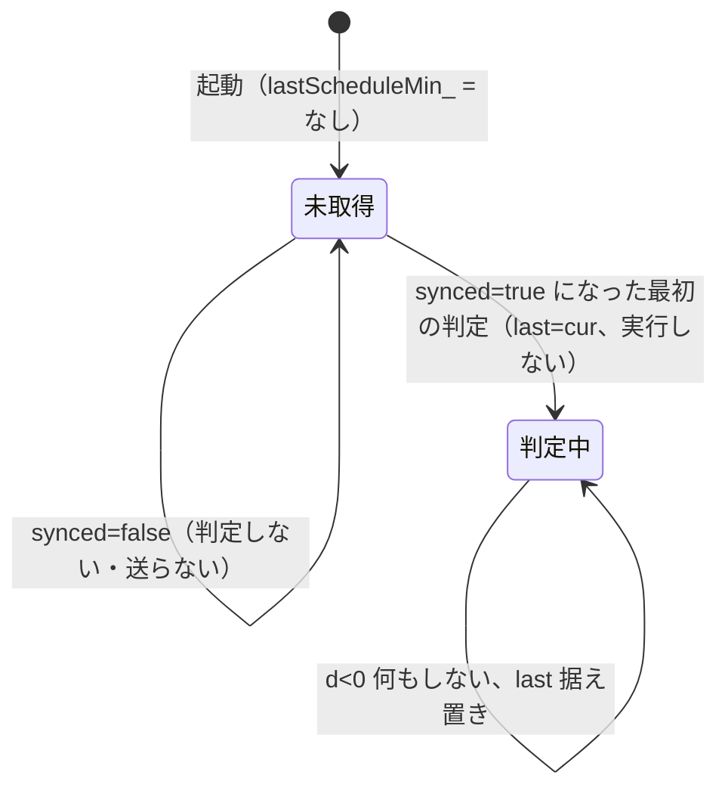

# 詳細設計：スケジュール

作業項目：D-03／要件の原本：`docs/requirements.md` v0.4／要件ID：`docs/req-index.json`（D1 closed 後）／前提：`docs/design/01-architecture.md`（D-01、コミット 75ce1e8）、`docs/design/02-ac-state.md`（D-02、コミット 97efd33）／人の判断：`loop/decisions/D-03.md`

この文書では、`lib/core/src/schedule.h/.cpp` と `lib/core/src/schedule_json.h/.cpp` の中身を決める。あわせて、`Hub::tick` からスケジュールをどう判定・実行するか（D-01 で「D-03 で追加する」とした二重実行防止の記録を含む）を決める。D-01 の名前（`Schedule`・`ScheduleList`・`dueSchedules()`・`schedulesToJson()`・`schedulesFromJson()`・`LocalTime`・`ClockReading`）と依存の向き（`schedule → ac_state, time_types`、`schedule_json → schedule`、ArduinoJson は `schedule_json` と `api` だけ）に従う。

D1 の結果で変わったこと（この文書に関わるもの）：
- 照明（F3）は対象外。スケジュールの対象は**エアコンだけ**（`target` は `"ac"` だけ）。`LightButton`・`sendLight`・照明の JSON（`button`）は無い。
- 風向は作らない（D-01 7a 節）。スケジュールは風向を持たず、JSON の `swingV`・`swingH` を受け付けない。
- F1-VALUES は確定（モード4種、温度 16〜30℃、**自動は温度指定なし**、風量 5 段階：自動・静音（`min`）・弱・中・強）。値は `ac_capabilities.h` の `cap::` だけから読む。
- 本体タイマー（F1-TIMER）は対象外。F4 がその代わり。

HTTP の細部（ステータスの一覧、`/api/status` の形）は D-04、画面は D-05、NTP の設定と `synced` の判定は D-06 が決める。

---

## 対象要件

- [F4] スケジュール：「1. データ構造」（時刻・曜日・対象と操作・有効無効。対象はエアコンだけ）、「3. 登録・編集・削除（一覧の置き換え）」、「4. 実行判定」「5. Hub での実行」（JST で判定し、`AcPatch` を `Hub::applyAc` に通して送る）
- [F4-LIMIT] 上限 10 件（仮）：「1. データ構造」の `kScheduleMax`（`// 仮(F4-LIMIT)`）と「3.3」「6.3」の上限超過時の扱い
- [F4-IO] エクスポート／インポート：「6. JSON の形と検証」（エクスポートファイルの形・`version`・ファイル名、インポートの検証とエラー）
- [N-TIME] NTP・JST、取得前は実行しない：「4.3 時刻が取れていないとき」「5. Hub での実行」、JST への変換は「4.1」
- [N-STATE] メモリのみ：「1.」の `ScheduleList` は `Hub` のメンバ（RAM）。保存・読み込みはしない。再起動で空（「7. 作らないもの」）

---

## 設計

### 0. 全体の考え方

- スケジュールは RAM の固定配列（最大 `kScheduleMax` 件）。再起動で空になる（N-STATE、F4「再起動で消えてよい」）。戻すのはインポートだけ（F4-IO）。
- API は一覧の「まとめて置き換え」だけ（要件5章の `PUT /api/schedules`、`POST /api/schedules/import`）。追加・編集・削除は画面が一覧を組み立て直して `PUT` する（3節）。
- 判定は「分」単位。時刻を引数で受け取る純関数（`jstFromEpochMinute`・`scheduleMatches`・`nextWindow`・`dueSchedules`）で書き、native でテストする。`Hub` は「どの分まで判定したか」（`lastScheduleMin_`）を1つだけ持ち、同じ分を二度判定しないことで二重実行を防ぐ。
- 検証はすべて済ませてから置き換える（全部通るか、何も変えないか）。
- エアコンの値の範囲・選択肢は `cap::` の関数だけで検証する（D-02 1節の決まり）。`schedule.*`・`schedule_json.*` に数値や選択肢を直書きしない。
- 実行は画面からの操作と同じ `Hub::applyAc` を通す（D-02 6節の申し送り）。登録時の検証（1.1）は `AcModel::validate` と同じ順・同じ `cap::` 関数で行い、登録時に通った件が実行時に落ちないようにする。

### 1. データ構造（lib/core/src/schedule.h）

```cpp
// lib/core/src/schedule.h
#pragma once
#include <cstdint>
#include <optional>
#include "ac_state.h"     // AcPatch、AcMode など、cap::（D-02）
#include "time_types.h"   // ClockReading（D-01）

namespace irhub {

constexpr int      kScheduleMax   = 10;    // 仮(F4-LIMIT) 要件「仮に10件」
constexpr uint16_t kScheduleIdMax = 9999;  // ID は 1..9999。0 は「未採番」

// 曜日のビット。bit n = LocalTime::wday n（0=日 … 6=土）
constexpr uint8_t kDayBit(int wday) { return static_cast<uint8_t>(1u << wday); }
constexpr uint8_t kAllDays = 0x7F;

// 対象。要件 F4 の対象はエアコンだけ（F3 照明は対象外）。JSON の "target":"ac" に対応
enum class ScheduleTarget : uint8_t { Ac };

struct Schedule {
  uint16_t       id      = 0;       // 1..kScheduleIdMax。0 は「入力に id が無かった」（replaceAll が採番）
  bool           enabled = true;
  int8_t         hour    = 0;       // 0..23（JST）
  int8_t         minute  = 0;       // 0..59
  uint8_t        days    = 0;       // 曜日ビットの OR。0 は不可（検証で落とす）
  ScheduleTarget target  = ScheduleTarget::Ac;
  AcPatch        ac;                // D-02 の型をそのまま使う。swingV/swingH は常に空（1.1 の規則10・11）
};

enum class ScheduleError : uint8_t {
  None,
  TooMany,               // 件数 > kScheduleMax
  IdOutOfRange,          // id が 1..kScheduleIdMax の外（0 は「無し」扱いで可）
  DuplicateId,           // 同じ id が2件以上
  TimeOutOfRange,        // hour/minute が範囲外
  NoDays,                // days == 0 または kAllDays 以外のビット
  AcPowerMissing,        // エアコンの操作に power が無い
  AcStopHasOtherFields,  // power=false（エアコン停止）なのに他の項目がある
  AcTempWithoutMode,     // temp があるのに mode が無い
  AcTempNotSupported,    // cap::tempSupported(mode) が false（確定値では自動）
  AcTempOutOfRange,      // cap::tempInRange が false
  AcFanNotSupported,     // cap::fanSupported が false（確定値では Max）
  AcSwingVNotSupported,  // swingV に値がある（風向は持たない。値によらず）
  AcSwingHNotSupported,  // swingH に値がある（同上）
};
const char* errorMessage(ScheduleError e);   // 6.4 の表。None は ""

// 1件の検証（id の重複と件数は見ない。それは replaceAll）
ScheduleError validateSchedule(const Schedule& s);

class ScheduleList {
 public:
  int             size() const { return count_; }
  const Schedule& at(int i) const { return items_[i]; }    // 0 <= i < size()。並びは入力の順
  const Schedule* findById(uint16_t id) const;             // 無ければ nullptr

  // 一覧をまとめて置き換える（3節）。n 件すべてを検証し、1件でも駄目なら何も変えずにエラーを返す。
  // *badIndex にはエラーの件の添字（件数・一覧全体のエラーは -1）。成功時は id=0 の件に採番する。
  ScheduleError replaceAll(const Schedule* items, int n, int* badIndex);

 private:
  // 3.2 の規則。引数は取らず、写し終えた items_[0..count_-1] の id と nextId_ だけを見る。
  // 選んだ id を返し、nextId_ を進める（items_ への書き込みは呼び出し側の replaceAll が行う）。
  uint16_t allocateId();
  Schedule items_[kScheduleMax];
  int      count_  = 0;
  uint16_t nextId_ = 1;
};

}  // namespace irhub
```

- `Schedule` 1件はおよそ 30 バイト、`ScheduleList` は 300 バイト余り。ヒープを使わない。
- `ScheduleTarget` は列挙子 `Ac` 1つだけだが、JSON の `target` キー（要件5章の例にある）と1対1にするため型として残す。照明の列挙子は作らない。
- 要件の「エアコン：運転＋モード＋温度など／エアコン停止」を、次の2通りで表す。

| 要件の対象と操作 | target | `ac`（AcPatch）の中身 |
|---|---|---|
| エアコン（運転＋モード＋温度など） | `Ac` | `power = true` 必須。`mode`・`tempC`・`fan` は任意。`tempC` を入れるなら `mode` も必須で、そのモードが温度を指定できること（自動は不可）。`swingV`・`swingH` は空 |
| エアコン停止 | `Ac` | `power = false` だけ |

#### 1.1 validateSchedule の規則（上から順に見て最初に当たったもの）

| 順 | 条件 | 結果 |
|---|---|---|
| 1 | `id > kScheduleIdMax` | `IdOutOfRange` |
| 2 | `hour` が 0..23 の外、または `minute` が 0..59 の外 | `TimeOutOfRange` |
| 3 | `days == 0`、または `days & ~kAllDays` が 0 でない | `NoDays` |
| 4 | `!ac.power` | `AcPowerMissing` |
| 5 | `*ac.power == false` で `mode`/`tempC`/`fan`/`swingV`/`swingH` のどれかがある | `AcStopHasOtherFields` |
| 6 | `tempC` があり `mode` が無い | `AcTempWithoutMode` |
| 7 | `tempC` があり `!cap::tempSupported(*mode)` | `AcTempNotSupported` |
| 8 | `tempC` があり `!cap::tempInRange(*tempC)` | `AcTempOutOfRange` |
| 9 | `fan` があり `!cap::fanSupported(*fan)` | `AcFanNotSupported` |
| 10 | `swingV` に値がある（`Off` でも） | `AcSwingVNotSupported` |
| 11 | `swingH` に値がある（`Off` でも） | `AcSwingHNotSupported` |
| — | どれにも当たらない | `None` |

- 無効（`enabled=false`）の件も同じく検証する。
- D-02 4節の `AcModel::validate` との対応：規則7・8 は D-02 の順2（`TempNotSupported`）→順3（`TempOutOfRange`）と同じ順、規則9 は順4 と同じ `cap::fanSupported`。違いは、D-02 は「パッチに mode が無ければ今のモード」で温度可否を見るのに対し、この文書は規則6 で **mode を必須**にして、登録時に今のモードに左右されずに決める点。このため規則7 は D-02 の順2 と同じ結果になり、登録時に通った件が実行時に `AcModel::validate` で落ちることはない（D-02 6節の申し送り「登録時に弾く」「特に自動＋温度」に応える）。`AcModel::validate` は今のモードに依存するので登録時には使わない。
- 確定値での例：`{power:true, mode:auto}` は通る（自動は温度無しで指定）。`{power:true, mode:auto, temp:24}` は規則7 で `AcTempNotSupported`。`{power:true, mode:cool, temp:31}` は規則8。`{power:true, fan:min}`（静音）は通る。`{power:true, fan:max}` は規則9。
- 規則10・11 は風向を「持たない」ことの守り（D-01 7a）。`cap::swingVSupported(Off)` は true なので `cap::` の検査では `Off` が通ってしまう。スケジュールは風向を一切持たないので、値の有無だけで落とす。JSON から来た件は 6.1 の「知らないキー」で先に落ちるので、ここに当たるのは `replaceAll` を直接呼んだ場合だけ。
- 実行時のパッチは風向を埋めないので、実行で変わるのは運転・モード・温度・風量だけ。状態の風向は常に `Off` のまま（D-02 1節）。

### 2. 時刻の型（lib/core/src/time_types.h への追加）

D-01 の `LocalTime`・`ClockReading` はそのまま使う（名前・フィールドは変えない）。判定用に「分」の値型を1つ足す。

```cpp
// lib/core/src/time_types.h に追加
namespace irhub {

constexpr int64_t kJstOffsetMin = 9 * 60;   // JST = UTC+9。日本に夏時間は無いので固定

// ある1分の JST での曜日と時分
struct JstMinute {
  int8_t wday;    // 0=日 … 6=土
  int8_t hour;    // 0..23
  int8_t minute;  // 0..59
};

}  // namespace irhub
```

「分の番号」は `epochMin = epochSec / 60`（UNIX 時刻の分。JST のずれ 540 分は分の境目を変えない）で表す。`synced == true` のとき `epochSec` は 2020 年以降の正の値（D-06 の `synced` の判定に任せる）なので、負の数の割り算は考えない。

### 3. 登録・編集・削除（一覧の置き換え）

#### 3.1 replaceAll(items, n, badIndex) の手順

手順は「検証 → 一覧を写す → `nextId_` を入力 id の後ろへ進める → id の無い件に採番」の順（人の判断 `loop/decisions/D-03.md` の2）。

1. `n > kScheduleMax` なら `TooMany`（`*badIndex = -1`）。
2. `i = 0..n-1` について `validateSchedule(items[i])`。最初のエラーで返す（`*badIndex = i`）。
3. `id != 0` の件どうしで同じ id があれば `DuplicateId`（`*badIndex` は2件目の添字）。
4. ここまで通ったら、`items` を `items_` に写し、`count_ = n`。
5. 入力の `id != 0` の件の最大値を `maxId` とする（1件も無ければこの手順は飛ばす）。`maxId >= nextId_` なら `nextId_ = (maxId == kScheduleIdMax) ? 1 : maxId + 1`。
6. `items_` の `id == 0` の件に、入力の順に `items_[i].id = allocateId()` で採番する（3.2。使用中の id は飛ばす）。`allocateId()` は引数を取らず `items_[0..count_-1]` を見るので、先に採番した件の id も「使用中」になる。
7. `None` を返す。

1〜3 のどれかで返ったときは、`items_`・`count_`・`nextId_` を変えない。

#### 3.2 ID の採番

- 入力に id がある件は、その id をそのまま使う（エクスポート→インポートで id が変わらない。画面は編集した件の id を付けて送り返す）。
- 入力に id が無い件（画面で新しく追加した件）は採番する。
- 採番の前に（3.1 の手順5）、入力 id の最大値が `nextId_` 以上なら `nextId_` を「最大値 + 1」にする。最大値が `kScheduleIdMax`（9999）なら 1 にする。インポートした id の後ろから採番し、消した件の id をすぐに使い回さないため。
- 採番（3.1 の手順6、`allocateId()`）：`nextId_` から始めて、今の `items_[0..count_-1]`（手順4で写した後の一覧）で使われていない最初の id を選ぶ（入力にあった id と、この回ですでに採番した id を飛ばす）。`kScheduleIdMax` の次は 1 に戻る。件数は最大 `kScheduleMax` なので必ず見つかる。選んだ後、`nextId_` を「選んだ id + 1」にする（`kScheduleIdMax` の次は 1）。
- `nextId_` は RAM だけ。再起動で 1 に戻る（N-STATE）。

例（上から順に続けて行う行と、独立の行がある。「前の一覧」と `nextId_` がその行の前提）：

| 前の一覧 | nextId_ | 入力（id） | 手順5の後の nextId_ | 後の一覧（id） | 後の nextId_ |
|---|---|---|---|---|---|
| 空 | 1 | `[無, 無]` | 1（入力 id 無し） | `[1, 2]` | 3 |
| `[1, 2]` | 3 | `[1, 無]`（2を削除し1件追加） | 3（1 < 3） | `[1, 3]` | 4 |
| 空（再起動直後） | 1 | インポート `[5, 7]` | 8 | `[5, 7]` | 8 |
| `[5, 7]` | 8 | `[7, 無]` | 8（7 < 8） | `[7, 8]` | 9 |
| 空（再起動直後） | 1 | `[5, 無]` | 6 | `[5, 6]` | 7 |
| 空（再起動直後） | 1 | インポート `[9999]` | 1（最大が 9999） | `[9999]` | 1 |
| `[9999]` | 1 | `[9999, 無]`（最大 id 9999 のあとに1件足す） | 1（最大が 9999） | `[9999, 1]` | 2 |
| `[9999, 1]` | 2 | `[9999, 1, 無]` | 1（最大が 9999） | `[9999, 1, 2]`（1 は使用中なので飛ばす） | 3 |

#### 3.3 画面からの登録・編集・削除（F4）

要件5章の API は一覧の置き換え（`PUT /api/schedules`）だけなので、画面の操作はすべて次の形になる（画面の詳細は D-05）。

| 画面の操作 | 画面がすること |
|---|---|
| 追加 | 今の一覧の末尾に id 無しの件を足して `PUT` |
| 編集 | 該当 id の件を書き換えた一覧を `PUT` |
| 削除 | 該当 id の件を除いた一覧を `PUT` |
| 有効／無効の切り替え | `enabled` を変えた一覧を `PUT` |

- 画面は一覧が `max` 件（`GET` の応答、6.1）に達したら追加ボタンを無効にする。サーバーも `kScheduleMax + 1` 件以上は 400（6.3 の順6）を返す（上限超過の扱い）。超えた分だけ捨てて受け付けることはしない。
- 応答は置き換え後の一覧（採番済みの id 付き）なので、画面はそれで描き直す。
- 画面が作るエアコンの操作の選択肢（モード・温度・風量）は `/api/status` の `acCapabilities`（D-02 8節）から作る。温度の入力は `tempModes` に入っているモードのときだけ出す（自動では温度を出さない。出すと 400 になる）。風向の入力は置かない。

### 4. 実行判定（純関数、lib/core/src/schedule.h/.cpp）

```cpp
// lib/core/src/schedule.h（続き）
namespace irhub {

constexpr uint32_t kScheduleCheckIntervalMs = 1000;  // 判定の間隔（推測：1秒）
constexpr int64_t  kScheduleCatchUpMinutes  = 5;     // 遅れて判定したとき、遡って判定する最大の分数（推測）

// UNIX 時刻の分番号 → JST の曜日・時・分
JstMinute jstFromEpochMinute(int64_t epochMin);

// s がその分に実行すべきか：enabled、かつ days に t.wday のビット、かつ hour/minute が一致
bool scheduleMatches(const Schedule& s, const JstMinute& t);

// 前回判定した分と今の分から、今回判定する分の範囲 [from, to] を決める（4.2 の表）
struct MinuteWindow {
  int64_t from;     // from > to なら判定しない
  int64_t to;
  int64_t newLast;  // 判定後に Hub が lastScheduleMin_ に入れる値
};
MinuteWindow nextWindow(std::optional<int64_t> lastMin, int64_t curMin);

// [fromMin, toMin] の各分について、一覧の順に scheduleMatches を調べ、当たったものを out に入れる。
// 並び：分の昇順、同じ分の中は一覧の順。戻り値は入れた件数（cap を超えた分は捨てる）。
struct DueEntry {
  uint16_t id;
  int64_t  epochMin;
};
int dueSchedules(const ScheduleList& list, int64_t fromMin, int64_t toMin, DueEntry* out, int cap);

}  // namespace irhub
```

#### 4.1 jstFromEpochMinute

```
m        = epochMin + kJstOffsetMin
dayNo    = m / 1440                // 1970-01-01（JST）からの日数
minOfDay = m % 1440
wday     = (dayNo + 4) % 7         // 1970-01-01 は木曜（4）
hour     = minOfDay / 60
minute   = minOfDay % 60
```

実例：`epochSec = 1790334000`（2026-09-25 20:00:00 JST、金曜）→ `epochMin = 29838900` → `{wday=5, hour=20, minute=0}`。

`ClockReading::local`（D-06 が `time()`＋`localtime_r()` から作る）は画面の時刻表示とエクスポートの `exportedAt` に使い、判定には使わない。判定は `epochSec` だけから作る（遡って判定する分の曜日・時分も同じ式で作れるため）。

#### 4.2 nextWindow の規則（二重実行の防止と、遅れて判定した場合）

`d = curMin - lastMin` とする。

| 場面 | 条件 | from, to | newLast | 意味 |
|---|---|---|---|---|
| NTP 取得後はじめての判定 | `lastMin` が無い | 判定しない | `curMin` | 取得前・取得した分の予定は遡らない（N-BOOT、D-01 10節の4） |
| 同じ分の2回目以降 | `d == 0` | 判定しない | `curMin` | **二重実行の防止**。1分に何回判定しても1回だけ |
| 普通に次の分へ | `d == 1` | `curMin, curMin` | `curMin` | その分を判定 |
| 遅れて判定（`loop()` が止まっていた等） | `2 <= d <= kScheduleCatchUpMinutes` | `lastMin+1, curMin` | `curMin` | 飛ばした分も判定する（取りこぼさない） |
| 大きく進んだ（NTP の補正、長い停止） | `d > kScheduleCatchUpMinutes` | `curMin, curMin` | `curMin` | 今の分だけ判定。古い分は遡らない |
| 時計が戻った（NTP の補正） | `d < 0` | 判定しない | `lastMin`（据え置き） | 戻った先から元の分までは判定しない。元の分を過ぎてから再開する |

- 1件の予定は1日に1分だけ当たる。遡る範囲は最大 5 分なので、1回の判定で同じ件が2回当たることはない。よって `dueSchedules` の `cap` は `kScheduleMax`（10）で足りる。
- 時計が戻ったときに `newLast` を `lastMin` のまま据え置く理由：`curMin` にすると、07:00 の判定を済ませた後に 06:59:50 へ戻った場合、次の 07:00 が `d == 1` になって**もう一度当たる**。据え置けば、07:00 は `d == 0` となり二度目は実行しない。
- 判定の間隔は 1 秒（`kScheduleCheckIntervalMs`）。予定の時刻が来てから遅くとも約 1 秒で送る。`loop()` が 1 分以上止まることは想定しない（D-01 で `delay()` による長い停止を禁じている）が、止まった場合でも 5 分までは取りこぼさない。

状態遷移（`Hub` の `lastScheduleMin_`）：



#### 4.3 時刻が取れていないとき（N-TIME）

- `ClockReading::synced == false` の間は、`nextWindow` も呼ばず、何も送らない。`lastScheduleMin_` は無いまま。
- D-01 の定義では `synced` は「一度でも取れていれば true」なので、取得後に NTP との通信が途切れても ESP32 の内部時計で判定を続ける。
- 画面の警告：`/api/status` に `synced` を載せ、画面が「時刻未取得のためスケジュールは実行されません」と出す。キー名と文言は D-04／D-05 が決める（この文書は `Hub::clockNow().synced` が判断材料であることだけを決める）。
- 時刻が取れていない間も、スケジュールの登録・編集・削除・インポート・エクスポートは受け付ける（再起動直後、NTP を待たずにインポートして戻せるように）。エクスポートの `exportedAt` は `null` になる（6.2）。

### 5. Hub での実行（lib/core/src/hub.h/.cpp への追加）

D-01 の `Hub` に次を足す（D-01 5節「スケジュールの二重実行防止のための記録は D-03 で追加する」）。

```cpp
// lib/core/src/hub.h（追加分）
class Hub {
 public:
  // PUT /api/schedules と POST /api/schedules/import はこれを使う（schedules().replaceAll を直接呼ばない）。
  // schedules_.replaceAll(items, n, badIndex) を呼んで結果を返すだけ。送信も lastScheduleMin_ の更新もしない（5.2）。
  ScheduleError replaceSchedules(const Schedule* items, int n, int* badIndex);
  // D-01 の ScheduleList& schedules() はそのまま（GET とエクスポートの読み取りに使う）
 private:
  void runSchedules(const ClockReading& now);   // 4.2 の判定と実行
  void runOne(const Schedule& s);               // 5.1

  bool                   scheduleCheckedOnce_  = false;
  uint32_t               lastScheduleCheckMs_  = 0;
  std::optional<int64_t> lastScheduleMin_;      // 判定済みの最後の分（epochMin）。無し＝NTP 取得後まだ判定していない
};
```

`Hub::tick(nowMs)` のスケジュール部分：

```cpp
if (!scheduleCheckedOnce_ || static_cast<uint32_t>(nowMs - lastScheduleCheckMs_) >= kScheduleCheckIntervalMs) {
  scheduleCheckedOnce_ = true;
  lastScheduleCheckMs_ = nowMs;
  const ClockReading now = clock_.now();   // tick の中で1回だけ
  if (now.synced) runSchedules(now);       // N-TIME：取れていなければ何もしない
}
```

`runSchedules(now)`：

```cpp
const int64_t cur = now.epochSec / 60;
const MinuteWindow w = nextWindow(lastScheduleMin_, cur);
lastScheduleMin_ = w.newLast;              // 先に進めてから送る（送信中に再入しても同じ分を二度実行しない）
if (w.from > w.to) return;
DueEntry due[kScheduleMax];
const int n = dueSchedules(schedules_, w.from, w.to, due, kScheduleMax);
for (int i = 0; i < n; ++i) {
  if (const Schedule* s = schedules_.findById(due[i].id)) runOne(*s);
}
```

#### 5.1 runOne（1件の実行）

```cpp
void Hub::runOne(const Schedule& s) {
  // target は Ac だけ。画面からの操作と同じ検証・更新・送信の流れ（D-02 6節）
  applyAc(s.ac, nullptr);   // 戻り値・エラー文言は使わない
}
```

- `s.ac` は必ず `power` を含む（1.1 の規則4）ので、`Hub::applyAc` の送信条件（`patch.power.has_value()`）に当たり、検証が通れば `sendAc(状態一式)` をちょうど1回呼ぶ。エアコン停止（`{power:false}`）も、今が停止中かどうかによらず1回送る（D-02 疑問9 と同じ動き）。
- 検証で落ちた場合（1.1 により起きない想定）は、状態は変わらず送らない（D-02 6節）。
- D-01 10節の決まり2（`sendAc` を呼んでよいのは `Hub::applyAc` と `Hub::tick` のスケジュール実行）を守る。`runOne` は `tick` からだけ呼ばれ、送信は `applyAc` の中の1か所。
- エアコンは画面からの操作と同じ `AcModel` を更新する。スケジュールで暖房 20℃ にしたら、画面にもその状態が出る。モードを変えたときの復元（D-02 4節）も同じ規則。例：`{power:true, mode:heat}` だけの予定は、暖房の最後の設定（温度・風量）で運転する。
- 同じ分に複数件が当たったら、一覧の順に続けて `applyAc` する（後の件の設定が最終の状態になる）。送信の間隔は空けない（推測）。
- 送信の戻り値は見ない（D-01 5節と同じ考え方）。実行の記録（ログ・履歴）は持たない。

#### 5.2 置き換えと同じ分の扱い

人の判断（`loop/decisions/D-03.md` の1、案(c)）に従う。

- `replaceSchedules` は `schedules_.replaceAll(...)` を呼ぶだけ。`clock_.now()` も `runSchedules` も呼ばず、IR も送らず、`lastScheduleMin_` も変えない。
- これで D-01 10節の決まり2 をそのまま守る。
- 各分に何を実行するかは、`Hub::tick` がその分を判定した時点の一覧で決まる。置き換えの前後で次のようになる。

| 置き換えた時刻 | その分（例 07:00）の判定 | 07:00 の予定 |
|---|---|---|
| `tick` が 07:00 を判定した後（例 07:00:20） | 済み（`lastScheduleMin_` = 07:00）。置き換え後も d==0 で判定しない | 新しい一覧の 07:00 の件は、その日は実行しない（次に当たる曜日から） |
| 分の変わり目から `tick` が 07:00 を判定する前（1秒の判定間隔の内、例 07:00:00.4） | まだ | 新しい一覧で判定される。新しい一覧に 07:00 の件があれば実行、古い一覧にだけあった件は実行しない |
| `loop()` が止まっていて未判定の分がある（4.2 の遅れ） | まだ | 遡って判定する分も、判定した時点の（新しい）一覧で決まる |

- 置き換えが検証で失敗したときは一覧も `lastScheduleMin_` も変わらない（3.1）。

### 6. JSON の形と検証（lib/core/src/schedule_json.h/.cpp）

```cpp
// lib/core/src/schedule_json.h
#pragma once
#include <string>
#include <string_view>
#include "schedule.h"
#include "time_types.h"

namespace irhub {

constexpr int    kScheduleExportVersion = 1;      // エクスポートファイルの版（要件5章の例）
constexpr size_t kScheduleJsonMaxBytes  = 8192;   // 本文の上限（推測。10件の実寸は 2KB 程度）

enum class ScheduleJsonKind : uint8_t {
  List,    // GET/PUT /api/schedules
  Export,  // GET /api/schedules/export、POST /api/schedules/import
};

// 一覧 → JSON 文字列。kind==Export のときだけ now を使う（exportedAt）
std::string schedulesToJson(const ScheduleList& list, ScheduleJsonKind kind, const ClockReading& now);

struct ScheduleParseResult {
  Schedule    items[kScheduleMax];
  int         count = 0;
  std::string error;    // 失敗時の理由（6.4）。成功時は空
};
// JSON 文字列 → Schedule の配列。形・型・文字列・件数・1件ごとの validateSchedule まで確かめる。
// id の重複は確かめない（Hub::replaceSchedules → replaceAll が DuplicateId を返す）。
bool schedulesFromJson(std::string_view body, ScheduleJsonKind kind, ScheduleParseResult* out);

// エクスポートのファイル名（ApiResponse::downloadFilename）
std::string exportFilename(const ClockReading& now);

// LocalTime → "YYYY-MM-DDTHH:MM:SS+09:00"（ゼロ埋め、6.2 の exportedAt と同じ書式）。
// schedulesToJson の exportedAt はこれで作る。api の /api/status の時刻もこれを使ってよい（D-04）。
// synced の確かめは呼ぶ側で行う（未取得なら呼ばずに null を書く）。
std::string formatJstIso(const LocalTime& t);

}  // namespace irhub
```

`formatJstIso` の作り方：`char buf[32]; snprintf(buf, sizeof buf, "%04d-%02d-%02dT%02d:%02d:%02d+09:00", t.year, t.month, t.day, t.hour, t.minute, t.second);` を `std::string` にして返す（各フィールドは `int` に上げて渡す）。値の範囲は確かめない（`LocalTime` は D-06 が作る正しい値の前提）。

文字列 ⇔ 列挙は D-02 2節の `parseAcMode`・`parseAcFan`・`toString` だけを使う（`schedule_json` に文字列表を持たない）。`parseAcSwingV`・`parseAcSwingH` は使わない。

使う ArduinoJson v7 の API：`JsonDocument`、`deserializeJson(doc, const char* input, size_t inputSize)`（戻り値 `DeserializationError`、`if (err)` で失敗判定）、`JsonVariant::is<T>()`（`bool`・`int`・`const char*`・`JsonArray`・`JsonObject`）、`as<T>()`、`JsonObject` の `for (JsonPair kv : obj)` と `kv.key().c_str()`、`JsonArray::size()`、`to<JsonObject>()`/`add<JsonObject>()`、`serializeJson(doc, std::string&)`。

要確認：
- `is<int>()` が `26.5`・`1.5`・`1e10`・`true`・`"1"`・`null` に対して false を返すこと（v7 の挙動として期待。test_schedule で確かめ、false にならなければ `is<float>` と整数判定を自前で行う）。
- `is<long long>()` が使えること（`ARDUINOJSON_USE_LONG_LONG` が native・ESP32 とも有効か）。使えなければ 6.1 の id の手順4を省き、`int` に入らない整数は手順5の `must be integer` になる（どちらでも 400 で、一覧は変わらない）。
- `serializeJson` に `std::string` を渡す機能（`ARDUINOJSON_ENABLE_STD_STRING`）が ESP32 の Arduino ビルドでも有効なこと。native では有効。無効なら `measureJson` で長さを取り `char` バッファに書いて `std::string` にする。

#### 6.1 1件の形と一覧（kind=List）

1件の形（要件5章の例と同じキー。エクスポートでも同じ）：

```json
{ "id": 1, "enabled": true, "time": "07:00", "days": ["mon","tue","wed","thu","fri"],
  "target": "ac", "action": { "power": true, "mode": "heat", "temp": 20 } }
```

```json
{ "id": 2, "enabled": true, "time": "23:30", "days": ["sun","mon","tue","wed","thu","fri","sat"],
  "target": "ac", "action": { "power": false } }
```

```json
{ "id": 3, "enabled": false, "time": "06:45", "days": ["sat","sun"],
  "target": "ac", "action": { "power": true, "mode": "auto", "fan": "min" } }
```

（3件目は自動・静音。自動は温度指定なしなので `temp` を付けない。付けると `temp not supported in this mode` で 400）

| キー | 型 | 必須 | 規則 |
|---|---|---|---|
| `id` | 整数 | 任意 | 1..`kScheduleIdMax`（9999）。`uint16_t` に詰める前に確かめる（下の手順）。無い件は `Schedule::id = 0` として採番（3.2）。出力では必ず付ける |
| `enabled` | bool | 必須 | |
| `time` | 文字列 | 必須 | `"HH:MM"` の5文字。`HH` は 00..23、`MM` は 00..59、どちらも2桁の数字。`"7:00"`、`"07:00:00"`、`"24:00"` は不可 |
| `days` | 文字列の配列 | 必須 | `sun` `mon` `tue` `wed` `thu` `fri` `sat` のどれか。1個以上、重複不可。出力は日曜から土曜の順 |
| `target` | 文字列 | 必須 | `ac` だけ。それ以外（旧版の `light` を含む）は `unknown target` |
| `action` | オブジェクト | 必須 | キーは `power`（bool、必須）、`mode`・`fan`（文字列。D-02 2節の表の `parseAcMode`・`parseAcFan`）、`temp`（整数）の4つだけ。`swingV`・`swingH`・`button` などは「知らないキー」。規則は 1.1 |

`action` の各キーの確かめ方（形・型は schedule_json、値の可否は 1.1）：

| キー | 形・型のエラー（schedule_json） | 値のエラー（1.1、順8） |
|---|---|---|
| `power` | 無い → `action.power: missing`、bool でない → `action.power: must be boolean` | 停止に他のキー → `ac stop takes only power` |
| `mode` | 文字列でない → `must be string`、`parseAcMode` が nullopt → `unknown mode` | —（4モードとも選べる） |
| `temp` | `is<int>()` でない → `must be integer` | mode 無し → `temp requires mode`、自動 → `temp not supported in this mode`、範囲外 → `temp out of range` |
| `fan` | 文字列でない → `must be string`、`parseAcFan` が nullopt → `unknown fan` | `max` など選択肢の外 → `fan not supported` |

`id` の確かめ方（人の判断 `loop/decisions/D-03.md` の3。schedule_json の中で、`Schedule::id`（`uint16_t`）に代入する前に行う）：

| 順 | 条件 | 結果 |
|---|---|---|
| 1 | キー `id` が無い | `id = 0`（採番される） |
| 2 | `v.is<int>()` が true で、`1 <= v.as<int>() <= kScheduleIdMax` | `id = static_cast<uint16_t>(v.as<int>())` |
| 3 | `v.is<int>()` が true で、上の範囲の外（0、-1、10000、70000 など） | 400 `schedules[<i>].id: out of range` |
| 4 | `v.is<int>()` が false で、`v.is<long long>()` が true（`int` に入らない整数。例 10000000000） | 400 `schedules[<i>].id: out of range` |
| 5 | それ以外（小数 `1.5`、文字列 `"1"`、真偽値、`null`、配列、オブジェクト） | 400 `schedules[<i>].id: must be integer` |

- `"id": 0` を「無し」とみなして採番することはしない（0 は範囲外で 400）。
- この確かめは 6.3 の順7（形・型）で行う。よって JSON から来た件で 1.1 の `IdOutOfRange` に当たることはない（`IdOutOfRange` は `replaceAll` を直接呼ぶ場合の守り）。

- 1件と `action` の中に表に無いキーがあれば 400（打ち間違い・作っていない項目（風向・照明のボタン・本体タイマー）に気付けるように）。一番外側（`schedules` の外）の知らないキーは無視する。
- 1件の中のキーは次の順で見る（結果を決まった形にするため。本文の中の順ではない）：知らないキー（本文の中で最初のもの）→ `id` → `enabled` → `time` → `days` → `target` → `action`。`action` の中は知らないキー → `power` → `mode` → `temp` → `fan`。
- `action` の出力は、値のあるキーだけを書く（`AcPatch` の `std::optional` が空のキーは出さない）。キーの順は `power, mode, temp, fan`。`swingV`・`swingH` は出さない（1.1 の規則10・11 により常に空）。
- `temp` のキー名は `/api/ac` と同じ `temp`（D-02 の `AcPatch::tempC` に入れる）。
- 風量の文字列は D-02 2節の表のまま（静音は `min`）。

`GET /api/schedules` の応答と `PUT /api/schedules` の本文（キー名の最終確定は D-04）：

```json
// GET /api/schedules → 200、PUT /api/schedules 成功時の応答も同じ形（採番済み）
{ "max": 10, "schedules": [ { "id": 1, "enabled": true, "time": "07:00", "days": ["mon"], "target": "ac", "action": { "power": true } } ] }

// PUT /api/schedules の本文（max は付けても無視する）
{ "schedules": [ { "enabled": true, "time": "07:00", "days": ["mon"], "target": "ac", "action": { "power": true } } ] }
```

`max` は `kScheduleMax`。画面は上限を直書きせず、これを使う（F4-LIMIT が変わっても画面を直さずに済む）。

#### 6.2 エクスポートファイル（kind=Export）と version

```json
{
  "version": 1,
  "exportedAt": "2026-09-25T20:00:00+09:00",
  "schedules": [
    { "id": 1, "enabled": true, "time": "07:00", "days": ["mon","tue","wed","thu","fri"],
      "target": "ac", "action": { "power": true, "mode": "heat", "temp": 20 } },
    { "id": 2, "enabled": true, "time": "23:30", "days": ["sun","mon","tue","wed","thu","fri","sat"],
      "target": "ac", "action": { "power": false } }
  ]
}
```

- キーは `version`・`exportedAt`・`schedules` の3つ（要件5章の例どおり）。`max` は入れない。
- `version`：整数 `kScheduleExportVersion`（今は 1）。1件の形や意味を変えたら 2 に上げる。対象がエアコンだけになったことは、要件5章の例（`target: "ac"`）の形の中なので版は上げない（旧版の照明の件は 6.3 で 400 になる。まだ実装前でそのファイルは存在しない）。
- `exportedAt`：`synced` なら `formatJstIso(now.local)`（`"YYYY-MM-DDTHH:MM:SS+09:00"`、ゼロ埋め）。`synced == false` のときは `null`。インポートでは読まない（有っても無くても、`null` でもよい）。
- 応答：200、`contentType = "application/json"`、`downloadFilename = exportFilename(now)`。
- ファイル名：`synced` なら `irhub-schedules-YYYYMMDD-HHMM.json`（例 `irhub-schedules-20260925-2000.json`）、そうでなければ `irhub-schedules.json`。
- 0 件でもエクスポートできる（`"schedules": []`）。

#### 6.3 インポート（POST /api/schedules/import）の検証

本文はエクスポートファイルの中身そのもの（画面の JS がファイルを読んで JSON 本文として送る。確定は D-04／D-05）。

検証の順（最初のエラーで 400 `{"error": "..."}`、一覧は変えない）：

| 順 | 見ること | エラー文言 |
|---|---|---|
| 1 | 本文の長さ ≤ `kScheduleJsonMaxBytes` | `body too large` |
| 2 | JSON として読める、一番外側がオブジェクト | `invalid json` |
| 3 | `version` がある | `version missing` |
| 4 | `version` が整数で `kScheduleExportVersion` と等しい | `unsupported version` |
| 5 | `schedules` があり配列 | `schedules missing` |
| 6 | `schedules` の件数 ≤ `kScheduleMax` | `too many schedules (max 10)`（数は `kScheduleMax` から作る。6.4） |
| 7 | 各件の形・型・文字列（6.1 の表） | `schedules[<i>].<キー>: <理由>`（6.4） |
| 8 | 各件の `validateSchedule` | `schedules[<i>]: <errorMessage>` |
| 9 | id の重複（`replaceAll`） | `schedules[<i>]: duplicate id` |

- 順7・8 は件ごとに行う（件 0 の 7→8、件 1 の 7→8 …）。最初に見つかったエラーを返す。
- 順9 の文言は ApiRouter（D-04）が組み立てる：`Hub::replaceSchedules` が返した `DuplicateId` と `badIndex` から `"schedules[" + badIndex + "]: " + errorMessage(DuplicateId)` を作る（`badIndex < 0` のときは `errorMessage(e)` だけ）。`ScheduleList`・`Hub` は文字列を作らない。
- `PUT /api/schedules`（kind=List）も同じ検証で、3・4 を行わない（`version` があっても無視する）。
- 上限超過（6）は一部だけ取り込むことをしない。ファイル全体を拒否し、今の一覧はそのまま。
- 成功したら一覧は**ファイルの内容で置き換わる**（今ある件と混ぜない。要件5章「置き換える」）。応答は 6.1 の一覧の形（200）。
- 今のファームで使えない値を含むファイルは 400 になり、どの件のどの値かが文言で分かる：`"target":"light"` → `schedules[i].target: unknown target`、`action` の `swingV` → `schedules[i].action: unknown key "swingV"`、`"fan":"max"` → `schedules[i]: fan not supported`、自動に `temp` → `schedules[i]: temp not supported in this mode`。

#### 6.4 エラー文言

`<i>` は 0 始まりの添字。`ScheduleError` の `errorMessage`：

| ScheduleError | 文字列 |
|---|---|
| None | `""` |
| TooMany | `too many schedules`（数は入れない。下の注） |
| IdOutOfRange | `id out of range` |
| DuplicateId | `duplicate id` |
| TimeOutOfRange | `time out of range` |
| NoDays | `no days` |
| AcPowerMissing | `power required` |
| AcStopHasOtherFields | `ac stop takes only power` |
| AcTempWithoutMode | `temp requires mode` |
| AcTempNotSupported | `temp not supported in this mode`（D-02 の `TempNotSupported` と同じ文字列） |
| AcTempOutOfRange | `temp out of range`（D-02 と同じ） |
| AcFanNotSupported | `fan not supported`（D-02 と同じ） |
| AcSwingVNotSupported | `swingV not supported` |
| AcSwingHNotSupported | `swingH not supported` |

注（件数の文言の作り方）：`errorMessage` は `const char*` の固定文字列を返すので、数を含めない。6.3 の順6は schedule_json が `char buf[48]; snprintf(buf, sizeof buf, "too many schedules (max %d)", kScheduleMax);` で組み立てて `ScheduleParseResult::error` に入れる（`kScheduleMax` が変われば文言も変わる）。`replaceAll` が `TooMany` を返すのは `replaceAll` を直接呼ぶ場合だけ（JSON から来た件は順6で先に落ちる）で、そのときの文言は `too many schedules` のまま。

schedule_json が形・型で返す文言（6.3 の順7 の `<キー>: <理由>`）：

| 場面 | 文言の例 |
|---|---|
| 件がオブジェクトでない | `schedules[2]: not an object` |
| `id` が整数でない（`1.5`、`"1"`、`true`、`null`） | `schedules[0].id: must be integer` |
| `id` が 1..`kScheduleIdMax` の外（`0`、`-1`、`10000`、`70000`） | `schedules[0].id: out of range` |
| 必須キーが無い | `schedules[0].time: missing`、`schedules[0].action.power: missing` |
| 型が違う | `schedules[0].enabled: must be boolean`、`schedules[0].action.temp: must be integer`、`schedules[0].action.mode: must be string`、`schedules[0].action: must be object` |
| `time` の書式 | `schedules[0].time: must be HH:MM` |
| 知らない文字列 | `schedules[1].days: unknown day "mo"`、`schedules[0].target: unknown target`、`schedules[0].action.mode: unknown mode`、`schedules[0].action.fan: unknown fan` |
| 曜日の重複・空 | `schedules[1].days: duplicate day`、`schedules[1].days: empty` |
| 知らないキー | `schedules[0]: unknown key "note"`、`schedules[0].action: unknown key "swingV"`、`schedules[0].action: unknown key "button"` |

文言は英語の短い文にそろえる（D-02 の `errorMessage` と同じ流儀）。画面は `error` をそのまま表示する。文言に `"` を含むものがあるので、エラー本文の JSON は ApiRouter が ArduinoJson で組み立てる（D-04）。

### 7. 作らないもの

| 作らないもの | 理由 |
|---|---|
| スケジュール・`nextId_`・`lastScheduleMin_` のフラッシュ保存、起動時の自動読み込み | やらないこと（永続化）、N-STATE。戻すのはインポートだけ |
| 1件ずつの追加・削除 API（`POST /api/schedules/<id>` など） | 要件5章の API に無い。画面が一覧を置き換える（3.3） |
| 照明の予定（`target: "light"`、`button`、`LightButton`、`sendLight`） | F3 対象外・やらないこと（照明の操作） |
| 風向の予定（`action` の `swingV`・`swingH`） | D1 で風向は作らない（D-01 7a） |
| 実行履歴・実行結果の通知 | やらないこと（通知）。要件に無い |
| 室温を条件にした予定 | やらないこと（自動運転） |
| 1回だけの予定（日付指定）、秒単位の時刻、祝日 | 要件の1件の中身は「時刻、曜日」だけ |
| 本体タイマーを使った予定 | F1-TIMER 対象外。F4 は ESP32 が時刻に送る方式だけ（これが本体タイマーの代わり） |
| NTP 取得前・起動前に過ぎた予定の後追い実行 | N-TIME、N-BOOT（4.2） |
| 旧版ファイル（照明の件を含む）の読み替え | 実装前で旧版のファイルは存在しない。来たら 400（6.3） |

---

## 仮・未決の扱い

この文書の対象に **未決** の要件は無い（F1-VALUES は D1 で決定、F1-TIMER・F3 は対象外）。

| 要件・値 | 状態 | この文書での扱い | 変わったときに直す場所 |
|---|---|---|---|
| F4-LIMIT（10件） | 仮 | `schedule.h` の `kScheduleMax = 10`（`// 仮(F4-LIMIT)`）の1か所。エラー文言の数、`GET` の `max`、`dueSchedules` の `cap` はすべてこの定数から作る。画面は `max` を受け取る | `kScheduleMax` の値だけ。RAM は1件約 30 バイトなので数十件でも問題ない |
| N-TIME | 仮 | `synced == false` の間は判定も送信もしない（4.3、`Hub::tick`）。取得後はじめての判定では実行しない（4.2） | 方針が変わったら `Hub::tick` のスケジュール部分と `nextWindow` の最初の行だけ。`synced` の判定そのものは D-06（`src/clock_esp32.cpp`） |
| 判定の間隔 1 秒・遡る分数 5 分・本文の上限 8192 バイト | 要件に数値なし（推測） | `kScheduleCheckIntervalMs`・`kScheduleCatchUpMinutes`（schedule.h）、`kScheduleJsonMaxBytes`（schedule_json.h） | それぞれの定数1つ |
| API（仮） | 仮 | キー名・形の案を 6.1〜6.3 に置いた | D-04 が変えたら `schedule_json.cpp`（とこの文書） |
| F1-VALUES | 決定（D1） | スケジュールのエアコン操作の検証は `cap::tempSupported`・`cap::tempInRange`・`cap::fanSupported` だけを使う。`schedule.*`・`schedule_json.*` に値や選択肢を直書きせず、`F1-VALUES` の文字列もコードに書かない（allowed_in の外） | 直す場所なし（`ac_capabilities.h` が I-06 で確定値になれば自動で追従。例：自動＋温度は確定値で `AcTempNotSupported`、`fan:"min"` は確定値で通る） |
| F2 | 仮 | スケジュールは F2 の初期値を直接使わない。`mode` だけの予定はそのモードの最後の設定（初期値は `kInitialSettings`）で運転する（`AcModel` の復元） | 直す場所なし |
| F1-TIMER | 対象外（D1） | 作らない。スケジュールに本体タイマーの項目を持たない。F4 がその代わり | — |
| F3 | 対象外 | 作らない。`target` は `ac` だけ | — |
| N-STATE | 決定 | `ScheduleList`・`nextId_`・`lastScheduleMin_` は `Hub` のメンバ（RAM）だけ | — |

---

## テスト観点

### native 単体テスト（`pio test -e native`、`test/test_schedule/`）で確かめること

期待値に `ac_capabilities.h` の値（温度範囲、温度を指定できるモード、風量の選択肢）と仮値（10件）を直書きせず、`kScheduleMax`・`cap::` から作る（D-02 テスト観点と同じ流儀）。温度を指定できないモードは `cap::tempSupported(m)` が false の `m` をループで探し、無ければ `TEST_IGNORE_MESSAGE`。選択肢外の風量は `cap::fanSupported` が false の列挙を探し、無ければ IGNORE。

- `jstFromEpochMinute`（F4・N-TIME）：`1790334000/60` → 金曜 20:00。`1790287200/60`（2026-09-25 07:00 JST）→ 金曜 7:00。JST の日付の境目：UTC 14:59 → 23:59 と UTC 15:00 → 翌日 0:00（曜日が1つ進む）。土曜 23:59 の次の分が日曜 0:00（wday 6 → 0）。
- `scheduleMatches`：時・分・曜日がすべて合うときだけ true。無効の件は false。曜日ビットの外の曜日は false。
- `nextWindow`（二重実行防止・遅れ・NTP）：4.2 の各行（`lastMin` 無し、d=0、d=1、d=2、d=5、d=6、d=-1、d=-300）で from/to/newLast が表どおり。d<0 で `newLast` が据え置きであること（戻りが `kScheduleCatchUpMinutes` を超えても据え置き。疑問7）。
- `dueSchedules`：同じ分に2件当たると一覧の順。範囲 [07:00, 07:02] で 07:00 と 07:02 の件が分の昇順で入る。日付をまたぐ範囲（23:59〜00:01）で曜日が正しく切り替わる。
- `validateSchedule`（1.1 の各行）：
  - 境界（hour 0/23/24/-1、minute 0/59/60）。`days == 0`、`0x80` ビット。
  - power 無し → `AcPowerMissing`。停止に mode／temp／fan 付き → `AcStopHasOtherFields`。temp だけで mode 無し → `AcTempWithoutMode`。
  - 温度を指定できないモード（確定値では自動）＋ temp → `AcTempNotSupported`。同じモードで範囲外の temp（`cap::kTempMaxC+1`）も `AcTempNotSupported`（規則7 が規則8 より先。D-02 の順2・3 と同じ）。
  - 温度を指定できるモードで `cap::kTempMinC`／`kTempMaxC` は通り、`kTempMinC-1`／`kTempMaxC+1` は `AcTempOutOfRange`。
  - 温度を指定できないモードで temp 無し（`{power:true, mode:自動}`）は通る。
  - `cap::kFanChoices` の各値は通る（静音 `Min` を含む）。`cap::fanSupported` が false の列挙（確定値では `Max`）は `AcFanNotSupported`。
  - `swingV = Off`／`swingH = Off` を入れた件（`cap::` では通る値）が `AcSwingVNotSupported`／`AcSwingHNotSupported`。
  - 1.1 を通った件を `AcModel` の任意のモード（4モードそれぞれを今のモードにして）で `validate` すると `None`（登録時に通った件は実行時に落ちない）。
- `replaceAll`：`kScheduleMax` 件は通り `kScheduleMax+1` 件は `TooMany`。失敗時に一覧と `nextId_` が変わらない（原子性）。重複 id で `DuplicateId` と `badIndex`。3.2 の採番例の表の各行（再起動直後 `[5, 無]` → `[5, 6]`・次は 7、`[9999]` のあとに1件足す → `[9999, 1]`・次は 2、使用中の 1 を飛ばして 2）を、「前の一覧」と `nextId_` を作ってから流す。`nextId_` は公開されていないので、次に id 無しの1件を足したときの採番結果で確かめる。手順5の順番（採番の前）で結果が変わる `[5, 無]` を必ず含める。
- Hub と合わせて（FakeClock・FakeIrSender）：
  - N-TIME：`synced=false` の間は予定の分になっても送信 0 回。
  - 取得直後：`synced=true` にした最初の `tick` が予定の分でも送信 0 回。次の分からは当たる。
  - 二重実行なし：同じ分の中で `tick` を 60 回（1 秒ずつ）呼んでも送信 1 回。
  - 判定の間隔：`tick(0)` の次に `tick(999)` では `clock.now()` を呼ばない（FakeClock に呼び出し回数を持たせる）、`tick(1000)` で呼ぶ。`millis()` の一周でも 1000ms で判定する。
  - 遅れ：07:00 の予定、最後の判定 06:58、次の判定 07:03 → 1 回送る。最後の判定 06:50、次 07:03（d=13）→ 送らない。
  - 時計が戻る：07:00 を実行後 06:59 に戻して 07:00・07:01 まで進めても、07:00 の件は 2 回目を送らない。
  - エアコンの実行：`{power:true, mode:heat, temp:T}`（T は `cap::tempInRange` の中）で `lastAc` が power=true・Heat・T、`acState()` も同じ。停止（`{power:false}`）は運転中でも停止中でも送信1回、`lastAc.power == false` で他の項目は変わらない。`{power:true, mode:m}`（温度を指定できないモード）で `lastAc.hasTemp == false`。`{power:true, mode:heat}` だけの予定で、暖房の温度・風量が `settingsFor(Heat)`（最後の設定）になる。
  - 送った `lastAc` の `swingV`・`swingH` は常に `Off`。
  - 同じ分に2件（冷房 → 暖房の順）が当たると送信 2 回、最後の `lastAc` と `acState()` は暖房。
  - 置き換え（5.2）：`replaceSchedules` の呼び出しで FakeIrSender の送信回数が増えず、FakeClock の `now()` も呼ばれない。`tick` が 07:00 を判定した後（07:00:20）に 07:00 の件を入れても、その分には送らない。07:00 になったが `tick` がまだ判定していないとき（前の判定 06:59:59.5、置き換え、次の `tick` 07:00:00.5）は、新しい一覧の 07:00 の件が送られ、古い一覧にだけあった 07:00 の件は送られない。置き換えが失敗したとき、次の分の判定は元の一覧で行われる。
  - N-STATE：新しい `Hub` の `schedules().size() == 0`。
- `schedule_json`（F4-IO）：
  - 往復：`schedulesToJson(Export)` → `schedulesFromJson(Export)` → `replaceAll` で id・内容が元と一致。0 件でも往復できる。
  - 6.1 の3つの実例と 6.2 の例が読める。出力の曜日は日曜始まり、`action` は値のあるキーだけで順は `power, mode, temp, fan`、`swingV`・`swingH` のキーが出ない。
  - `exportedAt`：`synced` なら `+09:00` 付きのゼロ埋め、未取得なら `null`。`exportFilename` の2通り。
  - `formatJstIso`：2026-01-05 07:03:09 → `"2026-01-05T07:03:09+09:00"`（1桁の月日時分秒がゼロ埋め）。synced の Export の `exportedAt` が `formatJstIso(now.local)` と同じ文字列。
  - 6.3 の各行と 6.4 の文言：本文 8193 バイト、壊れた JSON、`version` 無し／`2`／`"1"`、`schedules` 無し／オブジェクト、`kScheduleMax+1` 件、`time` の `"7:00"`／`"24:00"`／`"07:60"`、曜日 `"mo"`・重複・空、`target` が `"light"`／`"tv"` → `unknown target`、`action` の知らないキー（`"tmp"`、`"swingV"`、`"swingH"`、`"button"`）、`power` 無し、`temp` が `26.5`（`is<int>()` の要確認を兼ねる）、`mode` 不明（`"fan"`、`"Cool"`）、`fan` 不明（`"turbo"`、`"quiet"`）、`fan` が `"max"` → `schedules[i]: fan not supported`、温度を指定できないモードの文字列＋ `temp` → `schedules[i]: temp not supported in this mode`、`temp` だけで `mode` 無し → `schedules[i]: temp requires mode`、重複 id。
  - 風量の文字列：`cap::kFanChoices` の各値の `toString` を `fan` に入れた件がすべて通る（`"min"` を含む）。
  - `id`（6.1 の id の手順）：`0`／`-1`／`10000`／`70000` → `schedules[i].id: out of range`。`1.5`／`"1"`／`true`／`null` → `schedules[i].id: must be integer`。`1` と `kScheduleIdMax` は通る。`id` 無しは採番される。`70000` が 4464（`uint16_t` に丸めた値）として通らないこと。いずれも失敗後に一覧が変わらない。
  - 検査の順：1件に知らないキーと `time` の誤りがあれば `unknown key` が先。件 0 の順8 のエラーと件 1 の順7 のエラーがあれば件 0 のものが返る。
  - 件数超過の文言が `kScheduleMax` から作られる（期待値も `snprintf` で `kScheduleMax` から作る）。
  - `PUT`（kind=List）では `version` が無くても通り、`max` は無視される。
  - 一番外側の知らないキーは無視される。
  - 失敗したインポートの後も一覧が変わらない。

### 実機でしか確かめられないこと

- `pio run -e esp32` で `schedule_json.cpp` がビルドできる（`serializeJson(doc, std::string&)` が ESP32 でも使えるかの要確認）。
- NTP 取得後、`/api/status` の時刻が JST で合っている。取得前（ルーターの WAN 側を外す等）は画面に警告が出て、予定の時刻になっても送らない（N-TIME、D-06 と合わせて）。
- フェーズ5の判定：画面から数分後の予定（エアコン運転＝暖房などのモード付き・エアコン停止の各1件）を登録し、その分の 0〜約1秒の間に送られ、エアコンが動く・止まる。同じ分に2回送られない（スマホのカメラで LED を見る）。
- フェーズ5の判定：エクスポートでスマホにファイルが保存される（ファイル名、中身が 6.2 の形）。ESP32 を再起動すると一覧が空になり（N-STATE）、そのファイルをインポートすると元の一覧（id を含む）に戻る。
- 再起動直後、予定の時刻をまたいでも何も送られない（一覧が空。N-BOOT）。その分の判定が済んだ後（分の変わり目から数秒以上後）にインポートした、同じ分の予定は送られない（5.2）。
- 画面から 11 件目を登録しようとすると拒否され、エラーが表示される（F4-LIMIT）。
- 同じ分の2件を続けて送ったとき（例：運転と風量変更）、エアコンが両方を受け付け、最後の状態になる。受け付けない場合は送信の間隔が要る（要件への疑問7）。
- 自動モードの予定で送った信号をエアコンが受け付ける（自動の温度欄・`state[11]` の扱いは D-02 の H-2 の確認に含まれる）。

---

## 要件への疑問

1. **「エアコン停止」と「運転＋モード＋温度など」の分け方。** 要件は2種の操作を挙げるが JSON の形は例1つだけ。推測：どちらも `target: "ac"` とし、停止は `action: {"power": false}` だけ（他のキーは不可）、運転は `power: true` 必須で他は任意とした。
2. **温度だけの予定。** `{"power":true,"temp":20}` のようにモード無しで温度を指定すると、実行時のモードで意味が変わり（今が自動なら `TempNotSupported`）、登録時に検証しきれない。推測：温度を指定するならモードも必須（`temp requires mode`）とした。自動＋温度は登録時に `temp not supported in this mode` で拒否する（D-02 6節の申し送りどおり）。
3. **ID の扱い。** 要件の例に `id` があるが、採番の規則とインポート時の扱いは書かれていない。推測：入力の id は保ち、無い件だけ採番する（1..9999、使い回しを遅らせる）とした。採番の順番と、JSON の id が範囲外・整数でないときの 400 は人の判断（`loop/decisions/D-03.md` の2・3）に従った。なお一覧に 9999 がある間は置き換えのたびに `nextId_` が 1 に戻るので、消した件の小さい id が早めに使い回されることがある（使用中の id は飛ばすので重複はしない）。
4. **追加・編集・削除の API。** 要件（F4）は「登録・編集・削除」、D-01 の `schedule` の責務も「追加・編集・削除」とあるが、要件5章の API は一覧の置き換えだけ。推測：core には `replaceAll` だけを置き、追加・編集・削除は画面が一覧を組み立てて `PUT` するとした（1件ずつの API は作らない）。
5. **判定に渡す時刻。** D-01 5節の `Hub::tick` のコメントは「判定関数に `LocalTime` を渡す」。遅れて判定した分の曜日・時分も作る必要があるため、推測：判定は `ClockReading::epochSec`（分番号）から JST を計算する純関数で行い、`LocalTime` は表示と `exportedAt` にだけ使うとした。D-01 の `LocalTime`・`ClockReading` の定義は変えていない（`JstMinute` と `kJstOffsetMin` を足しただけ）。
6. **NTP 取得直後・置き換え直後の同じ分。** 要件に定めがない。推測：NTP を取った分の予定は実行しない（遡らない側に倒した。N-BOOT の意図にも合う）とした。一覧を置き換えた分は、人の判断（`loop/decisions/D-03.md` の1、案(c)）により「`Hub::tick` がその分を判定した時点の一覧で決まる」とした（5.2）。人の判断の文中の「pressLight」は照明が対象外になったので無くなり、D-01 10節の決まり2（`applyAc` と `tick` の2か所）に合わせた。
7. **遅れて判定した場合・判定間隔・時計が戻った場合。** 要件に数値がない。推測：1 秒ごとに判定、5 分までの遅れは遡って実行、それを超える飛びは今の分だけ、時計が戻ったら元の分を過ぎるまで判定しない、とした。時計の戻りには上限を入れない（数時間戻ると、その間の予定はすべて実行されない）。二重実行を避ける側に倒した。同じ分の複数件は間隔を空けずに続けて送るとした（実機で届かなければ間隔を足す）。
8. **N-TIME の「取得できない間」。** D-01 の `synced` は「一度でも取れていれば true」なので、取得後に NTP が途切れても内部時計で実行を続ける。推測：要件の「取得できない間」は「起動後まだ一度も取れていない間」と読んだ。
9. **インポートの version と互換。** 要件は `version: 1` の例だけ。推測：`version` は必須、1 以外は `unsupported version` で拒否する（古い版の読み替えは作らない）。`exportedAt` は読まない。一番外側の知らないキーは無視し、1件の中の知らないキーは拒否するとした。対象がエアコンだけになったことでは版を上げない（照明の件を含むファイルはまだ存在しないため）。
10. **上限超過時の扱い。** 推測：11 件以上の一覧（PUT・インポートとも）は全体を 400 で拒否し、先頭 10 件だけ取り込むことはしないとした。
11. **時刻が取れていない間の登録・エクスポート。** 推測：受け付ける（再起動直後に NTP を待たずにインポートできるように）とし、エクスポートの `exportedAt` は `null`、ファイル名は日時無しとした。
12. **本文の大きさの上限。** 推測：8192 バイトとし、超えたら `body too large` で拒否するとした（10 件の実寸は 2KB 程度）。
13. **風向の値 `Off` をスケジュールで受けるか。** D-01 7a は「スケジュールは風向を持たない・受け付けない」とする一方、`cap::swingVSupported(Off)` は true。推測：スケジュールは値によらず風向を持たない（JSON では知らないキー、core では規則10・11 で値の有無だけで拒否）とした。
14. **実行を `Hub::applyAc` に通すこと。** D-02 6節は「`Hub::tick` から同じ検証・更新・送信の流れを通す」とする。推測：`runOne` は `applyAc(s.ac, nullptr)` を呼ぶだけにした（前の版は `ac_.apply` と `sendAc` を直接呼んでいた。スケジュールのパッチは必ず power を含むので送信回数は同じ）。
15. **既存の設計書との食い違い（この文書では上書きしない）。** D-04（`04-api.md`）の今の版は、スケジュールの例に `"target": "light"` の件と照明の `button` の検査、`/api/status` の `swingV`・`swingH` を載せている。この文書は human_feedback (a)(c) に従い、スケジュールの `target` は `ac` だけ・風向なしとした。D-04 の直しは D-04 の作業項目で行う。また req-index の PROTO の title（「仮：HITACHI_AC424」）、API の title（`/api/light` を含む）、source（v0.3）が古い（人が直す）。
