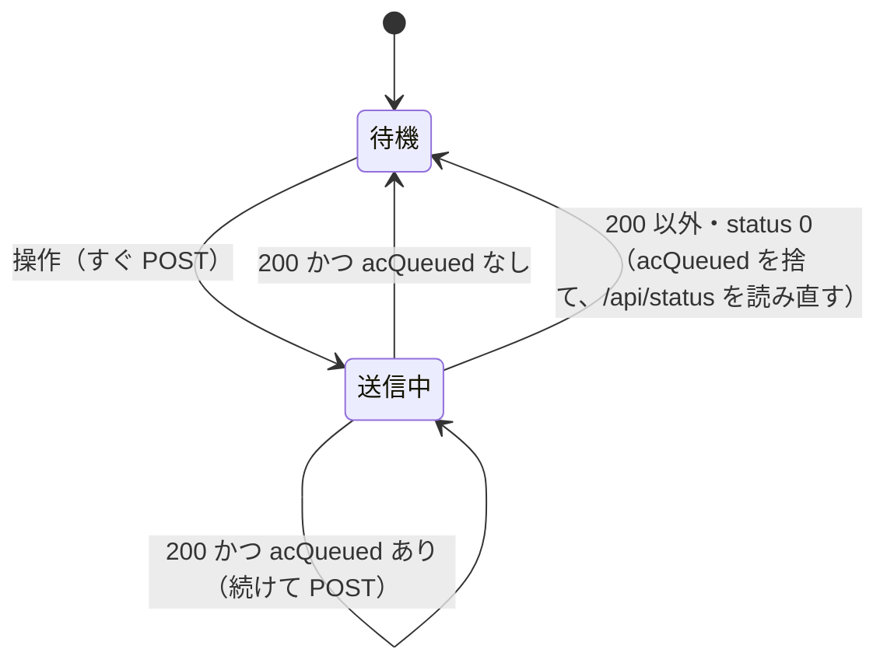
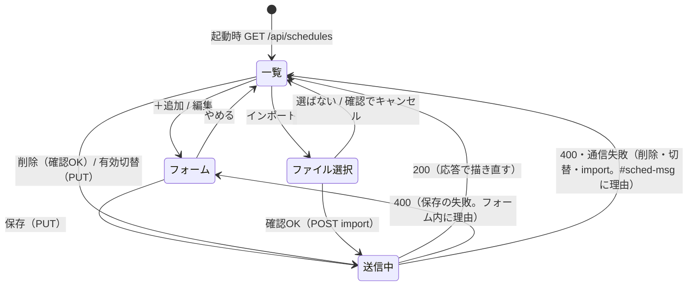

# 詳細設計：画面

作業項目：D-05／要件の原本：`docs/requirements.md` v0.3／要件ID：`docs/req-index.json`／前提：`docs/design/01-architecture.md`（D-01）、`docs/design/02-ac-state.md`（D-02）、`docs/design/03-schedule.md`（D-03）、`docs/design/04-api.md`（D-04）

この文書では、`web/index.html`（画面の唯一のソース）の構成と動き、各操作で呼ぶ API、状態を読み直すタイミング、警告・エラーの出し方、エクスポート／インポートの流れを決める。あわせて、`web/index.html` をビルド時に C++ ヘッダへ埋め込む方式（`tools/embed_html.py` → `src/generated/index_html.h`）と、`src/web_bridge` の `GET /` の返し方、PC で画面を確かめるための `tools/mock_server.py` の範囲を決める。

D-01 の流れ（`web/index.html` → `tools/embed_html.py`（pre script）→ `src/generated/index_html.h` の `kIndexHtml` → `web_bridge` が `GET /` で `send_P`）と、D-04 の API（パス・JSON・エラー文言）には従い、変えない。

---

## 対象要件

- [UI] 画面（仮）：「1. 画面の全体」「2. 画面の構成（DOM）」「3. 見た目の決まり」「10. 埋め込み方式」「11. web_bridge の GET /」「13. 作らないもの」
- [F1] エアコン操作：「4. エアコンカード」（運転／停止・モード・温度・風量・風向を、変えた項目だけ `POST /api/ac` で送る。選択肢は `/api/status` の `acCapabilities` から描く）
- [F3] 照明操作：「5. 照明カード」（6ボタン → `POST /api/light`、状態を表示しない）
- [F4] スケジュール：「6. スケジュールカード」（一覧・追加・編集・削除・有効無効を `PUT /api/schedules` の一覧置き換えで行う）
- [F4-IO] エクスポート／インポート：「6.5 エクスポート」（ファイル保存）、「6.6 インポート」（ファイル選択 → `POST /api/schedules/import`）
- [F5] 室温・湿度の表示：「7. 読み直しのタイミング」（`GET /api/status` を 30 秒ごと）、「2. 上部バー」の `#climate` と「7.0 室温・湿度の書式」（履歴は持たない）
- [N-TIME] NTP・JST、取得前は警告：「2. 上部バー」の時刻と NTP の状態、「8.1 時刻未取得の警告」
- [N-RESP] 押してから送信まで1秒以内：「9. 応答の速さのための決まり」（押したら待たずに送る、300ms の遅延を消す、エアコンの送信は1本ずつ）

---

## 設計

### 0. 全体の考え方

- `web/index.html` 1ファイルに HTML・CSS・JS を書く。外部ファイル・CDN・外部 URL・Web フォント・ビルドツール（npm、React など）は使わない（UI、D-01 1節）。大きさは 80,000 バイト以下（`scripts/verify.py` の ui 検査）。目安 40KB 以下。
- 画面は **サーバーの状態を描くだけ**。判断（値の範囲・選択肢の検証、スケジュールの検証、採番）は ESP32 側（lib/core）が行い、画面は 400 の `error` をそのまま見せる。画面側の事前チェックは「押せないボタンを押せなくする」程度に留める（4.3、6.3）。
- 選択肢（モード・温度範囲・風量・風向）とスケジュールの上限は API から受け取る。HTML/JS に値を直書きしない（F1-VALUES の rule、F4-LIMIT）。画面が持つのは、D-02 2節で**確定**した列挙文字列の日本語表示名と、F3 で決定の照明6ボタンだけ。
- パスはすべて `/api/...` の絶対パス（ホスト名を書かない）。家の中でも Tailscale 経由（F6）でも同じに動く。
- 画面は何も保存しない（`localStorage`・`sessionStorage`・Cookie・Service Worker を使わない）。やらないこと「永続化」の趣旨に合わせ、スケジュールを戻す手段はインポートだけにする。

### 1. 画面の全体

スマホ縦画面の1ページ（要件4章）。上から次の順に縦に並べる。幅は `max-width: 480px` で中央寄せ。

```
┌──────────────────────────────┐
│ IRハブ          9/25(金) 20:00 │  ← 上部バー（2節）
│ 室温 24.5℃  湿度 55.2%  時刻同期済み │
│ [!] 時刻未取得のためスケジュールは   │  ← 未取得のときだけ（8.1）
│     実行されません               │
│ [!] ESP32 に接続できません        │  ← 通信失敗のときだけ（8.2）
├──────────────────────────────┤
│ エアコン            [ 運転中 ⏻ ] │  ← エアコンカード（4節）
│        [−]   26℃   [＋]        │
│ モード [自動][冷房][除湿][暖房]    │
│ 風量   [自動][弱][中][強]         │
│ 風向上下 [固定][スイング]          │
│ 風向左右 [固定]                  │
│ （メッセージ行）                  │
├──────────────────────────────┤
│ 照明                            │  ← 照明カード（5節）
│ [切/入][常夜灯][明るく]           │
│ [暗く] [全灯]  [半灯]            │
│ （メッセージ行）                  │
├──────────────────────────────┤
│ スケジュール  3/10件   [＋追加]    │  ← スケジュールカード（6節）
│ 07:00 平日  エアコン 暖房 20℃ [有効][編集][削除] │
│ ...                             │
│ [エクスポート] [インポート]         │
│ （メッセージ行）                  │
└──────────────────────────────┘
```

### 2. 画面の構成（DOM）

実装者はこの id を使う（手の確認とモックでの確認の手がかりにする。class 名は自由）。

```html
<!doctype html>
<html lang="ja">
<head>
  <meta charset="utf-8">
  <meta name="viewport" content="width=device-width, initial-scale=1">
  <title>IRハブ</title>
  <link rel="icon" href="data:,">   <!-- /favicon.ico を取りに行かせない（ApiRouter で 404 になるだけだが無駄を省く） -->
  <style>/* 3節 */</style>
</head>
<body>
  <header id="top">
    <h1>IRハブ</h1>
    <span id="clock">--:--</span>
    <div><span id="climate">室温 --.-℃  湿度 --.-%</span> <span id="ntp">時刻未取得</span></div>
    <div id="ntp-warning" class="banner warn" hidden>時刻未取得のためスケジュールは実行されません</div>
    <div id="conn-error" class="banner error" hidden role="alert">ESP32 に接続できません</div>
  </header>

  <section id="ac-card" class="card">
    <h2>エアコン</h2>
    <button id="ac-power" aria-pressed="false">停止中</button>
    <div id="ac-temp-box"><button id="ac-temp-down">−</button><span id="ac-temp">--</span><button id="ac-temp-up">＋</button></div>
    <div id="ac-temp-none" hidden>このモードは温度を指定できません</div>
    <div id="ac-modes"   class="choices"></div>   <!-- acCapabilities.modes から描く -->
    <div id="ac-fan"     class="choices"></div>   <!-- acCapabilities.fan -->
    <div id="ac-swingv"  class="choices"></div>   <!-- acCapabilities.swingV -->
    <div id="ac-swingh"  class="choices"></div>   <!-- acCapabilities.swingH -->
    <p id="ac-msg" class="msg" role="status"></p>
  </section>

  <section id="light-card" class="card">
    <h2>照明</h2>
    <div id="light-buttons"></div>                 <!-- LIGHT_BUTTONS から描く（5節） -->
    <p id="light-msg" class="msg" role="status"></p>
  </section>

  <section id="sched-card" class="card">
    <h2>スケジュール <span id="sched-count">0/0件</span></h2>
    <p id="sched-ntp-note" hidden>時刻未取得の間は実行されません</p>
    <button id="sched-add">＋追加</button>
    <ul id="sched-list"></ul>
    <form id="sched-form" hidden>                  <!-- 欄の中身は 6.3 -->
      <input id="sf-time" type="time" step="60" required>
      <div id="sf-days"></div>                      <!-- チェックボックス7つ。id は sf-day-sun 〜 sf-day-sat -->
      <input id="sf-enabled" type="checkbox">
      <input id="sf-target-acon"  type="radio" name="sf-target" value="acon">   <!-- エアコン運転 -->
      <input id="sf-target-acoff" type="radio" name="sf-target" value="acoff">  <!-- エアコン停止 -->
      <input id="sf-target-light" type="radio" name="sf-target" value="light">  <!-- 照明 -->
      <div id="sf-ac-fields">                       <!-- エアコン運転のときだけ表示 -->
        <select id="sf-mode"></select> <select id="sf-temp"></select> <select id="sf-fan"></select>
        <select id="sf-swingv"></select> <select id="sf-swingh"></select>
      </div>
      <div id="sf-light-fields"><select id="sf-button"></select></div>   <!-- 照明のときだけ表示 -->
      <p id="sf-msg" class="msg" role="alert"></p>  <!-- 保存の失敗の文言（8.3「フォーム内」） -->
      <button id="sf-save" type="submit">保存</button>
      <button id="sf-cancel" type="button">やめる</button>
    </form>
    <a id="sched-export" href="/api/schedules/export" download>エクスポート</a>
    <button id="sched-import">インポート</button>
    <input id="sched-file" type="file" accept=".json,application/json" hidden>
    <p id="sched-msg" class="msg" role="status"></p>
  </section>
  <script>/* 4〜9節 */</script>
</body>
</html>
```

### 3. 見た目の決まり

- 要件4章のとおり、配置と操作の考え方だけを参考にする：機器ごとのカード、エアコンは温度を大きく（`font-size: 48px` 程度）表示して左右に −／＋、モードと風量はアイコン付きのボタン。
- **SwitchBot のロゴ・アイコン・名称・配色は使わない。** 画面の名前は「IRハブ」。`web/index.html` の中に `SwitchBot`（大文字小文字問わず）という文字列を一切書かない（コメントも。verify の ui 検査で落ちる）。
- アイコンは自作のインライン SVG（`viewBox="0 0 24 24"`、`fill="none" stroke="currentColor" stroke-width="2"`、線数本の簡単な図形）。既存のアイコンセットの図形を写さない。インライン SVG には `xmlns` を書かない（HTML の中では不要。外部 URL 検査の対象を増やさない）。

| 対象 | アイコン（自作） |
|---|---|
| モード auto | 円の中に「A」 |
| モード cool | 雪の結晶（3本の線の交差） |
| モード dry | しずく |
| モード heat | 太陽（円と短い放射線） |
| 風量 | 縦棒。`auto` は「A」、それ以外は選択肢の並び順 i（0 始まり、auto を除く）に対し i+1 本 |
| 運転ボタン | 電源記号（円弧と縦線） |

- 配色は CSS 変数で1か所に置く（自前の配色。暖色の赤をアクセントにしない）：

```css
:root {
  --bg: #f3f4f1;  --card: #ffffff;  --text: #1f2421;  --muted: #6b726e;
  --accent: #2f6f5e;   /* 選択中・運転中 */
  --cool: #2c6aa0;  --heat: #b8662a;   /* 冷房・暖房が選択中のときの色 */
  --warn-bg: #fff3c4;  --warn-text: #5c4600;
  --error-bg: #fde8e8; --error-text: #8a1c1c;
}
```

- 押せる要素はすべて高さ 44px 以上。`button, a, input { touch-action: manipulation; }`（9節）。
- 選択中のボタンは `aria-pressed="true"` と `--accent` の背景。停止中はエアコンカードの温度表示を `--muted` 色にする（操作はできる。D-02 4節：停止中も変更して送る）。
- 文字は端末の標準フォント（`font-family: system-ui, sans-serif`）。Web フォントを読まない。

### 4. エアコンカード（F1）

#### 4.1 表示名（画面が持つのはこれだけ。D-02 2節の確定した列挙文字列に対する日本語）

```js
const MODE_LABEL   = { auto: "自動", cool: "冷房", dry: "除湿", heat: "暖房" };
const FAN_LABEL    = { auto: "自動", min: "最弱", low: "弱", medium: "中", high: "強", max: "最強" };
const SWINGV_LABEL = { off: "固定", auto: "スイング", highest: "最上", high: "上", middle: "中", low: "下", lowest: "最下" };
const SWINGH_LABEL = { off: "固定", auto: "スイング", leftMax: "左端", left: "左", middle: "中央",
                       right: "右", rightMax: "右端", wide: "ワイド" };
const label = (table, s) => table[s] ?? s;   // 表に無い文字列はそのまま出す（D1 で列挙が増えても描ける）
```

- **どのボタンを並べるかは `acCapabilities` だけで決める**。上の表はラベル引きにしか使わない（表のキーを並べてボタンを作らない）。

#### 4.2 描き方 `renderAc(ac, caps)`

| 部品 | 描き方 |
|---|---|
| 運転ボタン `#ac-power` | `ac.power` が true なら「運転中」＋`aria-pressed="true"`、false なら「停止中」 |
| 温度 `#ac-temp` | `ac.temp` が数値なら `"<temp>℃"` を出し `#ac-temp-box` を表示、`#ac-temp-none` を隠す。`ac.temp === null`（そのモードで温度指定不可、D-02 5節）なら `#ac-temp-box` を隠し `#ac-temp-none` を出す |
| −／＋ | `temp <= caps.tempMin` なら − を `disabled`、`temp >= caps.tempMax` なら ＋ を `disabled` |
| モード `#ac-modes` | `caps.modes` の順にアイコン付きボタン。`ac.mode` と同じものを選択中に |
| 風量 `#ac-fan` | `caps.fan` の順にアイコン付きボタン |
| 風向上下／左右 | `caps.swingV` ／ `caps.swingH` の順に文字だけのボタン。選択肢が1つでもその1つを選択中として出す（要件「リモコンの選択肢すべて」） |

ボタンは描き直すたびに作り直してよい（数は十数個）。

#### 4.3 操作と送る本文（変えた項目だけ送る）

D-04 4節の申し送り：`/api/status` の `ac` をそのまま送り返さない（`"temp": null` で 400 になるため）。

| 操作 | 送る本文（`POST /api/ac`） | 画面の事前処理 |
|---|---|---|
| 運転ボタン | `{"power": !今の power}` | — |
| モードのボタン | `{"mode": "<mode>"}` | 今と同じモードを押しても送る（D-02：同じ値でも状態一式を送る。リモコンの押し直しと同じ） |
| ＋ | `{"temp": 表示中の温度 + caps.tempStep}` | 上限なら押せない（disabled） |
| − | `{"temp": 表示中の温度 - caps.tempStep}` | 下限なら押せない |
| 風量・風向のボタン | `{"fan": "..."}` ／ `{"swingV": "..."}` ／ `{"swingH": "..."}` | — |

- 応答 200 `{"ac":{...}}` で `renderAc` し直す（`/api/status` を読み直さない）。
- 応答が 200 以外（400・その他の HTTP エラー・status 0）は 4.4 の表のとおり：`#ac-msg` に 8.3 の文言を出し、`GET /api/status` を1回読み直して表示をサーバーの状態に合わせる。

#### 4.4 エアコンの送信は1本ずつ（キュー）

温度の＋を素早く3回押す場合などに、応答の順が入れ替わって表示が乱れないようにする。

```js
let acInFlight = false;     // 送信中の POST /api/ac があるか
let acQueued = null;        // 次に送るパッチ（オブジェクト）。複数の操作はキーごとに後勝ちで1つにまとめる
let acShown = null;         // 画面に出している ac（応答で上書き。＋／−はこれを基準に計算する）

function sendAcPatch(patch)  // acQueued に Object.assign し、送信中でなければ flush()
async function flushAc()     // acQueued を取り出して POST。終わったら acQueued が残っていれば続けて送る
```

| 今の状態 | 押された | すること |
|---|---|---|
| 送信中でない | 操作 | すぐ `POST /api/ac`（待たない）。`acShown` の該当項目を仮に書き換えて描く（＋を続けて押したときに 26→27→28 と積み上がるように） |
| 送信中 | 操作 | `acQueued` にまとめる（例：`{"temp":28}` の後に `{"temp":29}` → `{"temp":29}`、`{"temp":28}` の後に `{"fan":"high"}` → `{"temp":28,"fan":"high"}`）。仮の表示は上と同じ |
| 応答 200 | — | `acShown = 応答.ac` で描く。`acQueued` があれば取り出して続けて送る（`acInFlight` は true のまま）。無ければ `acInFlight = false` |
| 応答 200 以外（400・404/405 などその他の HTTP エラー・通信失敗やタイムアウトの status 0） | — | 順に：(1) `acQueued = null`（捨てる）、(2) `acInFlight = false`、(3) `#ac-msg` に 8.3 の文言を出す（status 0 なら `#conn-error` も 8.2 のとおり）、(4) `pollStatus()` で `/api/status` を読み直す。(1)(2) を先に行うので、読み直した `ac` は 7 節の `applyStatus` で必ず描かれる |

状態遷移（エアコンの送信）：



- まとめるのは「送信中に押された分」だけ。送信中でなければ1回押すごとに1回送る（N-RESP：押してから送るまでに待ちを入れない。9節）。
- 送信中・キューがある間は、`/api/status` の定期読み直しで `ac` を上書きしない（室温・時刻だけ更新する。7節）。

### 5. 照明カード（F3）

```js
// F3（決定）の6ボタン。API の文字列は D-04 5節
const LIGHT_BUTTONS = [
  ["power", "切/入"], ["night", "常夜灯"], ["brighter", "明るく"],
  ["dimmer", "暗く"], ["full", "全灯"],   ["half", "半灯"],
];
```

- 3列×2行に並べる（リモコンと同じく6つをそのまま並べる）。
- 押したら `POST /api/light` `{"button":"<名前>"}` をすぐ送る。照明の送信はキューにしない（状態を持たないので順の入れ替わりが表示に影響しない）。
- 200 `{"ok":true}`：押したボタンを 300ms だけ強調し、`#light-msg` に「送信しました：<表示名>」を 3 秒出す。点灯中かどうかは表示しない（F3、やらないこと「照明の点灯状態の検出」）。
- 400：`#light-msg` に 8.3 の文言。

### 6. スケジュールカード（F4・F4-IO）

画面が持つ一覧（`schedState`）は最後に受け取った `GET /api/schedules`（または `PUT`・import の 200 応答）の中身そのもの。

```js
let schedState = { max: 0, schedules: [] };   // 応答の形（D-04 6節）をそのまま
const DAYS = [["sun","日"],["mon","月"],["tue","火"],["wed","水"],["thu","木"],["fri","金"],["sat","土"]];
```

#### 6.1 一覧の表示

- 並びはサーバーの順のまま（並べ替えない。同じ分の件は一覧の順に実行されるため、D-03 5節）。
- 件数表示 `#sched-count`：`"<件数>/<max>件"`。
- 1行の中身：

| 欄 | 作り方 |
|---|---|
| 時刻 | `time` をそのまま（`07:00`） |
| 曜日 | 7つすべて → 「毎日」、mon〜fri の5つちょうど → 「平日」、sat と sun の2つちょうど → 「土日」、それ以外 → 日曜始まりで「月・水・金」 |
| 内容 | 下の表 |
| 有効 | トグルボタン（`aria-pressed`）。無効の行は文字を `--muted` にする |
| 編集・削除 | ボタン |

| 対象と操作 | 内容の文言（例） |
|---|---|
| `target:"ac"`、`action.power:false` | 「エアコン 停止」 |
| `target:"ac"`、`action.power:true` | 「エアコン 運転」に、あるキーだけ ` <モード>`、` <temp>℃`、` 風量<表示名>`、` 上下<表示名>`、` 左右<表示名>` を足す（例「エアコン 運転 暖房 20℃」） |
| `target:"light"` | 「照明 <表示名>」（例「照明 全灯」） |

- 0件のときは「スケジュールはありません」。

#### 6.2 操作と API（すべて一覧の置き換え、D-03 3.3）

| 操作 | 送るもの | 成功（200） | 失敗（400 など） |
|---|---|---|---|
| 追加の保存 | `PUT /api/schedules` `{"schedules": [...今の一覧, 新しい件（id なし）]}` | 応答で `schedState` を置き換えて描き直し、フォームを閉じる | フォームを開いたまま、フォーム内に 8.3 の文言。一覧は変えない |
| 編集の保存 | 該当 `id` の件を書き換えた一覧を `PUT` | 同上 | 同上 |
| 削除 | `confirm("この予定を削除しますか？")` が OK なら、該当 `id` を除いた一覧を `PUT` | 描き直し | `#sched-msg` に文言。一覧は元のまま描く |
| 有効／無効 | 該当 `id` の `enabled` を反転した一覧を `PUT` | 描き直し | 同上 |

- 送る一覧は `schedState.schedules` の各件をそのまま使う（`id` を付けたまま。D-03 3.2：id を保つ）。`max` は付けない。
- 追加ボタン `#sched-add` は `schedState.schedules.length >= schedState.max` のとき `disabled` にし、横に「上限 <max> 件」と出す。上限の数は `max` から作る（直書きしない）。
- `PUT` の送信中はカードのボタンを `disabled` にする（二重送信を防ぐ）。

#### 6.3 追加・編集フォーム `#sched-form`

| 欄 | 部品 | 既定値（追加） | 送る値 |
|---|---|---|---|
| 時刻 | `<input type="time" step="60" required>` | `07:00` | `time`：`"HH:MM"`（input の値そのまま。ゼロ埋め2桁） |
| 曜日 | チェックボックス7つ（日〜土） | 7つとも入 | `days`：入の曜日を日曜始まりで。0個なら保存ボタンを押せない |
| 有効 | チェックボックス | 入 | `enabled` |
| 対象 | ラジオ3つ：「エアコン運転」「エアコン停止」「照明」 | エアコン運転 | 下 |
| モード（運転のとき） | `<select>`：「指定しない」＋`acCapabilities.modes` | 指定しない | 指定したら `action.mode` |
| 温度（運転のとき） | `<select>`：「指定しない」＋`tempMin..tempMax`（`tempStep` 刻み） | 指定しない | 指定したら `action.temp`（数値） |
| 風量・上下・左右（運転のとき） | `<select>`：「指定しない」＋`acCapabilities.fan`／`swingV`／`swingH` | 指定しない | 指定したら `action.fan` など |
| ボタン（照明のとき） | `<select>`：`LIGHT_BUTTONS` | `power` | `action.button` |

- 温度の `<select>` は、モードが「指定しない」のとき、またはモードが `tempModes` に無いとき `disabled`（値は「指定しない」に戻す）。D-03 1.1 の規則6（温度にはモードが要る）・規則7 に画面の側でも合わせる。
- 選択肢は `/api/status` の `acCapabilities`（最後に受け取ったもの）から作る。
- 組み立てる `action`：
  - エアコン運転：`{"power": true}` に、指定したキーだけを足す。例 `{"power":true,"mode":"heat","temp":20}`
  - エアコン停止：`{"power": false}` だけ
  - 照明：`{"button":"full"}`
- 編集のときは、その件の値をフォームに入れる。件の値が今の選択肢に無い（D1 後の古い件など）ときは、その値を「<値>（使えない値）」という選択肢として足して選択中にする（保存すればサーバーが 400 を返し、フォームに理由が出る）。
- 「保存」`#sf-save`・「やめる」`#sf-cancel` ボタン。保存は `submit` で受け、`preventDefault()` してから `PUT` する（ページを遷移させない）。保存の失敗は `#sf-msg` に出す。やめるとフォームを閉じ、何も送らない。フォームを開いている間は一覧の編集・削除ボタンを押せなくする（同時に2件を編集しない）。

送る本文の実例（追加。今の一覧に id 1 の件があるとき）：

```json
{ "schedules": [
  { "id": 1, "enabled": true, "time": "07:00", "days": ["mon","tue","wed","thu","fri"],
    "target": "ac", "action": { "power": true, "mode": "heat", "temp": 20 } },
  { "enabled": true, "time": "23:30", "days": ["sun","mon","tue","wed","thu","fri","sat"],
    "target": "ac", "action": { "power": false } }
] }
```

#### 6.4 状態遷移（スケジュールカード）



#### 6.5 エクスポート（ファイル保存）

- `<a id="sched-export" href="/api/schedules/export" download>エクスポート</a>`（D-04 8節）。JS は使わない。
- サーバーが `Content-Disposition: attachment; filename="irhub-schedules-YYYYMMDD-HHMM.json"` を付けるので、スマホにそのファイル名で保存される（NTP 未取得なら `irhub-schedules.json`）。
- 0件でもエクスポートできる（押せなくしない）。
- 保存の成否はブラウザが扱う（画面は結果を知らない。通信できなければブラウザのエラー表示になる）。

#### 6.6 インポート（ファイル選択）

D-04 9節：ファイルの中身を JSON 本文として送る（multipart は使わない）。

```js
const IMPORT_MAX_BYTES = 8192;   // D-03 の kScheduleJsonMaxBytes と同じ値。大きな誤ファイルを ESP32 に送らないための画面側の守り

async function importFile(file)  // 下の手順
function readAsText(file)        // FileReader.readAsText(file, "utf-8") を Promise にしたもの（File.text() より古い端末でも動く）
```

手順：

1. `#sched-import` を押す → `#sched-file` の `click()`（ファイル選択の画面が開く）。
2. `change` でファイルが選ばれなければ何もしない。
3. `file.size > IMPORT_MAX_BYTES` なら送らずに `#sched-msg` に「ファイルが大きすぎます」。
4. 今の一覧が1件以上なら `confirm("今のスケジュール（<件数>件）をファイルの内容で置き換えます。よろしいですか？")`。キャンセルなら終わり。
5. `readAsText(file)` で文字列 `text` にし、`api("POST", "/api/schedules/import", text)` で送る。`text` は文字列なので 8.2 の決まりどおり `JSON.stringify` せずそのまま本文になり、`Content-Type: application/json` が付く（画面で JSON を解析・書き換えしない。検証はサーバー、D-03 6.3）。読み取りに失敗したら送らずに `#sched-msg` に「ファイルを読めませんでした」。
6. 200：応答（一覧の形）で `schedState` を置き換えて描き直し、`#sched-msg` に「<件数>件を読み込みました」。
7. 400：`#sched-msg` に「読み込めませんでした：<error>」（例 `unsupported version`、`schedules[0].time: must be HH:MM`）。一覧はそのまま（サーバーも変えていない）。その他の HTTP エラー・status 0 は 8.3 の表のとおり。
8. 最後に `#sched-file.value = ""`（同じファイルをもう一度選べるように）。

- NTP 未取得でもインポートできる（D-03 4.3。再起動直後に戻すための機能）。

### 7. 読み直しのタイミング

| 何を | いつ | 使う API |
|---|---|---|
| 状態（エアコン・室温湿度・時刻・NTP） | ページを開いたとき、その後 **30 秒ごと**（F5）、ページが見える状態に戻ったとき（`visibilitychange` で `visible`）、エアコンの送信が 400・通信失敗になったとき、接続エラーの帯を押したとき | `GET /api/status` |
| スケジュール一覧 | ページを開いたとき（状態の後に続けて）、ページが見える状態に戻ったとき | `GET /api/schedules` |
| スケジュール一覧（操作の後） | 読み直さない。`PUT`・import の 200 応答で描き直す | — |
| エアコン（操作の後） | 読み直さない。`POST /api/ac` の 200 応答の `ac` で描き直す | — |

```js
const STATUS_POLL_MS = 30000;    // 仮(F5) 要件「更新間隔：仮に30秒」
const FETCH_TIMEOUT_MS = 5000;   // 1回の要求の待ち時間の上限（推測）

function scheduleNextPoll()      // clearTimeout して setTimeout(pollStatus, STATUS_POLL_MS)
async function pollStatus()      // GET /api/status → applyStatus → scheduleNextPoll（成否どちらでも）
function applyStatus(s)          // 上部バーを描く。acInFlight || acQueued なら ac は描かない。acCapabilities は毎回置き換える
let statusInFlight = false;      // 送信中の GET /api/status があるか
```

- `pollStatus()` は `statusInFlight` が true なら何もせずに戻る（新しく投げない）。`visibilitychange`・`#conn-error` を押したとき・エアコンの失敗後など、どこから呼ばれても同じ要求を重ねない。終わったら（成否どちらでも）`statusInFlight = false` にしてから `scheduleNextPoll()`。

#### 7.0 室温・湿度の書式 `#climate`

| `climate` | 表示 |
|---|---|
| `valid: true` | `"室温 " + temperature.toFixed(1) + "℃  湿度 " + humidity.toFixed(1) + "%"`。整数でも小数1桁（`24` → `24.0℃`） |
| `valid: false`（値は null） | `室温 --.-℃  湿度 --.-%` |

- 定期読み直しは `setInterval` ではなく、1回終わってから次を予約する（`setTimeout` の連鎖）。ESP32 に同じ要求を重ねない。
- `document.hidden` の間は予約しない（見ていない画面が ESP32 に要求し続けないように）。`visible` に戻ったらすぐ `pollStatus()` と `GET /api/schedules`。
- ページを開いたときは `GET /api/status` → `GET /api/schedules` の順に1本ずつ（同時に投げない。WebServer は1本ずつ処理するため）。
- すべての `fetch` に `cache: "no-store"` を付ける（ブラウザが古い状態を見せないように）。

#### 7.1 時刻の表示

- `clock.now`（`"YYYY-MM-DDTHH:MM:SS+09:00"`、D-04 3節）を受け取ったら、正規表現 `/^(\d{4})-(\d{2})-(\d{2})T(\d{2}):(\d{2}):(\d{2})\+09:00$/` で読み、`serverMs = Date.UTC(y, mo-1, d, h, mi, s) - 9*3600*1000` とし、`clockOffsetMs = serverMs - Date.now()` を覚える。
- 表示は 1 秒ごとに `t = new Date(Date.now() + clockOffsetMs + 9*3600*1000)` を作り、`getUTC*` で `"M/D(曜) HH:MM"` を出す（例 `9/25(金) 20:00`）。スマホのタイムゾーン設定に左右されず JST で出る（外出先 F6 でも同じ）。
- 30 秒ごとの読み直しで `clockOffsetMs` を取り直す。
- `clock.synced === false`（`now` は null）なら `#clock` は `--:--` とし、1秒ごとの更新を止める。

### 8. 警告・エラーの出し方

#### 8.1 時刻未取得の警告（N-TIME）

| `clock.synced` | `#ntp` | `#ntp-warning`（上部の帯） | `#sched-ntp-note` |
|---|---|---|---|
| `true` | 「時刻同期済み」 | 隠す | 隠す |
| `false` | 「時刻未取得」 | 出す：「時刻未取得のためスケジュールは実行されません」（D-04 3節の文言） | 出す：「時刻未取得の間は実行されません」 |

- 警告を出していても、スケジュールの登録・編集・削除・エクスポート・インポートは押せる（D-04 6〜9節：未取得でも受け付ける）。
- `synced` が true になれば、次の読み直し（最大 30 秒後）で帯が消える。

#### 8.2 通信の失敗

```js
// 戻り値：{ status: number, data: object|null }。通信失敗・タイムアウトは status 0
async function api(method, path, body)
// body の扱い：
//   undefined            → 本文なし（GET）。Content-Type も付けない
//   typeof body === "string" → そのまま本文にする（インポート 6.6 のファイルの中身）。Content-Type: application/json
//   それ以外（オブジェクト） → JSON.stringify(body) を本文にする。Content-Type: application/json
```

- インポートも専用の送り方を作らず、この `api("POST", "/api/schedules/import", text)`（`text` は文字列）で送る。そのため、タイムアウト（`FETCH_TIMEOUT_MS`）・`status: 0`・`#conn-error` の出し方・隠し方は、ほかの要求とまったく同じになる。
- `api` は `fetch(path, { method, cache: "no-store", headers, body, signal })`。`AbortController` で `FETCH_TIMEOUT_MS` を超えたら中止して `status: 0`。応答が JSON として読めなければ `data: null`。
- `Content-Type: application/json` を必ず付ける（D-04 1節・12節：付けないと WebServer が本文を `arg("plain")` に入れない）。
- `status === 0` のとき：上部の `#conn-error` を出す（「ESP32 に接続できません」＋「（最終更新 HH:MM:SS）」。最終更新は最後に `/api/status` が 200 だった端末の時刻）。前の表示は残し、全体を薄く（`opacity: .6`）する。
- どれかの要求が 200 になったら `#conn-error` を隠し、薄くしていたのを戻す。
- `#conn-error` を押すと `pollStatus()` をすぐ行う。

#### 8.3 400 などのエラー（各カードのメッセージ行）

| 応答 | 表示する文言 | 出す場所 |
|---|---|---|
| 400 `{"error":"temp out of range"}` | 「送れませんでした：temp out of range」 | エアコン → `#ac-msg`、照明 → `#light-msg` |
| 400（スケジュール保存） | 「保存できませんでした：<error>」 | フォーム内の `#sf-msg` |
| 400（削除・有効切替） | 「保存できませんでした：<error>」 | `#sched-msg` |
| 400（インポート） | 「読み込めませんでした：<error>」 | `#sched-msg` |
| 404・405・その他（`error` あり） | 「エラー（HTTP <status>）：<error>」 | 操作したカード |
| 200 以外で JSON でない | 「エラー（HTTP <status>）」 | 操作したカード |
| 通信失敗（status 0） | 8.2 の帯＋カードに「送れませんでした（通信エラー）」 | 帯と操作したカード |

- `error` の英語の文言は訳さずにそのまま出す（D-03 6.4「画面は error をそのまま表示する」）。
- エラーはそのカードで次の操作が成功するまで残す。成功の知らせ（「送信しました」「<n>件を読み込みました」）は 3 秒で消す。
- エアコンで POST が 200 以外（通信失敗・タイムアウトを含む）になったときは、4.4 の表のとおり `acQueued` を捨てて `acInFlight = false` にしてから、`/api/status` を読み直して表示を合わせる（タイムアウトでもサーバーで送信済みかもしれないため）。

### 9. 応答の速さのための決まり（N-RESP）

要件（仮）：画面のボタンを押してから赤外線を送るまで1秒以内。画面の側で遅れを作らないための決まり：

1. 押したら `click` の処理の中ですぐ `fetch` する。確認ダイアログ・待ち時間・まとめ送り（デバウンス）を挟まない（エアコンのキューは送信中に押された分だけ、4.4）。
2. `touch-action: manipulation` をボタン類に付け、スマホのダブルタップ拡大待ち（約 300ms）を消す。`<meta name="viewport" content="width=device-width, initial-scale=1">` も付ける。
3. エアコン・照明の操作の前に `/api/status` を読まない（応答の `ac` で描き直す）。
4. 定期読み直しは 30 秒に1本だけで、同時に重ねない（7節）。操作の要求が定期読み直しの後ろで長く待たされないようにする。
5. HTML は1ファイルで、外部から何も読まない（初回表示も速い）。

ESP32 側の処理時間（`loop()` が止まらないこと）は D-06 が扱う。

### 10. 埋め込み方式（tools/embed_html.py → src/generated/index_html.h）

**方式：バイト列の配列**（16進数の `char` 配列＋長さ）。生文字列リテラル（`R"delim(...)delim"`）は区切り文字の衝突と文字コードの扱いを気にする必要があるため使わない。配列ならどんなバイトでもそのまま入り、UTF-8 の日本語も壊れない。

生成するヘッダ（例。実際は `web/index.html` の全バイト）：

```cpp
// src/generated/index_html.h
// 生成物：tools/embed_html.py が web/index.html から作る。手で編集しない。
#pragma once
#include <cstddef>

namespace irhub {

// web/index.html の中身（UTF-8）。末尾に 0 を1つ付ける（send_P の長さなし版でも安全なように）
static const char kIndexHtml[] = {
  0x3c, 0x21, 0x64, 0x6f, 0x63, 0x74, 0x79, 0x70, 0x65, 0x20, 0x68, 0x74, 0x6d, 0x6c, 0x3e, 0x0a,
  /* … */
  0x00
};
// 末尾の 0 を含まないバイト数
static const size_t kIndexHtmlLen = 12345;

}  // namespace irhub
```

- `static const` の配列は ESP32 ではフラッシュ（`.rodata`）に置かれ、RAM を使わない。ESP32 では `PROGMEM` は意味を持たないので付けない（付けても害はないが、Arduino のヘッダが要るので付けない）。
- このヘッダを include してよいのは `src/web_bridge.cpp` だけ（`static` なので、複数のファイルから include すると複製される）。

`tools/embed_html.py` の決まり（Python 標準ライブラリだけ）：

| 項目 | 決まり |
|---|---|
| 呼ばれ方 | `platformio.ini` の `[env:esp32]` に `extra_scripts = pre:tools/embed_html.py`。`env:native` には付けない（native は `src/` をビルドしない）。単独でも `python tools/embed_html.py` で動く |
| プロジェクトの場所 | PlatformIO から呼ばれたときは `Import("env")` して `env.subst("$PROJECT_DIR")`。単独実行のときは `os.path.dirname(os.path.dirname(os.path.abspath(__file__)))`（PlatformIO の extra script の中では `__file__` が無いことがあるため、`Import` を先に試す。`try: Import("env") except NameError:` の形） |
| 入力 | `web/index.html` をバイナリで読む |
| 検査（1つでも当たれば失敗してビルドを止める） | ファイルが無い／UTF-8 として読めない／0x00 を含む／80,000 バイトを超える（verify の ui 検査と同じ上限） |
| 出力 | `src/generated/index_html.h`。上の形。1行16バイト、`0x%02x` の小文字。末尾に `0x00` |
| 書き込み | 作った内容が今のファイルと同じなら書かない（ヘッダの時刻が変わらず、毎回の再コンパイルを避ける）。違うときだけ書く。ディレクトリが無ければ作る |
| 表示 | 書いたときだけ `embed_html: web/index.html (<n> bytes) -> src/generated/index_html.h` を1行出す |
| 失敗のさせ方 | 理由を1行出して `sys.exit(1)`。PlatformIO の pre script で `sys.exit(1)` がビルドを止めることは**要確認**（I-04 で確かめる。止まらなければ SCons の `Exit(1)` を使う） |

- `src/generated/index_html.h` は **Git に入れない**（今の `.gitignore` に `src/generated/` が入っている。これに合わせる）。`pio run -e esp32` の pre script が毎回作る（中身が同じなら書き換えない）。native（`pio test -e native`）は `src/` をビルドしないので、このヘッダが無くても影響しない。手で編集しない。`web/index.html` を直したら `pio run -e esp32` で作り直される。

### 11. web_bridge の GET /（D-04 12節の細部）

```cpp
// src/web_bridge.cpp（抜粋）
#include "generated/index_html.h"

void WebBridge::handleRoot() {
  server_.sendHeader("Cache-Control", "no-cache");   // 書き込み後に古い画面を見せない
  server_.send_P(200, "text/html; charset=utf-8", kIndexHtml, kIndexHtmlLen);
}
```

- Arduino core 2.x（arduino-esp32 2.0.17 の `libraries/WebServer/src/WebServer.h`）に `void send_P(int code, PGM_P content_type, PGM_P content, size_t contentLength);` がある。中身はヘッダを書いた後 `sendContent_P(content, contentLength)` でそのまま送り、HTML を `String` にコピーしない（同版の `WebServer.cpp` で確認）。ESP32 では `PGM_P` は `const char*`。
- `content_type` は内部で 64 バイトの配列に写される。`"text/html; charset=utf-8"` は 24 文字で収まる。
- 使う core の版が 2.0.17 以外（espressif32 6.x に入る 2.0.x）でも同じ宣言があることは、I-05 の `pio run -e esp32` で確かめる（要確認）。

### 12. tools/mock_server.py（PC で画面を確かめる道具）

I-04 が作る。Python 標準ライブラリ（`http.server`、`json`、`argparse`）だけ。本体の代わりではなく、画面の見た目と流れを PC・スマホのブラウザで確かめるためのもの。

| 項目 | 決まり |
|---|---|
| 起動 | `python tools/mock_server.py [--host 127.0.0.1] [--port 8000] [--unsynced] [--no-sensor] [--delay-ms 0]` |
| `GET /` | `web/index.html` を要求のたびに読み直して返す（編集してリロードすれば反映） |
| API | D-04 の7つのパスとメソッドを真似る。応答の形（キー・型）は D-04 と同じ。状態はメモリだけ |
| 検証 | 画面のエラー表示を試せる程度：JSON が読めない → 400 `invalid json`、`temp` が範囲外 → 400 `temp out of range`、件数が `max` を超える → 400 `too many schedules (max <max>)`、import の `version` が 1 でない → 400 `unsupported version`。完全な検証は本体（lib/core）とそのテストの役目 |
| `--unsynced` | `clock.synced=false`、`now=null`（8.1 の警告を試す） |
| `--no-sensor` | `climate.valid=false`、値は null |
| `--delay-ms` | 各 API 応答をその時間遅らせる（キュー 4.4 とタイムアウト 8.2 を試す） |
| 選択肢 | 画面確認用の見本値を持つ（本体の値ではないとコメントに書く）。本体の値は `lib/core/src/ac_capabilities.h` だけ |
| エクスポート | `Content-Disposition: attachment; filename="irhub-schedules-....json"` を付ける |

### 13. 作らないもの

| 作らないもの | 理由 |
|---|---|
| 本体タイマー（入／切）の欄・ボタン | F1-TIMER は未決（作らない） |
| 室温・湿度の履歴・グラフ | F5「履歴は持たない」 |
| 照明の点灯状態の表示 | F3、やらないこと（点灯状態の検出） |
| 通知（Notification API、音、バイブ）、Service Worker、PWA のマニフェスト | やらないこと（通知）、外部に頼らない1ファイル |
| ログイン・パスワード入力 | N-AUTH（LAN 内は認証なし） |
| 画面側の保存（localStorage など）と自動の復元 | やらないこと（永続化）の趣旨。戻すのはインポートだけ |
| 室温に応じた操作の提案・自動操作 | やらないこと（自動運転） |
| 外部の CSS・JS・フォント・アイコン、CDN | UI（1ファイル）、ESP32 はインターネット前提にしない |
| SwitchBot のロゴ・アイコン・名称・配色 | 要件4章 |
| 選択肢・上限の直書き | F1-VALUES の rule、F4-LIMIT（API から受け取る） |
| 静音・節電などの要件に無い項目 | 要件 F1 の表に無い |
| スケジュールの並べ替え・1件ずつの API | 要件5章の API は一覧の置き換えだけ（D-03 3.3） |

---

## 仮・未決の扱い

| 要件・値 | 状態 | この文書での扱い | 変わったときに直す場所 |
|---|---|---|---|
| UI | 仮 | 1〜9節の構成・文言・見た目を `web/index.html` 1ファイルに置く | 画面の構成が変わっても `web/index.html` だけ（と本書）。埋め込み方式が変われば `tools/embed_html.py` と `src/web_bridge.cpp` の `handleRoot` |
| F5 の 30 秒 | 仮（F5 は決定） | 画面の `STATUS_POLL_MS = 30000`（`// 仮(F5)`）。センサーの読み取り周期 `kClimateIntervalMs`（hub.h）とは別の定数 | 間隔が変われば `web/index.html` の `STATUS_POLL_MS` と `hub.h` の `kClimateIntervalMs` の2つ（そろえる） |
| N-TIME | 仮 | `clock.synced` を見て 8.1 の表のとおり帯と注記を出す。文言は D-04 3節の「時刻未取得のためスケジュールは実行されません」 | 方針・文言が変われば `web/index.html` の `applyStatus` と `#ntp-warning`・`#sched-ntp-note` |
| N-RESP（1秒） | 仮 | 9節の決まり（待たずに送る、300ms 遅延を消す）。画面に数値は置かない | 画面の側は直す場所なし。足りなければ D-06（ESP32 側）で見直す |
| F1-VALUES | 未決 | 選択肢・温度範囲は `acCapabilities` から描く。画面は列挙文字列（D-02 で確定）の日本語表示名だけを持ち、表に無い文字列はそのまま出す | 直す場所なし（`ac_capabilities.h` が変われば自動で追従）。列挙そのものが増えたら表示名の表に1行足す（足さなくても文字列のまま出る） |
| F1-TIMER | 未決 | 作らない（13節） | D1 で「対応」と決まったら新しい作業項目で画面に足す |
| F4-LIMIT（10件） | 仮 | `GET /api/schedules` の `max` で上限表示と追加ボタンの無効化 | 直す場所なし（`kScheduleMax` だけ） |
| 取り込みファイルの上限 8192 バイト | 推測（D-03 の `kScheduleJsonMaxBytes` と同じ値） | `IMPORT_MAX_BYTES`（6.6） | `kScheduleJsonMaxBytes` を変えたらこの定数も合わせる |
| 通信の待ち時間 5 秒 | 推測 | `FETCH_TIMEOUT_MS` | その定数1つ |
| モックの選択肢 | 見本値 | `tools/mock_server.py` に画面確認用の値。本体の値ではない | 直さなくてよい（画面は何が来ても描ける） |

---

## テスト観点

### native 単体テスト・PC で確かめること

画面は C++ ではないので Unity のテストの対象外。画面が頼る API の約束は D-04 の `test/test_api/` が native で確かめている（下の最初の項目）。画面そのものは PC（`scripts/verify.py` と `tools/mock_server.py`）で確かめる。

- native（`pio test -e native`、test_api、D-04 のテスト観点に含まれるもの）で、画面が前提にしている次の点が保たれていること：
  - `/api/status` に `acCapabilities`（`modes`・`tempMin`・`tempMax`・`tempStep`・`tempModes`・`fan`・`swingV`・`swingH`）と `clock.synced`／`clock.now`、`climate` がある。未取得のとき `now` と `temperature`・`humidity` が null。
  - `POST /api/ac` に1項目だけ送ると 200 で `{"ac":{...}}` が返る。`"temp": null` は 400。
  - `PUT /api/schedules` の 200 応答が `{"max":…, "schedules":[…]}`（id 付き）。
  - export の本文をそのまま import に送ると元に戻る。
  - エラーの本文が `{"error":"..."}`。
- `scripts/verify.py` の ui 検査：`web/index.html` に外部 `script src`・外部 stylesheet・`http(s)://` が無い、`SwitchBot` の文字列が無い、使っている `/api/...` のパスが要件5章の一覧にある、80,000 バイト以下。
- 埋め込み（`tools/embed_html.py` を単独で実行）：
  - 生成された `src/generated/index_html.h` の配列の中身（末尾の 0 を除く）が `web/index.html` のバイト列と一致し、`kIndexHtmlLen` がそのバイト数。日本語（UTF-8）を含む HTML で確かめる。
  - 2回続けて実行すると、2回目はファイルを書き換えない（更新時刻が変わらない）。
  - `web/index.html` が無い・0x00 を含む・80,000 バイト超のとき、終了コードが 0 以外。
- モック（`python tools/mock_server.py`）を PC のブラウザ（スマホ幅の表示）で開いて：
  - 初回表示で上部バー・エアコン・照明・スケジュールが描かれ、モード・風量・風向のボタンが `acCapabilities` の順に並ぶ（モックの選択肢を変えるとボタンも変わる。HTML に直書きしていない）。
  - ＋／−で温度が1刻みで変わり、`tempMax`・`tempMin` で押せなくなる。ブラウザの開発ツールで、送った本文が変えた項目だけ（`{"temp":27}` など）であること。
  - `ac.temp` が null のモード（モックの `tempModes` から `dry` を外して試す）で温度欄が隠れ、「このモードは温度を指定できません」が出る。スケジュールのフォームでも温度が選べない。
  - `--delay-ms 800` で＋を素早く3回押すと、要求が重ならず（1本ずつ）、最後の表示が 3 つ上の温度になる。
  - `--delay-ms 6000` で操作すると 5 秒で「ESP32 に接続できません」の帯が出て、次の成功で消える。
  - 30 秒ごとに `GET /api/status` が1本ずつ出る。タブを隠すと止まり、戻すとすぐ出る。
  - `--unsynced` で上部の警告帯とスケジュールの注記が出て、`#clock` が `--:--`。スケジュールの操作は押せる。
  - `--no-sensor` で室温・湿度が `室温 --.-℃  湿度 --.-%` と出る。モックの値が整数（24）のとき `24.0℃` と出る。
  - `--delay-ms 6000` でエアコンを操作して＋を続けて押すと、タイムアウト後に `acQueued` が捨てられ、読み直した `/api/status` の温度が描かれる（その後の操作もすぐ送られる）。
  - `--delay-ms 3000` のまま、読み直し中にタブを隠して戻しても `GET /api/status` が2本重ならない。
  - インポートで送った本文がファイルの中身そのもの（`"{\"version\"...` のように文字列化されていない）であること。
  - 照明の6ボタンがそれぞれ `{"button":"power"}`〜`{"button":"half"}` を送る。点灯状態を表示しない。
  - スケジュール：追加（エアコン運転＋暖房 20℃、エアコン停止、照明 全灯）・編集・削除・有効切替がそれぞれ `PUT` 1回で、送る一覧に既存の id が付いている。上限（`max`）で追加ボタンが押せなくなる。温度だけ指定してモードを「指定しない」にできない。
  - 400 の文言がそのまま出る（モックで `temp out of range`、`unsupported version`、`too many schedules (max 10)`）。
  - エクスポートでファイルが保存される。そのファイルをインポートすると一覧が置き換わる。`version` を 2 に書き換えたファイルは「読み込めませんでした：unsupported version」で一覧が変わらない。同じファイルを2回続けて選べる。
  - 時刻表示が PC のタイムゾーンを UTC などに変えても JST で出る。

### 実機でしか確かめられないこと

- `pio run -e esp32` で埋め込みの pre script が動き、`src/generated/index_html.h` ができてビルドが通る。`web/index.html` を直して再ビルドすると反映される。検査に当たる HTML でビルドが止まる（`sys.exit(1)` の要確認）。
- スマホ（iOS Safari、Android Chrome）で `http://<ESP32のIP>/` を開くと、日本語が化けずに画面が出る（`charset=utf-8`）。画面の書き込み直後に古い画面が出ない（`Cache-Control: no-cache`）。
- F1：運転・停止、モード、温度の＋／−、風量、風向でエアコンが動く（フェーズ4の判定）。
- F3：照明の6ボタンで照明が動く（フェーズ4の判定）。
- F5：室温・湿度が表示され、30 秒以内に変化が反映される（DHT20 に息をかける等。フェーズ4の判定）。
- N-RESP：ボタンを押してから赤外線 LED が光るまで（スマホのカメラで LED を見る）1 秒以内。＋を連打しても最後の温度が送られる。
- N-TIME：NTP が取れない状態（ルーターの WAN 側を外す等）で起動すると警告の帯が出て、取れると 30 秒以内に消える。時刻表示が JST で合っている。
- F4-IO（フェーズ5の判定）：エクスポートで iOS Safari・Android Chrome の両方にファイルが `irhub-schedules-YYYYMMDD-HHMM.json` の名前で保存される（`download` 属性と `Content-Disposition` が効くか。iOS で JSON が画面に表示されるだけにならないか）。ESP32 を再起動した後、そのファイルをファイル選択で選ぶと一覧が戻る。
- `PUT /api/schedules` が実機の WebServer で本文付きで受け取られ、画面からの追加・編集・削除が効く（D-04 12節の要確認と同じ）。
- F6：Tailscale 経由（モバイル回線）で同じ画面が開け、操作できる（パスが絶対パスだけなので追加の対応なし）。
- 連続して開いたまま（数時間）でもページが重くならない（タイマーの積み残しが無い）。

---

## 要件への疑問

1. **生成したヘッダを Git に入れるか。** 要件に定めがない。今の `.gitignore` に `src/generated/` が入っているので、それに合わせて「Git に入れない。`pio run -e esp32` の pre script で毎回作る」とした。Git に入れる方がよければ（ビルド前でもリポジトリだけで中身を揃えたい場合）、人が `.gitignore` から `src/generated/` を外す。埋め込みの流れは変えずに済む（`.gitignore` の編集はこのループの設計者・実装者の書ける場所の外なので人の作業になる）。
2. **埋め込みの形。** 要件は「文字列として埋め込み」。推測：C++ の文字列リテラルではなく `char` 配列（16進数）＋長さとした。中身は同じ文字列（末尾 0 付き）で、区切り文字や文字コードの問題が起きない。gzip 圧縮は要件に無いので行わない。
3. **時刻の表示の細かさ。** 要件は「時刻」とだけ書く。推測：`M/D(曜) HH:MM` を出し、30 秒ごとに受け取る `clock.now` と端末の時計の差を使って 1 秒ごとに進めるとした（30 秒ごとにしか変わらない表示を避けるため）。秒は出さない。
4. **状態の読み直しの細部。** 要件は「更新間隔：仮に30秒」（F5）だけ。推測：30 秒の読み直しは `/api/status` だけで、スケジュール一覧は開いたとき・画面に戻ったとき・操作の応答でだけ描き直すとした。画面が隠れている間は読み直さないとした。
5. **エアコンの連打の扱い。** 要件に定めがない。推測：送信中に押された分だけキーごとに後勝ちでまとめ、1本ずつ送るとした（4.4）。送信中でなければ押すたびに送る（N-RESP を優先）。
6. **表示名の訳。** 要件は選択肢の表示名を決めていない。推測：4.1 の表とした（`swingV`/`swingH` の `off` は「固定」、`auto` は「スイング」）。リモコン OAR-N9 の表記に合わせるなら、フェーズ1で分かった時点で表だけ直す。
7. **エクスポートの保存方法。** 推測：`<a href download>` でブラウザに任せる（D-04 8節の案どおり）とした。iOS Safari で JSON が保存されず表示されてしまう場合は、`fetch` で受け取って Blob から保存する方式に変える必要がある（実機で確認）。
8. **インポートの確認と上限。** 要件に定めがない。推測：今の一覧が1件以上あれば置き換えの確認を出し、8192 バイト（D-03 の本文の上限と同じ値）を超えるファイルは送らないとした。同じ数値が画面と `schedule_json.h` の2か所になる。
9. **スケジュール一覧の並び。** 推測：サーバーの順のまま並べ、時刻順に並べ替えないとした（同じ分の実行順が一覧の順のため）。
10. **エラーの文言。** API の `error` は英語（D-04）。推測：画面は訳さずに日本語の前置き（「送れませんでした：」など）を付けて出すとした。
11. **`GET /` の応答ヘッダ。** 推測：`Content-Type: text/html; charset=utf-8` と `Cache-Control: no-cache` を付けるとした（D-04 12節の `send_P(200, "text/html", kIndexHtml)` を細かくしたもの。書き込み後に古い画面を見せないため）。
12. **モックの選択肢の値。** 推測：`tools/mock_server.py` に画面確認用の見本値を持たせるとした。本体の値の置き場所は `ac_capabilities.h` だけという決まり（F1-VALUES）とは別物で、本体のビルドに入らない。
