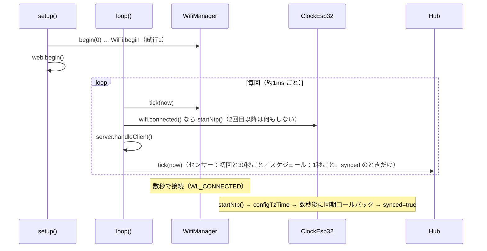
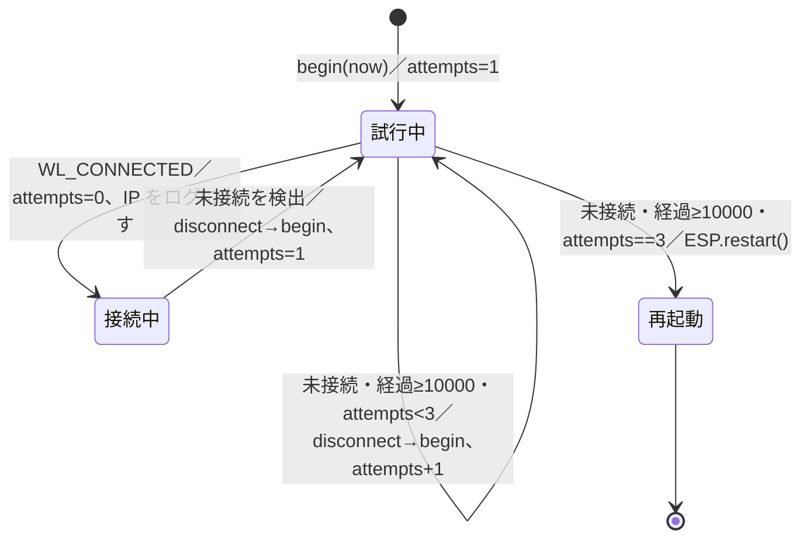

# 詳細設計：起動・ネットワーク・時刻・センサー

作業項目：D-06／要件の原本：`docs/requirements.md` v0.5（部品表・ピン割り当て・配線v2 を反映。温湿度センサーは AHT25）／要件ID：`docs/req-index.json`（D1 closed 後）／前提：`docs/design/01-architecture.md`（D-01、75ce1e8）、`docs/design/02-ac-state.md`（D-02、97efd33）、`docs/design/03-schedule.md`（D-03、1f16bdf）、`docs/design/04-api.md`（D-04、f340073）、`docs/design/05-ui.md`（D-05、6bf1464）、`docs/hw/phase1-capture.md`（H-1 の受信記録）

この文書では、`src/` 側の実行時の動きを決める。対象は `src/main.cpp`（`setup()` と `loop()`）、`src/wifi_manager.*`、`src/clock_esp32.*`、`src/climate_dht20.*`、`src/ir_sender_esp32.h` の public の形、`include/secrets.h(.example)`。

D-01 で決めた名前・シグネチャ（`WifiManager(ssid, pass)`・`begin(nowMs)`・`tick(nowMs)`・`connected()`、6a 節の状態遷移表、`kWifiMaxAttempts = 3`・`kWifiAttemptTimeoutMs = 10000`、`IClock`・`IClimateSensor`・`ClockReading`、`IIrSender`（`sendAc` だけ）、`Hub::tick(nowMs)`、`kClimateIntervalMs = 30000`、`src/pins.h`）には従い、変えない。D-01・D-02 に無く、この文書で足す public の形は次のとおり（既存のシグネチャは変えない）。
- `struct StaticIpConfig` と `WifiManager::setStaticIp(const StaticIpConfig&)`：IP 固定の設定（4.1）
- `ClockEsp32::startNtp()` と定数 `kTzJst`・`kNtpServer1〜3`・`kMinValidEpochSec`（5.1）
- `ClimateDht20::ClimateDht20()`・`ClimateDht20::begin()`（8.1）
- `IrSenderEsp32::IrSenderEsp32()`・`IrSenderEsp32::begin()`（2.4。`sendAc` は D-01 の `IIrSender` の override。照明用のメソッドは無い）
- `irhub::secrets` 名前空間の定数（7節）

あわせて、D-01 が「D-06 で決める」とした点（自動再接続を切るか、`WiFi.config()` の呼び方、NTP の開始と `synced` の判定、センサーの初期化）をここで決める。

照明（F3）は要件 v0.4 で対象外。この文書のどこにも照明の送信・照明の応答時間・照明の信号データは出てこない。起動時に送らない決まり（N-BOOT）はエアコンだけが対象。

---

## 対象要件

- [N-WIFI] Wi-Fi の再接続：「4. Wi-Fi（src/wifi_manager）」。D-01 6a 節の遷移表をそのまま使う。この文書では自動再接続を切ること（4.2）と、接続前の設定の順番（4.3）を決める
- [N-TIME] NTP・JST、取得前は実行しない：「5. 時刻（src/clock_esp32）」。NTP を始めるタイミング、`synced` の判定（SNTP の同期完了コールバック）、JST への変換を決める
- [N-BOOT] 起動時にエアコンへ信号を送らない：「2. 起動シーケンス」の手順と「2.3 起動時に送らないための確認」
- [N-SECRET] SSID／パスワードを別ファイルに置く：「7. include/secrets.h の形」（`include/secrets.h.example` の全文と、ファイルが無いときのビルドエラー）
- [N-IP] IP 固定の2方式：「6. IP アドレスの固定（2方式）」（方式A＝DHCP 予約、方式B＝ESP32 側で固定。`secrets.h` の `kUseStaticIp` で切り替える）
- [N-RESP] 押してから送信まで1秒以内：「3. loop() の中身と周期」の「3.2 loop() を止める処理の上限」（エアコンの送信時間の見積もり）と「3.3 1秒の内訳」
- [F5] 室温・湿度：「8. 温湿度センサー（src/climate_dht20）」。読み取り周期は `Hub::tick` の `kClimateIntervalMs`（D-01）で、ここでは初期化と1回の読み取りを決める
- [HW-PINS] ピン割り当て：「2.1 setup() の手順」「2.4」と「8.」で `pins::kIrSend`（IO23）、`pins::kI2cSda`／`kI2cScl`（IO21／IO22）を使う。IO14 は初期化しない（D-01 のとおり。要件 v0.5 の配線v2 では未接続）
- [C-TECH] 技術制約：「1. 使うライブラリ API の一覧」（Arduino core 2.x の WiFi・SNTP、IRremoteESP8266 の `IRac`、RobTillaart DHT20、Wire、`monitor_speed = 115200` に合わせた `Serial.begin(115200)`）

---

## 設計

### 1. 使うライブラリ API の一覧

この文書に出てくる外部 API はこの表だけ。「確認」の列は、この設計を書くときに何で確かめたかを表す。

| API | 場所 | 確認 |
|---|---|---|
| `Serial.begin(115200)`、`Serial.printf(...)` | main ほか | Arduino core 2.x |
| `millis()`、`delay(ms)`、`pinMode(pin, OUTPUT)`、`digitalWrite(pin, LOW)` | main、ir_sender_esp32 | Arduino core 2.x |
| `esp_reset_reason()`（`esp_system.h`、戻り値 `esp_reset_reason_t`） | main（シリアルに出すだけ） | ESP-IDF 4.4。要確認：Arduino から `#include <esp_system.h>` で使えること |
| `IRac(const uint16_t pin, const bool inverted = false, const bool use_modulation = true)` | ir_sender_esp32 | 取得済みのライブラリ `.pio/libdeps/dump/IRremoteESP8266/src/IRac.cpp` 109〜114行で確認。値を覚えるだけでピンに触らない |
| `bool IRac::sendAc(const stdAc::state_t desired, const stdAc::state_t *prev)` | ir_sender_esp32 | 同 IRac.cpp 3045行。HITACHI_AC296 の経路 `IRac::hitachi296`（1680〜1699行）は `ac->begin()`（中で `IRsend::begin()`＝`pinMode(OUTPUT)`＋消灯。IRsend.cpp 45〜50行）→ モード・温度・風量・運転を設定 → `ac->send()` |
| `WiFi.persistent(bool)`、`WiFi.mode(WIFI_STA)`、`WiFi.setAutoReconnect(bool)`、`WiFi.setSleep(bool)` | wifi_manager | Arduino core 2.x の `WiFiGeneric`／`WiFiSTA` |
| `WiFi.config(IPAddress local, IPAddress gateway, IPAddress subnet, IPAddress dns1, IPAddress dns2)` → `bool` | wifi_manager | Arduino core 2.x の `WiFiSTA` |
| `WiFi.begin(const char* ssid, const char* pass)`、`WiFi.disconnect()`、`WiFi.status()`（`WL_CONNECTED`）、`WiFi.localIP()`、`WiFi.macAddress()`（`String`） | wifi_manager | Arduino core 2.x |
| `IPAddress(uint8_t, uint8_t, uint8_t, uint8_t)`、`IPAddress::toString()` | wifi_manager | Arduino core 2.x |
| `ESP.restart()` | wifi_manager | Arduino core 2.x |
| `configTzTime(const char* tz, const char* server1, const char* server2, const char* server3)` | clock_esp32 | arduino-esp32 2.0.17 の `cores/esp32/esp32-hal-time.c` で確認（中で `sntp_setoperatingmode(SNTP_OPMODE_POLL)`・`sntp_setservername`・`sntp_init()` の後に `setenv("TZ", tz, 1)`・`tzset()`） |
| `sntp_set_time_sync_notification_cb(sntp_sync_time_cb_t)`、`typedef void (*sntp_sync_time_cb_t)(struct timeval* tv)` | clock_esp32 | ESP-IDF v4.4 の `components/lwip/include/apps/esp_sntp.h` で確認。要確認：Arduino から `#include <esp_sntp.h>` で見えること（見えなければ `#include "lwip/apps/sntp.h"` を試す） |
| `time(nullptr)`、`localtime_r(const time_t*, struct tm*)` | clock_esp32 | 標準 C（newlib） |
| `Wire.begin(int sda, int scl)` → `bool` | climate_dht20 | Arduino core 2.x |
| `DHT20(TwoWire* wire = &Wire)`、`bool begin()`、`int read()`、`float getTemperature()`、`float getHumidity()`、`DHT20_OK`（0） | climate_dht20 | RobTillaart/DHT20 の master（0.3.3）の `DHT20.h` で確認。`read()` の戻り値は 0.3.3 では `int`。D-01 のとおり `== DHT20_OK` の比較だけに依存する |
| `int requestData()`、`bool isMeasuring()`、`int readData()`、`int convert()`、`uint32_t lastRead()`、`DHT20_ERROR_READ_TIMEOUT`（-14）、`DHT20_ERROR_LASTREAD`（-15） | climate_dht20（1回目の読み取りだけ。8.3） | `.pio/libdeps/esp32/DHT20/DHT20.h`・`DHT20.cpp`（0.3.3）で確認。すべて public。`read()` はこの4つを順に呼ぶだけで、その前に `millis() - _lastRead < 1000` なら `DHT20_ERROR_LASTREAD` を返す。`_lastRead` はコンストラクタで 0、`readData()` が7バイト読めて、そのすべてが 0 ではないときだけ `millis()` で更新される（すべて 0 なら `DHT20_ERROR_BYTES_ALL_ZERO` で更新しない）。`lastRead()` はその値を返す |

使わないもの：
- `getLocalTime(struct tm*, uint32_t ms = 5000)`。中で「年が 2016 より後になるまで `delay(10)` で待つ」ループを最大 `ms` ミリ秒回すため（esp32-hal-time.c で確認）、既定値のまま呼ぶと NTP 未取得の間 `loop()` が5秒止まる（N-RESP に反する）。代わりに `time()`＋`localtime_r()` を使う（5.3）。D-01 7節の表の `getLocalTime` はこの理由で使わない（要件への疑問 10）。
- `IRsend` を `IrSenderEsp32` のメンバとして持つこと・`IRsend::sendRaw`。送信は `IRac` だけ（D-01 7節）。

`platformio.ini` の `env:esp32` の `lib_deps` に DHT20 を足す（I-05）。登録名は要確認（推測：`robtillaart/DHT20@^0.3.1`。0.3.0 から `begin()` が引数なしになり、`Wire.begin()` は呼び側が行う）。

### 2. 起動シーケンス

#### 2.1 setup() の手順

グローバル変数として実体を作る（生成順は下の宣言順。どのコンストラクタもハードウェアに触らず、送信もしない）。

```cpp
// src/main.cpp（骨組み。I-05 が書く）
#include <Arduino.h>
#include <WebServer.h>
#include <esp_system.h>
#if __has_include("secrets.h")
#include "secrets.h"
#else
#error "include/secrets.h がありません。include/secrets.h.example をコピーして作ってください（docs/design/06-runtime.md 7節）"
#endif
#include "core_version.h"
#include "pins.h"
#include "ir_sender_esp32.h"
#include "clock_esp32.h"
#include "climate_dht20.h"
#include "wifi_manager.h"
#include "web_bridge.h"
#include "hub.h"
#include "api.h"

namespace {
WebServer              server(80);
irhub::IrSenderEsp32   ir;       // コンストラクタはピンを触らない
irhub::ClockEsp32      clk;
irhub::ClimateDht20    sensor;
irhub::Hub             hub(ir, clk, sensor);   // 送らない（D-01 10節）
irhub::ApiRouter       router(hub);
irhub::WebBridge       web(server, router);
irhub::WifiManager     wifi(irhub::secrets::kWifiSsid, irhub::secrets::kWifiPass);
}  // namespace

void setup() {
  Serial.begin(115200);                                    // (1)
  Serial.printf("[boot] irhub %s reset=%d\n", irhub::coreVersion(), (int)esp_reset_reason());
  ir.begin();                                              // (2) IO23 を出力・LOW にする。送信しない（2.4）
  sensor.begin();                                          // (3) Wire.begin(21, 22) → DHT20::begin()
  if (irhub::secrets::kUseStaticIp) {                      // (4) N-IP 方式B のときだけ
    wifi.setStaticIp(irhub::secrets::kStaticIp);
  }
  wifi.begin(millis());                                    // (5) Wi-Fi 接続を始める（待たない）
  web.begin();                                             // (6) ハンドラ登録と server.begin()
  Serial.println("[boot] setup done");
}
```

| 順 | すること | 所要時間の目安 | 理由 |
|---|---|---|---|
| 1 | `Serial.begin(115200)`、版とリセット理由を出す | 数 ms | `monitor_speed = 115200`（C-TECH）。リセット理由は N-WIFI の再起動を実機で見分けるため（`ESP_RST_SW`＝`ESP.restart()`、`ESP_RST_POWERON`＝電源投入） |
| 2 | `ir.begin()`（`pinMode`＋`digitalWrite(LOW)`。2.4） | 1 ms 未満 | IO23 をできるだけ早く出力・LOW に固定する。GPIO23 はリセット直後にプルダウンされないため、`ir.begin()` までは 2SC1815 のベースが浮きうる。変調信号は出ないので N-BOOT には反しない（外付けプルダウンを付けるかは人がハード側で判断する。01-architecture.md 9節の注記）。送信メソッドは呼ばない |
| 3 | `sensor.begin()` | 最大約 100 ms | 8.2。失敗してもそのまま進む（`loop()` で 30 秒ごとに読み直す） |
| 4 | IP 固定の設定を渡す（方式B のときだけ） | 0 | 6節。`WiFi.config()` の実行は `wifi.begin()` の中 |
| 5 | `wifi.begin(millis())` | 数十 ms | 4.3 の順で設定して `WiFi.begin()`。**接続を待たない**（待つと接続できない間 `setup()` から出られず、D-01 6a の「約30秒で再起動」を `loop()` の `tick` で数えられない） |
| 6 | `web.begin()` | 数 ms | D-04 12節。接続前に `server.begin()` しても、接続後に受け付けられる（要確認：実機で確かめる。受け付けなければ `loop()` で `wifi.connected()` が初めて true になったときに1回だけ呼ぶ形に変える） |

`setup()` で**しないこと**：赤外線の送信、NTP の開始（接続後に `loop()` で行う。5.1）、Wi-Fi の接続待ち、センサーの読み取り（初回は `Hub::tick` が行う）、IO14 の初期化。

#### 2.2 起動から動き出すまでの流れ



目安の時刻（ルーターと NTP が正常なとき）：

| 時点 | できること |
|---|---|
| 0 秒（電源投入） | 何も送らない。エアコンの状態は初期値、スケジュールは空（N-STATE） |
| 約 0.1 秒 | `setup()` 終わり。`Hub::tick` の初回でセンサーを読む（F5） |
| 約 2〜5 秒 | Wi-Fi 接続。`GET /` が開ける。NTP を始める |
| 接続後 約 1〜5 秒 | NTP 同期。`/api/status` の `clock.synced` が true。スケジュールの判定を始める（D-03 4.2 により同期した分の予定は実行しない） |

#### 2.3 起動時に送らないための確認（N-BOOT）

対象はエアコン（送信先はエアコンしか無い）。D-01 10節の決まりに加え、実行時の側で次を守る。

| 場面 | 送らない理由 |
|---|---|
| グローバル変数の生成 | `IrSenderEsp32`（中の `IRac` のコンストラクタは値を覚えるだけ。1節）・`Hub` のコンストラクタは送らない（D-01 10節の3） |
| `setup()` | 上の表に送信は無い。`ir.begin()` はピンの設定だけ |
| Wi-Fi の接続・再接続 | `WifiManager` は `Hub`・`IIrSender` を知らない（D-01 2節の規則4） |
| NTP の同期 | 同期しても `Hub` は同期した分を実行しない（D-03 4.2）。コールバックは `ClockEsp32` の旗を立てるだけで `Hub` を呼ばない |
| `ESP.restart()` の後 | 上と同じ手順で起動するだけ。再起動の回数や前の状態は持ち越さない（RAM のみ） |

#### 2.4 IrSenderEsp32 の public の形（I-05 のスタブと I-06 の本物で共通）

`src/ir_sender_esp32.h` の public 部分はこの形に固定する。I-05 はスタブ、I-06 は本物を作るが、**ヘッダの public 部分は同じ**にし、`main.cpp`（2.1）は I-06 で書き換えない。private のメンバは各自で決めてよい。

```cpp
// src/ir_sender_esp32.h（public 部分。I-05 が作り、I-06 は private と .cpp だけを変える）
#pragma once
#include "ports.h"   // IIrSender、AcState（D-01）

namespace irhub {

class IrSenderEsp32 : public IIrSender {
 public:
  // ピンにも赤外線にも触らない（グローバル変数として生成されるため。N-BOOT）。
  // 送信ピンは pins::kIrSend（IO23）を .h/.cpp の中で使い、引数では受け取らない。
  IrSenderEsp32();
  // setup() で1回だけ呼ぶ。送信ピンを出力・LOW にするだけで、何も送らない（N-BOOT）。
  void begin();
  // D-01 の IIrSender。begin() の後にだけ呼ばれる（呼ぶのは Hub だけ）。
  bool sendAc(const AcState& state) override;
};

}  // namespace irhub
```

| | I-05（スタブ） | I-06（本物） |
|---|---|---|
| コンストラクタ | 何もしない | メンバ `IRac ac_{pins::kIrSend}` を初期化するだけ（`IRac` のコンストラクタは値を覚えるだけでピンに触らない。1節） |
| `begin()` | `pinMode(pins::kIrSend, OUTPUT); digitalWrite(pins::kIrSend, LOW);` | スタブと同じ2行。`IRac` には `begin()` が無く、送信のたびに `IRac::hitachi296` の中で `IRsend::begin()` が呼ばれる（1節）ので、起動時のピンの固定はこの2行で行う |
| `sendAc` | `Serial.printf("[ir] sendAc power=%d mode=%d temp=%d fan=%d\n", …)` を出して `true` | D-02 7節の変換（`protocol = decode_type_t::HITACHI_AC296`、`swingv`・`swingh` は `kOff`）で `ac_.sendAc(desired, prev)`。戻り値をそのまま返す |

- 送信メソッド（`sendAc`）の中以外で、`IRac` の送信メソッドを呼ばない（D-01 10節の1）。
- 押したボタンを表すバイト（`state[11]`：運転 0x13、モード 0x41、風量 0x42、温度 0x43／0x44）は `IRac` が埋めない。エアコンが受け付けるかは H-2 で確かめる（D-01 7節）。受け付けず対処が要る場合も、変えるのは `ir_sender_esp32.cpp` の中だけで、上の public の形と `main.cpp` は変えない。

### 3. loop() の中身と周期

#### 3.1 loop()

```cpp
void loop() {
  const uint32_t nowMs = millis();
  wifi.tick(nowMs);                 // (a) Wi-Fi の見張り。ブロックしない（4節）
  if (wifi.connected()) clk.startNtp();   // (b) 初めて接続したときに NTP を始める。2回目以降は何もしない（5.1）
  server.handleClient();            // (c) HTTP を1件処理（D-04 12節）
  hub.tick(nowMs);                  // (d) センサー（30秒）とスケジュール（1秒）の判定（D-01・D-03）
  delay(1);                         // (e) 他のタスク（Wi-Fi・lwIP）に CPU を譲る
}
```

- 周期の判断は `WifiManager::tick`（D-01 6a、src の唯一の例外）と `Hub::tick`（core）だけが持つ。`loop()` は毎回すべてを呼ぶだけで、`if (経過 >= …)` のような判断を書かない。
- (b) の `wifi.connected()` を見て呼ぶことは「条件付きの呼び出し」だが、回数・時間の判断ではない（`startNtp()` の中で1回だけに絞る）。
- `hub.tick` は Wi-Fi が切れている間も呼ぶ。スケジュールは NTP 取得後なら ESP32 の内部時計で判定を続ける（D-03 4.3）。`sendAc` は赤外線を出すだけなので、Wi-Fi の状態に関係なく動く。
- `millis()` の差はすべて `uint32_t` の引き算で取る（約49日の一周でも正しい）。

| 処理 | 周期 | 誰が周期を決めるか | 定数 |
|---|---|---|---|
| Wi-Fi の状態確認 | 毎回（約 1 ms） | — | — |
| Wi-Fi の再試行・再起動 | 試行ごとに 10 秒待つ、3 回で再起動 | `WifiManager::tick` | `kWifiAttemptTimeoutMs = 10000`、`kWifiMaxAttempts = 3`（D-01） |
| NTP の開始 | 初めて接続したとき1回 | `ClockEsp32::startNtp` | — |
| NTP の再同期 | 1 時間ごと（SNTP の既定。変えない） | ESP-IDF の SNTP | 要確認：Arduino core 2.x の既定値（`CONFIG_LWIP_SNTP_UPDATE_DELAY`、3600000 ms の見込み） |
| HTTP の処理 | 毎回 | — | — |
| 温湿度の読み取り | 起動直後に1回、その後 30 秒ごと | `Hub::tick` | `kClimateIntervalMs = 30000`（D-01、仮(F5)） |
| スケジュールの判定 | 1 秒ごと（`synced` のときだけ） | `Hub::tick` | `kScheduleCheckIntervalMs = 1000`（D-03） |

#### 3.2 loop() を止める処理の上限（N-RESP）

`loop()` は1本のタスクで回るので、どれかの処理が止まっている間は他の要求が待たされる。止まる処理と上限：

| 処理 | 止まる時間の目安 | 頻度 | 扱い |
|---|---|---|---|
| `delay(1)` | 1 ms | 毎回 | そのまま |
| `wifi.tick` | 1 ms 未満（`WiFi.status()` を見るだけ。再試行時も `WiFi.disconnect()`・`WiFi.begin()` は待たずに戻る） | 毎回 | そのまま。接続を待つループを書かない |
| `sensor.read()`（AHT25。DHT20 ライブラリ） | 約 80〜100 ms（測定の完了待ち） | 30 秒に1回 | そのまま（1秒の枠に収まる）。要確認：実機で所要時間をシリアルに出して測る（8.3） |
| エアコンの送信（`IRac::sendAc`、HITACHI_AC296） | **約 0.48 秒**（下の見積もり）。幅で言うと約 0.4〜0.7 秒 | 操作・スケジュールのとき | 送信は止められない（赤外線の信号の長さそのもの）。送信中に来た要求は送信後に処理される |
| `server.handleClient()` | 要求1件の処理。本文 8192 バイトまで（D-04） | 要求のたび | 遅い端末が本文を途中で止めると、WebServer のタイムアウトまで止まる（要確認：Arduino core 2.x の `HTTP_MAX_DATA_WAIT`、5000 ms の見込み）。LAN 内の自分だけの利用（N-AUTH）なので対策しない |

**エアコンの送信時間の見積もり（HITACHI_AC296、37 バイト＝ヘッダ＋296 ビット）**

1 の数：受信した信号（`docs/hw/phase1-capture.md` の `state[37]`）は、先頭 3 バイト（`0x01 0x10 0x00`、1 が 2 個）の後に「値と、そのビット反転」の組が 17 組並ぶ（例 `0x40 0xBF`、`0x13 0xEC`、`0x00 0xFF`）。1 組は必ず 1 が 8 個なので、**どの状態でも 1 が 138 個、0 が 158 個**で、送信時間は状態によらずほぼ一定。`IRac` の側も同じ組の形で作る（`IRHitachiAc296::hasInvertedStates` がこの形を確かめる）。

| 区間 | 受信記録の rawData（純正リモコン） | ライブラリの送信（`IRsend::sendHitachiAC`：ヘッダ 3300＋1700µs、マーク 400µs、1＝1250µs、0＝500µs、末尾の空き `kHitachiAcMinGap`＝`kDefaultMessageGap`＝100000µs、繰り返し 0 回。ir_Hitachi.cpp 25〜32・68〜85行、IRsend.h 41行、IRsend.cpp 421〜434行） |
|---|---|---|
| ヘッダ | 3400＋1660 ≈ 5.1 ms | 3.3＋1.7 = 5.0 ms |
| マーク 297 個（296 ビット＋末尾） | 約 470µs × 297 ≈ 139.6 ms | 400µs × 297 ≈ 118.8 ms |
| 1 の空き 138 個 | 約 1190µs × 138 ≈ 164.2 ms | 1250µs × 138 = 172.5 ms |
| 0 の空き 158 個 | 約 460µs × 158 ≈ 72.7 ms | 500µs × 158 = 79.0 ms |
| 信号の長さ | **約 0.38 秒** | **約 0.375 秒** |
| 末尾の空き（LED 消灯のまま `delay` で待つ） | — | 100 ms |
| `loop()` が止まる時間 | — | **約 0.48 秒** |

- 見積もりの中心は約 0.48 秒。D-05 4.4 が引いている「約 0.4〜0.7 秒」はこの値を含む幅で、下限 0.4 秒は信号の長さ（約 0.38 秒）＋α、上限 0.7 秒は `IRac::sendAc` の前処理と実機のばらつきへの余裕とする。実機で測る（テスト観点）。
- 赤外線の点灯が始まるのは `sendAc` を呼んでから数 ms 以内（ヘッダのマークから）。N-RESP の「送るまで」はここまでを数える（3.3）。

`loop()` に書いてはいけないもの：`delay()` による 10 ms を超える待ち、`getLocalTime()`（既定で最大5秒待つ）、Wi-Fi の接続待ちループ、`Serial` への大量の出力（1回の `loop()` で数行まで）。

#### 3.3 1秒の内訳（N-RESP、仮）

「画面のボタンを押してから赤外線を送り始めるまで」を次のように見積もる（エアコン、LAN 内）。

| 区間 | 目安 | 根拠・対策 |
|---|---|---|
| 画面：押してから `fetch` を出すまで | 数十 ms | D-05 9節（待たずに送る、ダブルタップ待ちを消す） |
| Wi-Fi：スマホ → ESP32 | 数 ms〜数十 ms | **`WiFi.setSleep(false)`** で ESP32 の省電力（モデムスリープ）を切る。切らないと受信がビーコン間隔（約 100 ms 単位）で遅れることがある。USB 給電なので電力は問題にしない |
| `loop()` が今の処理を終えるまで | 通常 1 ms 以下、最悪はセンサー読み取り中の約 100 ms | 3.2 |
| `handleClient` → `ApiRouter` → `Hub::applyAc` → `IRac::sendAc` の点灯開始 | 数 ms | JSON 512 バイト以下（D-04） |
| 合計 | 約 0.2 秒以下 | 1 秒に対して余裕あり |

例外：
- 別のエアコンの送信（3.2 の約 0.4〜0.7 秒、中心 約 0.48 秒）の途中に要求が届いた場合は、その送信が終わるまで待つ。合計は約 0.5〜0.9 秒の見込みで、1 秒以内に収まる見込み。実機で測る（テスト観点）。
- 画面が送信中に種類の違うボタンを続けて押したときの2本目以降（D-05 4.4 の「引き換え」）は、前の要求の往復（送信1回分を含む）を画面の側で待つので 1 秒を超えうる。これは D-05 の扱い（D-05 の要件への疑問5）で、ESP32 側では変えない。

外出先（F6、Tailscale 経由）は経路の遅れが加わるが、要件の 1 秒は LAN 内の操作についての値と読む（要件への疑問 4）。

### 4. Wi-Fi（src/wifi_manager）

#### 4.1 クラス（D-01 の形に1つ足す）

```cpp
// src/wifi_manager.h
#pragma once
#include <cstdint>

namespace irhub {

constexpr uint8_t  kWifiMaxAttempts      = 3;      // N-WIFI（決定）：最大3回
constexpr uint32_t kWifiAttemptTimeoutMs = 10000;  // 仮(N-WIFI)：「計30秒程度」を 3回×10秒 とした

// N-IP 方式B（ESP32 側で固定）のときの設定。値は include/secrets.h から来る（7節）
struct StaticIpConfig {
  uint8_t ip[4];
  uint8_t gateway[4];
  uint8_t subnet[4];
  uint8_t dns1[4];    // NTP のサーバー名を引くのに必要。通常はルーターのアドレス（= gateway）
};

class WifiManager {
 public:
  WifiManager(const char* ssid, const char* pass);   // D-01 のまま
  // D-06 で追加。begin() の前に呼ぶ。呼ばなければ DHCP（方式A）
  void setStaticIp(const StaticIpConfig& cfg);
  void begin(uint32_t nowMs);                         // D-01 のまま（中身は 4.3）
  void tick(uint32_t nowMs);                          // D-01 のまま（6a 節の表）
  bool connected() const;                             // D-01 のまま
 private:
  void startAttempt(uint32_t nowMs);                  // WiFi.disconnect() → WiFi.begin()、attempts_++、ログ
  const char*    ssid_;
  const char*    pass_;
  bool           useStatic_  = false;
  StaticIpConfig static_{};
  bool           trying_     = false;
  uint8_t        attempts_   = 0;
  uint32_t       attemptMs_  = 0;
};

}  // namespace irhub
```

`tick` の状態遷移は D-01 6a 節の表のとおり（ここでは変えない）。状態図で書き直すと次のとおり。



時刻の例（D-01 6a と同じ）：`begin(0)` の後つながらなければ 10000ms・20000ms で再試行、30000ms で再起動。運用中に 1000ms で切断を検出すれば、1000・11000・21000ms に試行して 31000ms で再起動（「計30秒程度」）。

#### 4.2 自動再接続は切る（D-01 からの申し送りの決定）

`WiFi.setAutoReconnect(false)` とし、再接続は `WifiManager` だけが行う。

- 理由1：Arduino core 2.x は既定で自動再接続が有効で、切断のイベントで裏から `WiFi.begin()` 相当を呼ぶ。自前の `WiFi.disconnect()`→`WiFi.begin()` と重なると、試行の途中で接続がやり直され、「10 秒×3 回」の数え方がずれる。
- 理由2：自動再接続に任せて数えるだけにする案は、裏の再接続の間隔が core の実装次第で、要件の「最大3回」を保証できない。
- 切っても D-01 6a の表の「接続中 → 未接続を検出 → 1 回目」の行で直ちに再接続を始めるので、再接続が遅れることはない。

#### 4.3 begin() の中身（接続前の設定の順）

```cpp
void WifiManager::begin(uint32_t nowMs) {
  WiFi.persistent(false);          // SSID 等を毎回フラッシュ（NVS）へ書かない
  WiFi.mode(WIFI_STA);
  WiFi.setAutoReconnect(false);    // 4.2
  WiFi.setSleep(false);            // 3.3（N-RESP）
  if (useStatic_) {                // 6節 方式B
    const bool ok = WiFi.config(IPAddress(static_.ip[0], ...), IPAddress(static_.gateway[0], ...),
                                IPAddress(static_.subnet[0], ...), IPAddress(static_.dns1[0], ...));
    Serial.printf("[wifi] static ip %s\n", ok ? "set" : "FAILED");   // 失敗してもそのまま begin（DHCP になる）
  }
  Serial.printf("[wifi] mac %s\n", WiFi.macAddress().c_str());       // 方式A の登録に使う
  startAttempt(nowMs);             // D-01：最初の接続も1回目の試行
}
```

- `WiFi.persistent(false)`：Arduino core は既定で `WiFi.begin()` のたびに接続情報をフラッシュへ保存する。要件の「フラッシュへの保存をしない」（やらないこと）は状態とスケジュールについてだが、再接続のたびにフラッシュを書くのは寿命の点でも避けたいので切る。機能は増えない。
- `WiFi.config()` は `WiFi.begin()` の**前**に1回だけ呼ぶ。再試行（`startAttempt`）では呼び直さない（設定は `WiFi.disconnect()` で消えない見込み。要確認：再試行後に `WiFi.localIP()` が固定の値のままであることを実機で確かめる。消える場合は `startAttempt` の `WiFi.begin()` の前でも呼ぶ）。
- 方式A（DHCP 予約）では `WiFi.config()` を呼ばない。

#### 4.4 シリアルに出すもの

実機での確認（テスト観点）に使う。1回の `tick` で出すのは2行まで（接続中に切断を見つけた `tick` では、`[wifi] lost` の後に `startAttempt` が `[wifi] attempt 1/3` を出すので2行になる。それ以外の `tick` は1行まで）。

| 時 | 行の例 |
|---|---|
| 試行を始めたとき | `[wifi] attempt 1/3 at 1000ms` |
| 接続したとき | `[wifi] connected ip=192.168.1.50 at 4210ms` |
| 切断を検出したとき | `[wifi] lost at 600000ms` |
| 再起動の直前 | `[wifi] giving up, restart at 31000ms` |

パスワードは出さない（N-SECRET）。SSID も出さない。

### 5. 時刻（src/clock_esp32）

#### 5.1 NTP の開始

```cpp
// src/clock_esp32.h
#pragma once
#include <atomic>
#include <sys/time.h>
#include "ports.h"

namespace irhub {

constexpr const char* kTzJst       = "JST-9";          // POSIX の TZ 表記で UTC+9、夏時間なし
constexpr const char* kNtpServer1  = "ntp.nict.jp";    // 推測（要件への疑問 2）
constexpr const char* kNtpServer2  = "time.google.com";
constexpr const char* kNtpServer3  = "pool.ntp.org";
constexpr int64_t     kMinValidEpochSec = 1577836800;  // 2020-01-01T00:00:00Z。これより前は「取れていない」扱い（D-03 の前提）

class ClockEsp32 : public IClock {
 public:
  // Wi-Fi が初めてつながった後に loop() から毎回呼ばれる。最初の1回だけ
  // sntp_set_time_sync_notification_cb(&onSync) → configTzTime(kTzJst, 3台) を行う。2回目以降は何もしない。
  void startNtp();
  ClockReading now() override;   // 5.3
 private:
  static void onSync(struct timeval* tv);    // SNTP の同期完了で呼ばれる（lwIP のタスクから）。synced_ を true にするだけ
  static std::atomic<bool> synced_;          // 一度 true になったら false に戻さない（D-01：一度でも取れていれば true）
  bool started_ = false;
};

}  // namespace irhub
```

- 開始を Wi-Fi の接続後にする理由：接続前に `configTzTime()` を呼ぶと、SNTP の最初の問い合わせが失敗し、再試行の間隔だけ同期が遅れる（lwIP の SNTP は失敗すると待ってから再試行する）。接続後なら最初の問い合わせで取れる。
- 一度始めたら、Wi-Fi が切れて再接続しても `startNtp()` はやり直さない。SNTP は動き続け、1時間ごとに再同期する（3.1 の表）。
- JST は `configTzTime` に `"JST-9"` を渡して TZ 環境変数で持つ。以後 `localtime_r()` が JST を返す。`configTime(gmtOffset, …)` は使わない（どちらでもよいが1つに決める）。

#### 5.2 synced の判定

`synced` は **SNTP の同期完了コールバックが一度でも呼ばれたこと** で判定する。

- 年の値（`time()` が 2016 年より後か）だけで判定しない理由：ESP32 はソフトウェアリセット（`ESP.restart()`）の後も内部の時刻を持ち越すことがあり（要確認）、NTP を取る前から正しそうな時刻が見えることがある。要件は「NTP で取得」なので、この起動で NTP が取れたことを旗で持つ。
- `synced_` は lwIP のタスクから書かれ、`loop()` のタスクから読まれるので `std::atomic<bool>` にする。コールバックの中では旗を立てて1行ログ（`[ntp] synced epoch=1767225600`。`tv->tv_sec` を出す）を出す以外、何もしない（`Hub` を呼ばない。2.3）。
- 念のため、旗が立っていても `time()` が `kMinValidEpochSec` より前なら `synced=false` を返す（D-03 は `synced` のとき 2020 年以降を前提にしている）。
- 一度 true になったら false に戻さない（D-01・D-03：取得後に NTP が途切れても内部時計で続ける）。

| 状態 | 条件 | `now()` の返す値 | 画面（D-04・D-05） |
|---|---|---|---|
| 未開始 | Wi-Fi に一度もつながっていない | `{false, {0…}, 0}` | 警告の帯 |
| 開始・未同期 | `startNtp()` 済み、コールバック未着 | `{false, {0…}, 0}` | 警告の帯 |
| 同期済み | コールバック着、`time() >= kMinValidEpochSec` | `{true, JST の日時, time()}` | 時刻を表示 |

#### 5.3 now()

```cpp
ClockReading ClockEsp32::now() {
  ClockReading r{false, {}, 0};
  if (!synced_.load()) return r;
  const time_t t = time(nullptr);
  if (static_cast<int64_t>(t) < kMinValidEpochSec) return r;
  struct tm tm;
  localtime_r(&t, &tm);                         // TZ=JST-9 により JST
  r.synced   = true;
  r.epochSec = static_cast<int64_t>(t);
  r.local    = LocalTime{ static_cast<int16_t>(tm.tm_year + 1900), static_cast<int8_t>(tm.tm_mon + 1),
                          static_cast<int8_t>(tm.tm_mday), static_cast<int8_t>(tm.tm_hour),
                          static_cast<int8_t>(tm.tm_min),  static_cast<int8_t>(tm.tm_sec),
                          static_cast<int8_t>(tm.tm_wday) };
  return r;
}
```

- ブロックしない（`getLocalTime()` を使わない。1節）。`Hub` は1秒に1回と API のたびに呼ぶ。
- スケジュールの判定は `epochSec` から JST を計算する（D-03 4.1）。`local` は表示と `exportedAt` 用（D-03 の記述「`time()`＋`localtime_r()` から作る」と一致）。

### 6. IP アドレスの固定（2方式）（N-IP、仮）

要件：「ルーターの DHCP 予約で固定する。ルーターを触れない場合は ESP32 側で、ルーターの自動割り当て範囲の外に固定する」。どちらにするかは人が `include/secrets.h` の `kUseStaticIp` で選ぶ。ファームのコードは同じで、切り替えはこの定数1つ。

| | 方式A：DHCP 予約（既定） | 方式B：ESP32 側で固定 |
|---|---|---|
| `kUseStaticIp` | `false` | `true` |
| ESP32 がすること | `WiFi.config()` を呼ばない（DHCP） | `WiFi.begin()` の前に `WiFi.config(ip, gateway, subnet, dns1)` |
| 人がすること | 1. 一度起動してシリアルの `[wifi] mac xx:xx:…` を控える 2. ルーターの管理画面で、その MAC に IP を予約する 3. ESP32 を再起動し、`[wifi] connected ip=` が予約した IP か確かめる | 1. ルーターの DHCP の自動割り当て範囲を調べる（例 192.168.1.2〜192.168.1.199） 2. その範囲の**外**で空いている IP を選ぶ（例 192.168.1.200） 3. `secrets.h` に IP・ゲートウェイ・サブネット・DNS を書いて書き込む 4. `[wifi] connected ip=` を確かめる |
| 向き・不向き | ルーターを触れるなら、こちら（IP の重なりが起きない） | ルーターを触れないとき。範囲の中の IP を選ぶと他の機器と重なるので、範囲外を必ず選ぶ |
| DNS | DHCP が配る | `dns1` に明示（通常はゲートウェイと同じ）。無いと NTP のサーバー名が引けず `synced` にならない |

どちらの方式でも、決まった IP を F6 の `tailscale set --advertise-routes=<IP>/32` に使う（ESP32 側の対応は要らない）。

### 7. include/secrets.h の形（N-SECRET、仮）

- `include/secrets.h`：本物。`.gitignore` に既に入っている（`include/secrets.h`）。Git に入れない。
- `include/secrets.h.example`：見本。Git に入れる。値はダミー。人はこれをコピーして `include/secrets.h` を作る。**作るのは I-05**（I-05 の outputs に `include/secrets.h.example` があり、implementer の書ける場所にも入っている）。下の全文どおりに作る。
- `src/main.cpp` だけが `secrets.h` を include する（2.1）。`wifi_manager` などには値を引数で渡す（D-01：`WifiManager(ssid, pass)`）。lib/core は include しない。
- `secrets.h` が無いと `#error` でビルドが止まり、作り方をメッセージで示す（2.1）。
- IP の設定も同じファイルに置く。秘密ではないが、家のネットワークの情報を Git に入れないためと、書き換える場所を1つにするため。

`include/secrets.h.example` の全文：

```cpp
// include/secrets.h.example
// このファイルを include/secrets.h にコピーして、値を書き換えてください。
// include/secrets.h は .gitignore に入っていて Git に含まれません（N-SECRET）。
#pragma once
#include <cstdint>
#include "../src/wifi_manager.h"   // StaticIpConfig（要確認：include パスの書き方は I-05 がビルドで確かめる）

namespace irhub::secrets {

// Wi-Fi（2.4GHz の SSID。ESP32 は 5GHz に接続できない）
constexpr char kWifiSsid[] = "your-ssid";
constexpr char kWifiPass[] = "your-password";

// IP アドレスの固定（N-IP、docs/design/06-runtime.md 6節）
//   false：方式A。ルーターの DHCP 予約で固定する（おすすめ）。下の kStaticIp は使われない
//   true ：方式B。ESP32 側で固定する。ルーターの自動割り当て範囲の「外」の IP を書く
constexpr bool kUseStaticIp = false;
constexpr irhub::StaticIpConfig kStaticIp = {
  {192, 168, 1, 200},   // ip
  {192, 168, 1, 1},     // gateway（ルーター）
  {255, 255, 255, 0},   // subnet
  {192, 168, 1, 1},     // dns1（通常はルーターと同じ）
};

}  // namespace irhub::secrets
```

- 値は `#define` ではなく `constexpr` にする（型が付き、名前空間に入る）。
- `kUseStaticIp` を `if` で見る（2.1 の (4)）ので、方式A でも `kStaticIp` は書いておく必要がある（見本の値のままでよい）。
- 入れ子の名前空間（`namespace irhub::secrets`）と 2.1 の `__has_include` は C++17 の書き方なので、`env:esp32` は `-std=gnu++17` でビルドする前提とする（今の platformio.ini では native にしか無い。I-04 で `env:esp32` の build_flags／build_unflags に入れる予定）。

### 8. 温湿度センサー（src/climate_dht20、F5）

センサーの部品は AHT25（DHT20 と同じメーカーの互換品。I2C アドレス 0x38 で、DHT20 用ライブラリで読める。要件 v0.5）。01-architecture.md 9節と同じく、部品を指すときは AHT25 と書き、ライブラリ名・クラス名・定数名・ログのタグ（DHT20 ライブラリ、`DHT20.h`、`class DHT20`、`ClimateDht20`、`src/climate_dht20.*`、`kDht20Addr`、`DHT20_OK`／`DHT20_ERROR_*`、`[dht20]`）は実際の名前なので DHT20 のまま使う。

#### 8.1 クラス

```cpp
// src/climate_dht20.h
#pragma once
#include <DHT20.h>
#include "ports.h"

namespace irhub {

class ClimateDht20 : public IClimateSensor {
 public:
  ClimateDht20();                  // dht_(&Wire)。I2C には触らない
  void begin();                    // 8.2。setup() で1回
  ClimateReading read() override;  // 8.3。周期の判断はしない（Hub::tick が 30 秒ごとに呼ぶ）
 private:
  int readFirst();                 // 8.3。まだ1回も読めていないときだけ使う（1秒の間隔チェックなし）
  DHT20 dht_;
};

}  // namespace irhub
```

#### 8.2 begin()

1. 電源投入から 100 ms 以上たってから通信する（センサーの起動時間。DHT20 のデータシートの値を AHT25 にも使う。要確認：AHT25 のデータシートで起動時間が 100 ms 以下であること）。`millis() < 100` なら `delay(100 - millis())`。`setup()` の中の1回だけなので、長く止める待ちには当たらない。
2. `Wire.begin(pins::kI2cSda, pins::kI2cScl)`（IO21／IO22、HW-PINS）。
3. `dht_.begin()`。戻り値が false なら `[dht20] begin failed` を出して進む。
4. I2C アドレス 0x38（`pins::kDht20Addr`）はライブラリの中で固定のため、コードでは渡さない（C-TECH の 0x38 はライブラリが使う値と同じ。要確認：DHT20.h の既定アドレスが 0x38 であること）。

#### 8.3 read()

```cpp
ClimateReading ClimateDht20::read() {
  const uint32_t t0 = millis();
  // まだ1回も読めていない（lastRead()==0）ときは、ライブラリの1秒の間隔チェックを通さない
  const auto st = (dht_.lastRead() == 0) ? readFirst() : dht_.read();  // 型を決め打ちしない（D-01）
  if (st != DHT20_OK) {
    Serial.printf("[dht20] read error %d\n", static_cast<int>(st));
    return {false, 0.0f, 0.0f};
  }
  const ClimateReading r{true, dht_.getTemperature(), dht_.getHumidity()};
  Serial.printf("[dht20] %.1fC %.1f%% (%lums)\n", r.temperatureC, r.humidityPct, millis() - t0);  // 所要時間は 3.2 の確認用
  return r;
}

// DHT20::read()（DHT20.cpp 0.3.3 の 76〜103 行）から、先頭の
// 「millis() - _lastRead < 1000 なら DHT20_ERROR_LASTREAD」だけを除いたもの。
// 順番・タイムアウト（1000 ms）・戻り値の判定はライブラリと同じにする。
int ClimateDht20::readFirst() {
  int st = dht_.requestData();       // 中で resetSensor() も呼ばれる（ライブラリどおり）
  if (st < 0) return st;
  const uint32_t start = millis();
  while (dht_.isMeasuring()) {       // 測定の完了待ち（H-3 の実測で約 40 ms。3.2 の 80〜100 ms は見積もり）
    if (millis() - start >= 1000) return DHT20_ERROR_READ_TIMEOUT;
    yield();
  }
  st = dht_.readData();              // 成功すると _lastRead が更新され、次からは dht_.read() を使う
  if (st < 0) return st;
  return dht_.convert();
}
```

- 1回目が必ず失敗していた理由：ライブラリの `_lastRead` は 0 から始まり、`read()` は `millis() - _lastRead < 1000` のとき `DHT20_ERROR_LASTREAD`（-15）を返す。`Hub::tick` の1回目は起動から約 0.1〜0.2 秒で `read()` を呼ぶ（初回は即読み、D-01・`lib/core/src/hub.cpp`）ので、必ず -15 になり、次の読み取りは 30 秒後だった。
- 直し方：`src/climate_dht20.*` の中だけで直す。まだ1回も読めていない間（`dht_.lastRead() == 0`）は `readFirst()` で間隔チェックを通さずに読む。1秒の間隔チェックは「前の測定から 1 秒空ける」ためのもので、前の測定が無い1回目には当てはまらない。電源投入からの起動待ち（100 ms）は `begin()`（8.2 の 1）で済んでいる。
- 待ちは増やさない：1回目のために `setup()` や `loop()` で 1 秒待つことはしない。1回目の所要時間は 2 回目以降と同じ（測定の完了待ち。H-3 の実測で約 40 ms、3.2 の表の 80〜100 ms は見積もり）。
- 1回目が別の理由（配線外れなど）で失敗した場合は `lastRead()` が 0 のままなので、30 秒後の次の周期も `readFirst()` で読む。30 秒空いているので、どちらの経路でも結果は同じ。
- `lib/core`（`Hub::tick`・`IClimateSensor`）は変えない。
- 失敗（配線外れ、チェックサム異常、2回目以降で前回から 1 秒以内の呼び出し `DHT20_ERROR_LASTREAD` など）はすべて `valid=false`。再試行は `Hub::tick` の次の周期（30 秒後）に任せ、ここで再試行しない。
- 値の丸め（小数1桁）は API（D-04 3節）が行う。ここでは丸めない。
- 補正（オフセット）は入れない。フェーズ3の「室温計と大きくずれない」で大きくずれた場合は、要件への疑問として人に上げる。
- 周期：起動直後に1回、その後 30 秒ごと（`Hub::tick`、`kClimateIntervalMs`）。DHT20 ライブラリの「1 秒以上空ける」制約（AHT25 の測定間隔の目安としても同じ値を使う。要確認）は満たす。

### 9. 作らないもの（やらないことの確認）

| 作らないもの | 理由 |
|---|---|
| OTA（`ArduinoOTA`、`Update`） | やらないこと（プログラムの Wi-Fi 経由の更新）。書き込みは USB（N-FLASH） |
| Wi-Fi 設定画面・AP モード・SmartConfig・WPS | 要件に無い。SSID は `secrets.h`（N-SECRET） |
| Wi-Fi 情報・再起動回数・時刻のフラッシュ保存（`Preferences` など） | やらないこと（永続化）。`WiFi.persistent(false)` で core の保存も切る |
| mDNS（`irhub.local` など） | 要件に無い。IP 固定（N-IP）で足りる |
| 起動時・再接続時・NTP 同期時の赤外線送信 | N-BOOT（2.3） |
| 照明の送信（照明用のメソッド・照明の信号データ・`IRsend` の直接の送信） | F3 は対象外（要件 v0.4、やらないこと「照明の操作」） |
| 本体タイマーのための時刻の同期・送信 | F1-TIMER は対象外（F4 で代替） |
| 室温による自動運転、温湿度の履歴 | やらないこと、F5 |
| NTP 以外の外部への接続 | やらないこと（クラウド）。NTP だけは N-TIME のため使う |
| ウォッチドッグの自前設定、再起動回数に応じた待ち時間の変更 | 要件は「全失敗なら再起動してやり直す」だけ。回数・待ち時間は D-01 の2定数のみ |
| 赤外線の受信（IO14） | D-01 7節（本体ファームでは使わない） |

---

## 仮・未決の扱い

| 要件・値 | 状態 | この文書での扱い | 変わったときに直す場所 |
|---|---|---|---|
| N-WIFI の「計30秒程度」の割り振り | 決定（割り振りは `// 仮(N-WIFI)`） | D-01 の2定数をそのまま使う。自動再接続は切る（4.2） | `src/wifi_manager.h` の `kWifiAttemptTimeoutMs`・`kWifiMaxAttempts` |
| N-TIME | 仮 | SNTP の同期コールバックで `synced` を立て、一度立てたら戻さない。開始は Wi-Fi 接続後（5節） | 「取得できない間」の読み方が変われば `src/clock_esp32.cpp` の `now()`（例：最後の同期から一定時間で false に戻す）。`Hub` 側は `synced` を見るだけなので直さない |
| NTP サーバー名 | 推測 | `clock_esp32.h` の `kNtpServer1〜3` | その3定数 |
| N-BOOT | 仮（原本は「決定案」） | `setup()` に送信を置かない（2.3）。対象はエアコンだけ | 起動時に何か送る仕様になったら、`setup()` の末尾に1か所足す（D-01 のとおり） |
| N-RESP（1秒） | 仮 | 3.2 のエアコンの送信時間の見積もり（中心 約 0.48 秒、幅 約 0.4〜0.7 秒）、3.3 の内訳と `WiFi.setSleep(false)`。`loop()` に長い待ちを書かない | 値が厳しくなったら、センサーの読み取りを非同期（`requestData()`／`readData()`／`convert()`）に分ける検討を `src/climate_dht20.*` と `IClimateSensor` で行う（今は作らない）。送信の長さそのものは短くできない |
| N-SECRET | 仮（原本は「決定案」） | `include/secrets.h`（Git 管理外）と `.example`（7節） | 置き場所が変われば `src/main.cpp` の include と `.gitignore` |
| N-IP | 仮 | 2方式を `kUseStaticIp` で切り替え（6節） | 方式が変われば `include/secrets.h(.example)` と `WifiManager::begin` の `WiFi.config()` の部分 |
| F5 の 30 秒 | F5 は決定、周期は仮 | `Hub::tick` の `kClimateIntervalMs`（D-01）を使う。src 側は周期を知らない | `lib/core/src/hub.h` の定数1つ（画面の `STATUS_POLL_MS` と合わせる。D-05） |
| PROTO（HITACHI_AC296） | 決定 | 3.2 の送信時間の見積もりに使った。プロトコル名を書くのは `ir_sender_esp32.cpp` の1か所（D-01）。押したボタンのバイト（`state[11]`）を `IRac` が埋めないまま受け付けるかは H-2 で確かめる（2.4） | H-2 で受け付けられなければ `src/ir_sender_esp32.cpp` の中だけ。この文書の public の形と `main.cpp` は変えない |
| F1-VALUES | 決定 | この文書では扱わない（実行時の処理に関係しない。値は `ac_capabilities.h` の1か所、D-01・D-02） | — |
| F1-TIMER | 対象外 | 作らない。本体タイマーのための時刻の同期なども作らない（9節） | — |
| F3（照明） | 対象外 | 作らない。起動時の送信・応答時間・送信時間の見積もりのどこにも照明を入れない | — |
| F2（D2 未確定の初期値） | 仮 | この文書では扱わない（初期値は起動時に送らないので、実行時の手順は値に依存しない） | — |

---

## テスト観点

### native 単体テストで確かめること

この文書の対象はすべて `src/`（Arduino 依存）なので、native テストの対象は無い。関係する core 側の動きは既に次のテストで確かめる（ここでは足さない）。
- `Hub::tick` のセンサー周期（初回即読み、30000ms ごと、`millis()` の一周）：D-01 テスト観点。
- `synced=false` の間はスケジュールを実行しない、同期した分は実行しない：D-03 テスト観点（test_schedule）。
- `/api/status` の `clock`・`climate` の形：D-04 テスト観点（test_api）。
- N-BOOT：`Hub` を作っただけではエアコンへの送信（`sendAc`）0 回：D-01 テスト観点。

### 実機でしか確かめられないこと

ビルド：
- `pio run -e esp32` が通る。`include/secrets.h` を消すと `#error` のメッセージで止まる（N-SECRET）。`git status` に `include/secrets.h` が出ない。
- `esp_sntp.h` の include と `sntp_set_time_sync_notification_cb`、`DHT20` の登録名が解決する（1節の要確認）。
- `src/ir_sender_esp32.h` の public 部分が 2.4 のとおりで、照明用のメソッドが無い（I-05・I-06 で同じ）。

起動（N-BOOT・HW-PINS）：
- 電源投入・EN ボタンでのリセット・`ESP.restart()` のどれでも、赤外線 LED が光らない（スマホのカメラで見る）し、エアコンが反応しない。シリアルに `[boot]` とリセット理由が出る。
- 起動から 1 秒以内（`setup()` の後の最初の `Hub::tick`、起動から約 0.1〜0.2 秒）に `[dht20]` の1回目の値（`xx.xC yy.y% (zzms)`）が出て、`[dht20] read error -15` が出ない（8.3 の `readFirst()`）。1回目の `(zzms)` が 2 回目以降の `(zzms)` と同じ程度で、どちらも 100 ms 前後以下（H-3 の実測は約 40 ms。3.2 の 80〜100 ms は見積もり。下の温湿度（F5）の「所要時間が 100 ms 前後」の観点と同じ基準）であること（`loop()` 側に 1 秒待ちを入れていないことの確認）。また `[boot]` から `[wifi] attempt 1/3` まで（`wifi.begin()` は `setup()` の中で呼ぶ）が約 100 ms（`sensor.begin()` の起動待ち）程度で、1 秒に届かないこと（`sensor.begin()` に待ちを足していないことの確認）。
- 1回目の 30 秒後の2回目以降も値が出る（`dht_.read()` の経路に切り替わっても失敗しない）。

Wi-Fi（N-WIFI、D-01 6a の表。シリアルの `[wifi]` の行と時刻で確かめる）：
- ルーター正常で起動 → `attempt 1/3` → 数秒で `connected ip=…`。
- 運用中にルーターの電源を切る → `lost` → 約 10 秒ごとに `attempt 1/3`・`2/3`・`3/3` → 切断から約 30 秒で `giving up, restart` → 再起動。
- 3 回目の前にルーターを戻す → 再起動せずに `connected`。もう一度切ると `attempt 1/3` から数え直す。
- ルーターを切ったまま起動 → 約 30 秒ごとに再起動を繰り返す。戻すとつながる。
- 自動再接続を切ったことの確認：切断中に `attempt` の行以外の接続が起きていない（`[wifi] connected` が `attempt` の後にだけ出る）。

時刻（N-TIME）：
- 接続後数秒で `/api/status` の `clock.synced` が true、`now` が JST で合っている（スマホの時計と数秒以内）。曜日も合っている。
- ルーターの WAN 側を外して起動 → `synced=false` のまま、画面に警告、予定の時刻になっても送らない。WAN を戻すと、SNTP の次の再試行で同期し（再試行の間隔は lwIP が失敗のたびに延ばすため、戻してから同期までの上限は要確認。lwIP の既定では 15 秒から最大 150 秒程度の見込み）、同期した後の画面の読み直し（30 秒以内）で警告が消える。判定は「`[ntp] synced` のログが出てから 30 秒以内に警告が消える」で行い、WAN を戻してからの時間では判定しない。
- 同期後に WAN を外しても `synced=true` のまま、スケジュールが動き続ける。
- `ESP.restart()` の直後、NTP を取る前に `synced=false` になっている（5.2：前の起動の時刻を持ち越しても同期扱いにしない）。

IP（N-IP）：
- 方式A：シリアルの MAC でルーターに予約 → 再起動後の `connected ip=` が予約した IP。
- 方式B：`kUseStaticIp=true` で `connected ip=` が指定の IP。NTP が同期する（DNS が効いている）。Wi-Fi の再試行（ルーターを一度切って戻す）の後も同じ IP（4.3 の要確認）。
- どちらでも、別の端末から `http://<IP>/` が開ける。

温湿度（F5）：
- 30 秒ごとに `[dht20]` が出る。所要時間（`(xxms)`）が 100 ms 前後であること（3.2 の見積もりの確認）。
- AHT25 の SDA を抜くと `read error` → `/api/status` の `climate.valid=false`。戻すと次の周期で戻る。
- 値が室温計と大きくずれない（フェーズ3）。

エアコンの送信時間（N-RESP・3.2 の見積もりの確認、I-06 の後）：
- `sendAc` の前後で `millis()` を取り（I-06 の実装で一時的にシリアルへ出す、または受信機 IRrecvDumpV2 で送信信号の rawData を取る。受信モジュールは要件 v0.5 の配線v2 で外したので、この確認のときだけ別に用意する）、`loop()` が止まる時間が約 0.48 秒（0.4〜0.7 秒の範囲）に収まることを記録する。受信機で取った信号が HITACHI_AC296・296 ビットとして読めることもあわせて見る。
- H-2 の確認（D-01 7節）：`IRac` の送った信号の `state[11]` の値を記録し、エアコンが運転・停止・モード・温度・風量を受け付けること。

応答（N-RESP）：
- 画面でエアコンの温度＋を押してから LED が光るまでを、スマホのスロー動画（240fps 等）で測り 1 秒以内。運転・停止のボタンでも同じ。
- センサー読み取り中に押しても 1 秒以内。スケジュールによるエアコンの送信の途中に（別の端末から）押しても 1 秒以内（見込みは約 0.5〜0.9 秒）。
- `WiFi.setSleep(false)` の有無で `curl -w '%{time_total}' http://<IP>/api/status` の時間を比べる（参考）。

`web.begin()` の位置（2.1 の要確認）：Wi-Fi 接続前に `server.begin()` しても、接続後に `GET /` が開ける。

---

## 要件への疑問

1. **N-WIFI の自動再接続と起動時の扱い。** D-01 の申し送りどおりここで決めた。推測：core の自動再接続を切り（`WiFi.setAutoReconnect(false)`）、`WifiManager` だけが再接続するとした（4.2）。起動時に一度もつながらない場合も約 30 秒で再起動するのは D-01 の推測を引き継いでいる。
2. **NTP サーバー。** 要件は「NTP で取得」だけでサーバーを決めていない。推測：`ntp.nict.jp`・`time.google.com`・`pool.ntp.org` の3台とした。
3. **`synced` の判定方法。** 推測：SNTP の同期完了コールバックが一度でも来たことで判定するとした（5.2）。`ESP.restart()` 後に時刻を持ち越すかどうかは要確認で、持ち越しても「この起動で NTP が取れた」ことだけを同期とみなす。
4. **N-RESP の範囲。** 要件は「ボタンを押してから赤外線を送るまで1秒以内」。推測：LAN 内からの操作で、送信の「開始」（最初の点灯）までを測る、と読んだ。外出先（F6、Tailscale 経由）の遅れや、エアコンの送信そのものの長さ（約 0.38 秒＋末尾の空き 0.1 秒）は含めない。別の送信の途中で届いた要求は約 0.5〜0.9 秒になりうる。画面の側で待つ場合（D-05 4.4 の引き換え）は D-05 の要件への疑問5 で人が判断する。
5. **`WiFi.setSleep(false)` と `WiFi.persistent(false)`。** 要件に直接の記述はない。推測：前者は N-RESP のため、後者はフラッシュに書かないため（やらないことの趣旨）に入れた。どちらも新しい機能ではなく設定だけ。
6. **IP 設定の置き場所。** 要件は SSID とパスワードだけを `secrets.h` に置くとしている。推測：IP 固定の方式と値（秘密ではない）も `secrets.h` に置くとした（家のネットワーク情報を Git に入れず、書き換える場所を1つにするため）。方式の既定は方式A（DHCP 予約）とした。
7. **`IrSenderEsp32` の public の形。** D-01・D-02 は `IrSenderEsp32` のコンストラクタと初期化の形を決めていない。推測：引数なしのコンストラクタ（ピンは `pins::kIrSend` を中で使う）と、送信しない `begin()`（I-05・I-06 とも `pinMode`＋`digitalWrite(LOW)`）を持ち、送信は `sendAc` だけの形とし、I-05（スタブ）と I-06（本物）で public 部分を共通にした（2.4）。
8. **`secrets.h` から `StaticIpConfig` を使うための include。** 見本は `#include "../src/wifi_manager.h"` としたが、PlatformIO の include パスでの書き方は要確認（I-05 がビルドで確かめる）。うまくいかなければ `secrets.h` では `uint8_t` の配列4つを定義し、`main.cpp` で `StaticIpConfig` に詰める形に変えてよい（そのときは7節の見本も合わせて直す）。
9. **センサー（AHT25）の補正と起動待ち。** 要件にない。推測：補正は入れず、起動時に 100 ms 待つ（DHT20 のデータシートの値を AHT25 にも使う。AHT25 での値は要確認）だけとした。1回目の読み取りについては、推測：ライブラリの 1 秒の間隔チェックは前の測定が無い1回目には不要とし、1回も読めていない間だけそのチェックを通さずに読むとした（8.3。人の判断 2026-09-28 を受けた直し。実機の AHT25 は DHT20 互換）。
10. **D-01 との差分。** D-01 7節は `clock_esp32` の API に `getLocalTime()` を挙げているが、既定で最大5秒止まるため使わず、`time()`＋`localtime_r()` にした（1節）。D-03 は既に「`time()`＋`localtime_r()` から作る」と書いており一致する。結果の `ClockReading::local` の中身は同じ。D-01 の表の直しは D-01 の担当に任せる。
11. **エアコンの送信時間の数え方。** 要件に定めがない。推測：`loop()` が止まる時間を、ライブラリの定数（信号 約 0.375 秒＋末尾の空き 0.1 秒＝約 0.48 秒）で見積もり、受信記録の rawData（約 0.38 秒）で信号の長さを裏づけた（3.2）。D-05 4.4 の「約 0.4〜0.7 秒」は、この中心値に余裕を持たせた幅として読むことにした（D-05 は変えない）。
12. **req-index の記述の古さ。** `docs/req-index.json` の `PROTO` の title が「（仮：HITACHI_AC424）」、`source` が v0.3 のままで、D1 の結果（HITACHI_AC296、v0.4）と合わない。この文書は D1 の結果と原本 v0.4 に従った。req-index の直しは人が行う。
