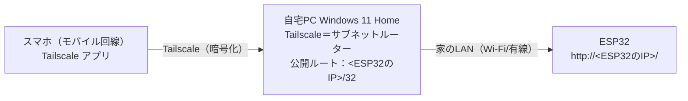

# 運用手順：外出先からの接続（Tailscale サブネットルーター）

作業項目：D-07／要件の原本：`docs/requirements.md` v0.3／要件ID：`docs/req-index.json`／前提：`docs/design/06-runtime.md`（D-06、6節 IP の固定）、`docs/design/04-api.md`（D-04）、`docs/design/05-ui.md`（D-05）

この文書は人が行う作業の手順書。ファームウェア（`lib/`、`src/`）と画面（`web/`）には何も足さない（F6「ESP32側で特別な対応は要らない」）。

---

## 対象要件

- [F6] 外出先からの操作：「設計」の手順1〜7（PC へのインストール、PC の鍵の有効期限の無効化（手順1a、H-DESIGN の人の判断）、Run unattended、スリープ無効、/32 だけの公開、管理画面での承認、スマホの設定、外からの確認）すべて
- [N-IP] IP の固定（仮）：「設計」の手順0（ESP32 の IP が固定されていることを先に確かめる）と「IP が変わったとき」の節。固定のやり方そのものは D-06 の 6 節に従い、この文書では変えない

---

## 設計

### 0. 全体像



- スマホは `http://<ESP32のIP>/` を開くだけ。家の中と同じ URL・同じ画面（D-05 の画面はパスを絶対パス `/api/...` で書いており、ホスト名に依存しない）
- 公開するのは ESP32 の1台（`/32`）だけ。家の LAN 全体（`/24`）は公開しない
- 使うもの：Tailscale の Windows クライアント（PC）、Tailscale アプリ（スマホ）、Tailscale の管理画面（ブラウザ）。どれも同じ Tailscale アカウントでログインする

この文書では、例として ESP32 の IP を `192.168.1.200` と書く。実際の値は手順0で控えたものに置き換える。

### 手順の一覧

| # | どこで | すること | 確認方法（この手順が済んだと言える条件） |
|---|---|---|---|
| 0 | ESP32・ルーター | ESP32 の IP が固定されていることを確かめ、IP を控える（N-IP） | 方式A：ルーターの DHCP 予約一覧に、シリアルの `[wifi] mac` の MAC とその IP が登録されていて、`[wifi] connected ip=` がその IP と一致する。方式B：`kUseStaticIp=true` で `connected ip=` が `secrets.h` の `kStaticIp` と一致し、その IP がルーターの自動割り当て範囲の外にある |
| 1 | PC | Tailscale をインストールしてログイン | 管理画面の Machines に PC が出て、Connected（接続中）になっている |
| 1a | 管理画面 | PC の鍵の有効期限を無効にする（Disable key expiry） | 管理画面の Machines の PC の行に Expiry disabled と出る（表示の文言は要確認） |
| 2 | PC | Run unattended を有効にする | Windows からサインアウトした状態で、管理画面の PC が Connected のまま |
| 3 | PC | スリープしない設定にする | 以前のスリープ時間より長く放置しても、管理画面の PC が Connected のまま |
| 4 | PC（管理者） | `tailscale set --advertise-routes=<ESP32のIP>/32` | 管理画面の PC に Subnets の表示が出て、未承認のルートとして `<ESP32のIP>/32` が出る |
| 5 | 管理画面 | そのルートを承認する | PC の Subnets に `<ESP32のIP>/32` が承認済みで出る。`/24` などほかのルートが無い |
| 6 | スマホ | Tailscale アプリを入れてログイン | アプリで接続中（オン）になり、端末の一覧に PC が出る |
| 7 | スマホ | Wi-Fi を切り、モバイル回線から `http://<ESP32のIP>/` を開いて操作する（フェーズ6の判定） | 画面が出て、エアコン／照明の操作が効く。ほかの LAN の機器は開けない |

以下、各手順の詳細。

### 手順0：ESP32 の IP が固定されていることを確かめる（N-IP）

F6 の前提は「ESP32 の IP が固定されていること」。固定のやり方は D-06 の 6 節（方式A＝ルーターの DHCP 予約／方式B＝ESP32 側で固定、`include/secrets.h` の `kUseStaticIp` で選ぶ）に従う。この文書ではやり方を変えない。

1. D-06 6 節のどちらかの方式で IP を固定する
2. ESP32 を USB でつないでシリアルモニタ（115200）を開き、リセットボタンで再起動する
3. `[wifi] mac xx:xx:…` の MAC と、`[wifi] connected ip=192.168.1.200` のような行の IP を控える

確認方法（再起動して同じ IP が出るだけでは足りない。DHCP は予約が無くても同じ IP を返すことがふつうなので、固定されていることを設定の側で確かめる）：
- 方式A（`kUseStaticIp=false`）：ルーターの管理画面の DHCP 予約一覧（画面の名前はルーターによる）に、シリアルの `[wifi] mac` の MAC と、その MAC に予約した IP が登録されている。かつ、`[wifi] connected ip=` がその予約した IP と一致する
- 方式B（`kUseStaticIp=true`）：シリアルに `[wifi] static ip set` が出て、`[wifi] connected ip=` が `include/secrets.h` の `kStaticIp` の IP と一致する。かつ、その IP がルーターの管理画面で見た DHCP の自動割り当て範囲の外にある
- 補助として、再起動をもう一度して同じ IP が出ること（これだけでは固定の確認にならない）
- 家の Wi-Fi につないだスマホか PC のブラウザで `http://<ESP32のIP>/` が開ける（この時点では家の中だけ）

### 手順1：PC に Tailscale を入れてログインする

1. Tailscale の公式サイトのダウンロードページから Windows 版を入れる
2. タスクバーの通知領域の Tailscale アイコンからログインする（スマホと同じアカウント）

確認方法：
- ブラウザで管理画面の Machines ページ（`https://login.tailscale.com/admin/machines`。要確認：公式ドキュメントのリンクは `https://console.tailscale.com/admin/machines` になっている。どちらかで開ける方を使う）を開き、PC の行があり、接続中（Connected）になっている
- 管理者の PowerShell で `tailscale status` を実行し、エラーにならずに自分の端末の一覧が出る（`tailscale status` は Tailscale CLI の公式コマンド。出力の列の形は版で変わりうるので、PC の名前が出ることだけを見る）

補足：
- `tailscale` コマンドがインストール後にそのまま PowerShell で使えるか（PATH が通るか）は要確認。使えない場合は Tailscale のインストール先（既定は `C:\Program Files\Tailscale\` の見込み。要確認）の `tailscale.exe` をフルパスで実行する

### 手順1a：PC の鍵の有効期限を無効にする（Disable key expiry）

目的：Tailscale の端末の鍵は既定で180日で切れ（公式の Key expiry のページ：「By default, new domains are set with an expiry period of 180 days.」）、切れると PC で再ログインするまで外からつながらなくなる。サブネットルーターにする PC は常時使うので、鍵の有効期限を無効にする。

根拠：Tailscale 公式のサブネットルーターのページが勧めている設定（「You can disable key expiry on your server to avoid having to periodically reauthenticate.」）。H-DESIGN のレビューで人が手順に入れると判断した。この節の2つの英文の引用（上の目的の Key expiry のページの文と、このサブネットルーターのページの文）は、人が公式ページの原文と照合済み（2026-09-26）。

やり方（公式の Key expiry のページの手順）：
1. 管理画面の Machines ページを開く
2. PC の行を探す
3. 行の右端のメニュー（「…」の形の見込み。見た目は要確認）を開く
4. Disable key expiry を選ぶ（公式の表記は「Disable Key Expiry」。大文字・小文字など画面の表記は要確認）

スマホの鍵の有効期限はこの文書では変えない（スマホで期限が切れたらアプリで再ログインすればよく、要件にも無い）。

確認方法：
- 管理画面の Machines で、PC の行に Expiry disabled と出る（表示の文言と出る位置は公式で確かめられなかったので要確認。PC の詳細画面で鍵の期限の欄が無効になっていることを見てもよい）
- 同じメニューを開いたとき、項目が Enable key expiry（鍵の有効期限を戻す側）に変わっている（項目名は要確認）

### 手順2：Run unattended を有効にする

目的：Windows からサインアウトしている間も Tailscale の接続を保つ（F6）。

やり方（GUI。こちらを正とする）：
1. 通知領域の Tailscale アイコンを右クリック
2. Preferences にカーソルを合わせる
3. Run unattended を選んでチェックを入れる

公式ドキュメントでは、管理者の権限を持つユーザーでログインしている必要がある場合がある、とされている。チェックが入らないときは管理者のアカウントでサインインし直して行う。

CLI でのやり方（参考）：公式ドキュメントには `tailscale up --unattended=true` が載っている。ただし `tailscale up` は `tailscale set` と違い、指定しなかった設定に既定値を当てる動きをするため、手順4で設定した `--advertise-routes` との関係が要確認。この文書では GUI を使い、CLI では行わない。`tailscale set` で `--unattended` が使えるかは CLI の版によって違う可能性があり要確認（この文書は GUI を使うので手順には影響しない）。

確認方法：
- アイコンの右クリック → Preferences で Run unattended にチェックが付いている
- Windows からサインアウトし（シャットダウンではなくサインアウト）、別の端末（スマホ）で管理画面の Machines を開き、PC が Connected のまま（数分待って確かめる）
- 手順5まで済んだ後なら、サインアウトしたまま手順7の確認が通る

### 手順3：PC をスリープしない設定にする

目的：PC が眠ると、スマホから ESP32 までの経路が切れる。

やり方：
1. Windows の「設定」→「システム」→「電源」（ノートPC では「電源とバッテリー」）を開く。メニューの名前と位置は Windows の版で変わるので要確認
2. 「画面とスリープ」（名前は要確認）で、電源接続時にスリープする時間を「なし」にする（ノートPC はバッテリー駆動時も、常時電源につないで使う前提で同じにしておく）
3. 機種によっては、スリープとは別に休止状態（hibernate）に入る時間が設定されていることがある。同じ電源の設定画面で休止状態の時間の項目が出ていれば、それも「なし」にする（項目の有無と名前は機種・版で違うので要確認）
4. 画面を消す時間は変えなくてよい（画面が消えるだけならネットワークは切れない）

コマンド（`powercfg` など）でのやり方は、要件にも Tailscale の公式ドキュメントにも無いので、この文書では書かない。

確認方法：
- 設定画面で、電源接続時のスリープが「なし」になっている。休止状態の時間の項目がある機種では、それも「なし」になっている
- 変える前のスリープ時間より長く（例：変える前が30分なら1時間）PC に触らずに置き、その間にスマホ（モバイル回線）から管理画面を見て PC が Connected のまま。手順5まで済んだ後なら、手順7の確認が通る

### 手順4：ESP32 の1台だけを公開する（`/32`）

PowerShell を「管理者として実行」で開き、次を実行する（要件 F6 のコマンド。公式の CLI リファレンスでも `tailscale set --advertise-routes=<ip>` はカンマ区切りの CIDR の並びとして載っている）。

```powershell
tailscale set --advertise-routes=192.168.1.200/32
```

- `192.168.1.200` は手順0で控えた ESP32 の IP に置き換える
- 末尾は必ず `/32`（1台だけ）。`/24`（例 `192.168.1.0/24`）は書かない
- ルートを1つだけ書く。カンマで別のルートを足さない
- `tailscale set --advertise-routes=...` は、前に公開していたルートを今回の値で置き換える（公式：「comma-separated string ... or an empty string to not advertise routes」）。空文字を渡すと公開をやめる

Windows の IP 転送（IP forwarding）について：公式のサブネットルーターのページは「Windows でルートを公開する前に IP 転送を有効にする必要がある」と書いているが、Windows で何をすればよいかの手順やコマンドは載っていない（2026-09 時点で確認）。そのため、この文書では先に手順4〜7をそのまま行い、手順7が通れば追加の設定はしない。手順5まで済んでいるのに手順7で開けない場合の対応は要確認（「うまくいかないとき」の表を参照）。レジストリの変更などの推測の手順は書かない。

確認方法：
- コマンドがエラーを出さずに終わる
- 管理画面の Machines で PC の行に Subnets の表示が出る（公式では `property:subnet` で絞り込める）。PC の詳細に、承認待ちのルートとして `192.168.1.200/32` が出る

### 手順5：管理画面でルートを承認する

公式の手順（サブネットルーターのページ）：
1. 管理画面の Machines ページを開く
2. 絞り込みに `property:subnet` を入れて、ルートを公開している端末を出す
3. PC を選び、Subnets の欄へ進む
4. Edit を押し、`192.168.1.200/32` にチェックを入れて Save

確認方法：
- PC の Subnets に `192.168.1.200/32` が承認済みで出ている
- 承認済みのルートが `/32` の1つだけで、`/24` などは無い
- （アクセス制御）管理画面の Access controls を開き、方針ファイルが最初のまま（すべて許可）であれば、変えない。自分で `acls` や `grants` を書き換えている場合は、スマホから `192.168.1.200/32` へ通す規則が要る（公式：ルートの承認と、通信を許すかどうかのアクセス規則は別の仕組み）。規則の書き方はこの文書では扱わない（要確認）

`autoApprovers`（自動承認）は使わない。要件は「管理画面で承認する」。

### 手順6：スマホに Tailscale を入れる

1. スマホに Tailscale アプリを入れ、PC と同じアカウントでログインする
2. アプリで接続をオンにする

公式ドキュメントでは、Android・iOS はサブネットのルートを自動で受け取るとされている（Linux だけ `--accept-routes` が要る。この構成では使わない）。

確認方法：
- アプリが接続中（オン）で、端末の一覧に PC が出ている
- 管理画面の Machines にスマホが出て、Connected になっている

### 手順7：外出先からつながることを確かめる（フェーズ6の判定）

1. スマホの Wi-Fi を切る（モバイル回線だけにする）
2. Tailscale アプリが接続中であることを確かめる
3. ブラウザで `http://192.168.1.200/` を開く

確認方法（すべて満たせばフェーズ6完了）：
- 家の中と同じ画面が出て、室温・湿度と時刻が表示される
- エアコンの温度を1℃変える、照明のボタンを1つ押す、の2つが実際に効く（家にいる人に見てもらうか、戻ってから確かめる。無理な場合は、家の中で PC のそばにスマホを置き、Wi-Fi を切ってモバイル回線で行う）
- `/32` だけが公開されていること：同じ状態のスマホで、ESP32 以外の家の機器（例：ルーターの管理画面 `http://192.168.1.1/`）が開けない（タイムアウトする）
- Tailscale アプリをオフにすると、`http://192.168.1.200/` が開けなくなる（モバイル回線から直接は届かないことの確認）
- 手順2・3の確認として、PC をサインアウトした状態でも上の1行目・2行目が通る

### IP が変わったとき（N-IP が変わったとき）

ESP32 の IP を変えた場合（ルーターの交換、方式A↔B の切り替えなど）：
1. 手順0で新しい IP を控える
2. 管理者の PowerShell で `tailscale set --advertise-routes=<新しいIP>/32`（前のルートは置き換わって消える）
3. 手順5で新しいルートを承認する。古いルートが残っていないことを確かめる
4. 手順7をやり直す。スマホのブックマークも新しい IP に直す

### うまくいかないとき

| 症状 | 見るところ | 対応 |
|---|---|---|
| 家の中でも `http://<IP>/` が開けない | ESP32 のシリアル、D-06 の IP の確認 | Tailscale の問題ではない。手順0に戻る |
| 管理画面で PC が Connected でない | PC の電源・スリープ・サインアウト状態 | 手順2・3をやり直す |
| 管理画面で PC が Expired（鍵の期限切れ）になっている／外から急につながらなくなった | 管理画面の Machines の PC の行（期限切れの表示の文言は要確認） | PC で Tailscale に再ログインし、手順1a をやり直す |
| PC に Subnets の表示が出ない | 手順4のコマンドの出力 | 管理者の PowerShell で実行したか確かめ、手順4をやり直す |
| ルートは承認済みなのに外から開けない | 管理画面の Access controls、PC の Windows の設定 | 方針ファイルを書き換えていれば、スマホから `/32` への通信を許す規則を確かめる（要確認）。Windows の IP 転送やファイアウォールの設定が要るかは要確認（公式に Windows の手順が無い）。家の中で PC のブラウザから `http://<IP>/` が開けることを先に確かめる |
| 外出先の Wi-Fi につないだスマホでだけ開けない | その Wi-Fi のアドレス | 外出先の LAN が同じ番号（例 `192.168.1.x`）を使っていると、そちらが優先される可能性がある（要確認）。モバイル回線で使う |

### やらないこと（この文書の範囲外）

| やらないこと | 理由 |
|---|---|
| `/24` など LAN 全体の公開、複数ルートの公開 | F6「公開する範囲は ESP32 の1台だけ」 |
| ESP32 に Tailscale を入れる、ESP32 側の対応（認証、CORS、ホスト名） | F6「ESP32側で特別な対応は要らない」。N-AUTH |
| ポート開放・DDNS・クラウド経由の中継 | F6 の方式はサブネットルーターだけ。「やらないこと」のクラウドサービスの利用 |
| MagicDNS 名や HTTPS で ESP32 を開く | 要件は `http://<ESP32のIP>/` |
| 出口ノード（exit node）、`autoApprovers` | 要件に無い。承認は管理画面で手で行う |
| 通知（PC が切れたら知らせる、など） | 「やらないこと」の通知 |
| OTA（Tailscale 経由の書き込み） | 「やらないこと」。書き込みは USB（N-FLASH） |

---

## 仮・未決の扱い

| 要件 | 状態 | この文書での扱い | 変わったときに直す場所 |
|---|---|---|---|
| F6 | 決定 | 手順1〜7のとおり | ― |
| N-IP | 仮 | 手順0で「固定されていることを確かめる」だけにし、固定のやり方は D-06 6 節に任せる。例の IP `192.168.1.200` は例示で、実値は手順0で控えた値 | IP や方式が変わったら「IP が変わったとき」の手順を行う。固定のやり方そのものが変わったら D-06 6 節と、この文書の手順0の確認方法 |

未決（F1-VALUES、F1-TIMER）はこの文書に関わらない。F6 の手順は画面の中身に依存しない。

この文書の中の「要確認」（公式ドキュメントで確かめられなかった点）：
1. 管理画面の URL（`login.tailscale.com` と `console.tailscale.com` のどちらか）
2. `tailscale` コマンドの PATH とインストール先
3. `tailscale up --unattended=true` と手順4の設定との関係、`tailscale set` で `--unattended` が使えるか（この文書では GUI を使うので手順には影響しない）
4. Windows の電源設定のメニュー名、休止状態の時間の項目の有無と名前
5. Windows の IP 転送・ファイアウォールの設定が要るか（手順7が通れば不要とみなす）
6. 方針ファイルを書き換えている場合のアクセス規則の書き方
7. 外出先の LAN のアドレスが家と同じ場合の動き
8. 手順1a の管理画面の表記（行のメニューの見た目、Disable key expiry の大文字・小文字、Expiry disabled の表示の文言と位置、Enable key expiry の項目名）

---

## テスト観点

native 単体テストで確かめること：
- なし。F6 は `code=false`（実装を伴わない要件）で、ファームウェアにも画面にも変更が無い。画面が絶対パスだけで API を呼ぶこと（F6 の前提）は D-05 のテストで扱う

実機（人）でしか確かめられないこと（`/hw-gate` で人が行う）：
1. 手順0（N-IP）：方式A ならルーターの DHCP 予約一覧に `[wifi] mac` の MAC と IP が登録され、`[wifi] connected ip=` がその IP と一致する。方式B なら `connected ip=` が `kStaticIp` と一致し、その IP がルーターの自動割り当て範囲の外にある（再起動で IP が変わらないだけでは合格にしない）
2. 手順1：管理画面で PC が Connected。手順1a：管理画面の PC の行に Expiry disabled と出る（文言は要確認）
3. 手順2：Windows からサインアウトしても PC が Connected のまま（Run unattended）
4. 手順3：以前のスリープ時間より長く放置しても PC が Connected のまま
5. 手順4・5：承認済みのルートが `<ESP32のIP>/32` の1つだけ
6. 手順7（フェーズ6の完成判定）：Wi-Fi を切ったスマホ（モバイル回線）から、Tailscale 経由で画面が開け、エアコンと照明の操作が効く
7. 手順7：ESP32 以外の家の機器（ルーターの管理画面など）には外から届かない（`/32` だけの公開）
8. 手順7：Tailscale アプリをオフにすると開けない
9. PC がサインアウトしている状態で 6 が通る

---

## 要件への疑問

1. **Windows の IP 転送。** 要件は「Windows は Tailscale のサブネットルーターに対応している」とだけ書いている。公式のサブネットルーターのページは「Windows では IP 転送を有効にする必要がある」と書いているが、Windows での手順は載っていない。推測：先に手順4〜7を行い、手順7が通れば追加の設定はしない、とした。通らない場合の設定は要確認のまま残した。
2. **鍵の有効期限（key expiry）。** 解決済み：H-DESIGN のレビューで人が「手順に入れる」と判断した。手順1a として、PC の鍵の有効期限を管理画面で無効にする手順と確認方法（Expiry disabled の表示）を足した。根拠は Tailscale 公式のサブネットルーターのページの勧め。画面の表記で公式で確かめられないものは要確認（要確認一覧の8）。
3. **アクセス制御（方針ファイル）。** 要件にはルートの承認だけが書かれている。推測：方針ファイルが最初のまま（すべて許可）であることを前提にし、変えないとした。書き換えている場合の規則は扱わない。
4. **フェーズ6の判定での操作の確かめ方。** 外出先からエアコン・照明が実際に動いたかは、家に人がいないと見えない。推測：家の中でスマホの Wi-Fi を切ってモバイル回線で行ってもよい、とした（経路はモバイル回線 → Tailscale → PC で、外出先と同じになる）。
5. **外出先の Wi-Fi。** 要件のフェーズ6は「Wi-Fiを切ったスマホ（モバイル回線）」で判定する。外出先の Wi-Fi（家と同じアドレス帯のもの）からの利用は保証しない、とした（推測）。
